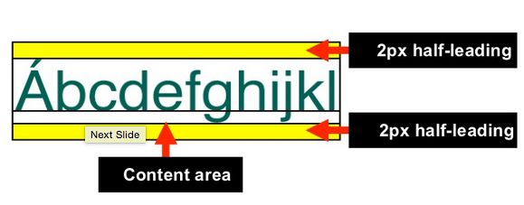

# HTML Markup
## dl 태그
> dl(description list) 요소는 이름-값 형태의 목록. 이름-값 형태의 그룹은 '단어와 정의', '메타데이터와 값', '질문과 답변', 이 외에 '이름과 값' 형태 등으로도 가능.
### 마크업 규칙
- 플로우 컨텐츠에 속한다.
- 자식 요소로 하나 이상의 dt 요소와 그 뒤를 따르는 하나 이상의 dd 요소로 구성된 0개 이상의 그룹을 포함할 수 있다.
- 이름-값은 1:1 형태가 아닌 1:다, 다:1, 다:다 형태를 취할 수 있다.
### 예시
```html
<dl>
  <dt>이름</dt>
  <dd>홍길동</dd>
</dl>
```
[참조 링크](https://www.w3schools.com/tags/tag_dl.asp)
## A 태그
>a태그는 하나의 페이지에서 다른 페이지로 연결하는 데 사용되는 하이퍼 링크를 정의합니다. 
> a요소의 가장 중요한 특성은 링크의 목적지를 나타내는 href 속성이다.
### 주요 속성
- Href (링크로 진행 페이지의 URL을 지정)
    - `value` : url
- Target
    - `_blank` : 새창에 로드
    - `_parent` : 부모창에 로드
    - `_self` : 현재창에 로드
    - `_top` : 최상위창에 로드
### 예시
```html
<a href="https://www.w3schools.com" target="_blank" title="w3school a태그 관련 링크">Visit W3Schools.com!</a>
```
### 접근성 이슈
- Title 속성을 사용하여 웹접근성을 향상시킬 수 있다.
- 명확한 링크대상과 target 속성에 대해 표현한다.
  [참조 링크](https://www.w3schools.com/tags/tag_a.asp)
## button
>  폼 내부에 버튼 형태를 만듦
```html
<input type="button" value="버튼 내용" onclick="함수()">
```
* submit이나 reset과 같은 자체 기능은 없으며 javascript와 같은 함수를 연결하여 사용
* 브라우저마다 agent style 이 다르기 때문에 box-sizing: border-box; 를 활용하여 agent style을 초기화 하여 작업
# CSS
## Style Attribute
### line-height
> 줄 간격을 지정하는 속성

 

 > CSS의 leading(행간)은 `font-size`와 `line-height`의 차이에 의해 결정된다. `line-height`와 `font-size`의 차이의 반만큼이 컨텐트 영역의 위/아래로 설정되면서 행간이 만들어진다.
- `normal` : 기본값으로 브라우저의 기본 속성을 따른다. 폰트(font-family 속성)에 따라 다르지만 보통 1.2 정도로 할당되어 있다.
- `number` : 폰트 사이즈를 기준으로 설정한 숫자만큼 배율로 적용한다. 대부분의 경우, 숫자를 사용하는 것이 가장 문제 없이 동작하고, 또 가장 선호되기도 한다.
- `length` : px, pt, cm, em 등의 단위로 직접 수치를 할당할 수 있다.
- `percent` : `computed` 폰트 사이즈를 기준으로 설정한 퍼센트만큼 배율로 적용한다. 
    * `percent`와 `length`의 경우, 자식 엘리먼트가 계산된 값을 상속받게 되어 의도하지 않게 동작할 수 있다.
### vertical-align
>  inline 요소 (inline, inline-block)를 수직 정렬하는 속성
- `baseline` : 기본값으로 부모 요소의 기준선(baseline)에 맞춘다.
- `length` : px, cm 등으로 0px는 baseline과 같은 값이고, 음수값으로도 설정 가능하다.
- `percent` : line-height의 백분율로 값을 지정할 수 있으며, 0%는 baseline과 같은 값이고 length와 마찬가지로 음수값도 설정 가능하다.
- `sub` : 부모 요소의 아래첨자 기준선에 맞춘다.
- `super` : 부모 요소의 위첨자 기준선에 맞춘다.
- `top` : 요소의 맨 위를 줄에서 가장 큰 요소의 맨 위에 맞춘다.
- `middle` : 부모 요소의 중앙에 위치한다.
- `bottom` : 요소의 맨 아래를 줄에서 가장 낮은 요소에 맞춘다.
- `text-top` : 요소의 맨 위를 부모 font의 맨 위에 맞춘다.
- `text-bottom` : 요소의 맨 아래를 부모 font의 맨 아래에 맞춘다.
### cursor
> 해당 태그 위에 위치하는 마우스 커서의 모양 지정하는 속성
- `auto` : 기본값으로 브라우저가 자동으로 설정한다.
- `default` : 기본값(화살표)
- `pointer` : 클릭시의 마우스(손가락 모양)
- `wait` : 로딩중인 마우스
  [참조 링크](https://www.w3schools.com/cssref/pr_class_cursor.asp)
### letter-spacing
> 글자 사이의 간격을 지정한다.
1. syntax 
    > `letter-spacing`: [normal] | [length] | [initial] | [inherit] ;
2. property
    - `normal` : 단어 사이의 여백을 없엔다.
    - `length` : 단어들 사이의 여백의 길이를 설정한다.
    - `initial` : default
    - `inherit` : 부모 요소에서 상속한다.
### text-indent
> 글자를 들여쓰기 한다.
1. syntax
    > `text-indent` : [length] | [initial] | [inherit] ;

2. property
    - `length` : px, pt, cm, em 등 단위로 된 숫자로 들여쓰기를 설정한다.
    - `%` : 부모 넓이에 비례한 %로 들여쓰기를 설정한다.
    - `initial` : default값으로 설정한다.
    - `inherit` : 부모 요소의 속성값을 상속 받는다.
### font-weight
> 글꼴 굵기를 지정한다.

1. syntax
    > `font-weight`: [normal] | [bold] | [bolder] | [lighter] | [number] | [initial] [inherit];

2. property
    - `normal` : default값
    - `bold` : 진하게 표시
    - `bolder` : 부모 요소에서 상속된 굵기보다 진하게 설정한다.
    - `lighter` :  부모 요소에서 상속된 굵기보다 흐리게 설정한다.
    - `number`
        - 100 ~ 300 : normal 보다 흐린 글씨
        - 400 : normal과 동일
        - 500 ~ 600 : normal 보다 진한 글씨
        - 700 : bold와 동일
        - 800 ~ 900 : bold보다 진한 글씨
    - `initial` : default 값
    - `inherit` : 부모 요소에서 상속
### radial-gradient
> 원형 그라디언트 표현
```css
 #grad {
    background: radial-gradient(circle at top right, #ffffff 0%, #000000 100%);
    }
```
## CSS 선택자
### Attribute Selectors (속성 선택자)
* `[`_`attr`_`]` : 해당 속성(_attr_)에 값이 존재하는 객체 선택
```css
.login-form [for]{  display: inline-block; }
```
* `[`_`attr`_`=`_`value`_`]` : 해당 속성(_attr_) 값(_value_)이 일치하는 객체 선택
```css
.login-form [for="user-email"]{  display: inline-block; }
```
* `[`_`attr`_`*=`_`value`_`]` : 해당 속성(_attr_)에 값(_value_)이 포함되어 있는 객체 선택
```css
.login-form [for*="user"]{  display: inline-block; }
```
[참조 링크](https://www.w3schools.com/css/css_attribute_selectors.asp)
### Pseudo-classes (가상 클래스)
* _`:nth-child(n)`_ : 부모의 (_n_)번째 위치에 있는 자식을 선택
* _`:nth-type-of(n)`_ : 같은 유형의 (_n_)번째 형제 선택
```html
 <dl class="term-list">
    <dt>웹 표준 이란?</dt>
    <dd>Web Standard</dd>
    <dd>W3C 단체에서 규정한 웹 기술 사양에 대한 규칙</dd>
</dl>
```
```css
.term-list dd:nth-of-type(2){ float:left; } /* Web Standard */
.term-list dd:nth-child(2){ float:left; } /* W3C 단체에서 규정한 웹 기술 사양에 대한 규칙 */
```
[참조 링크](https://www.w3schools.com/css/css_pseudo_classes.asp)
# 웹접근성
## 명도대비 이슈 - WCAG 2.0 지침이 전하는 전경색과 배경색의 명도 대비
1. 전경색과 배경색의 명도 대비에 관한 지침
- 명암 대비 (최소한의): 다음과 같은 경우를 제외하고 문자와 문자 이미지의 시각적인 표현은 최소한 4.5:1의 명암 대비를 부여해야 한다.
- 명암 대비 (향상): 다음과 같은 경우를 제외하고 문자의 시각 표현과 문자 이미지는 적어도 7:1의 명암대비를 부여해야 한다.
2. 전경색과 배경색 명암 대비 분석 도구들
- [snook.ca](http://www.snook.ca/technical/colour_contrast/colour.html)
- [Juicy Studio](http://juicystudio.com/services/luminositycontrastratio.php)
- [Colors on the web](http://www.colorsontheweb.com/colorcontrast.asp)
- [The Paciello Group](http://www.paciellogroup.com/resources/contrast-analyser.html)
3. WCAG 2.0 지침의 명도 대비 적합성 수준을 표시한 전경색과 배경색 사용의 예
- [예제 보기](http://naradesign.net/open_content/reference/contrastRatio.html)