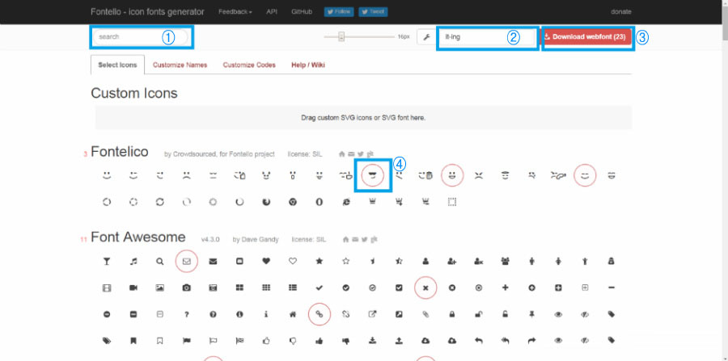
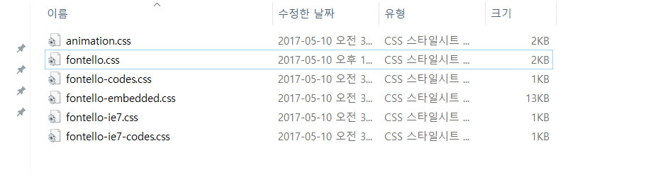

**VS code 단축키**
========
맥은  CTRL --> Cmd

| 키                 | 설명               |
| :---------------- | :--------------- |
| CTRL + \          | 화면분할             |
| CTRL + /          | 주석처리             |
| CTRL + `          | 내부에서 터미널열기       |
| CTRL + ALT + DOWN | 멀티선택             |
| CTRL + B          | 사이드바 보기          |
| CTRL + P          | 파일팔레트 보기         |
| CTRL + SHIFT + C  | 외부에서 터미널열기       |
| CTRL + SHIFT + E  | 파일탐색기 보기         |
| CTRL + SHIFT + G  | GIT 보기           |
| CTRL + SHIFT + M  | 문제 보기            |
| CTRL + SHIFT + O  | 심볼팔레트 보기         |
| CTRL + SHIFT + P  | 명령팔레트 보기         |
| CTRL + SHIFT + U  | 출력 보기            |
| CTRL + SHIFT + V  | 미리 보기            |
| CTRL + SHIFT + X  | 확장 보기            |
| CTRL + SHIFT + Y  | 디버그콘솔 보기         |
| CTRL + SPACE      | 자동완성(맥도 control) |
| CTRL + W          | 창닫기              |


#### Windows에서 GitBash로 터미널 설정하는 방법.
> 파일 → 기본설정 → settings → 설정 검색에서 terminal.integrated.shell.windows 찾기 →  "terminal.integrated.shell.windows": "C:\\Program Files\\Git\\bin\\bash.exe" 로 변경

**참고**
+ VSCode 단축키 : <https://code.visualstudio.com/docs/getstarted/keybindings>
+ 서브라임 단축키 : <http://docs.sublimetext.info/en/latest/reference/keyboard_shortcuts_win.html>

**HTML**
=====
## < time > 태그
### **Defines a date/time**

>HTML <time> 요소는 24시간 시각이나 정확한 그레고리력 날짜를 나타냅니다. (선택적으로 시간과 타임존 정보가 함께 들어갈수 있습니다.) 이 요소는 기계가 이해할수 있는 형태로 날짜나 시간을 나타내기 위해서 사용됩니다. 이를 이용해서 브라우저는 사용자 달력에 들어갈 일정을 안내할 수 있습니다.
>* HTML5에서 추가됨
>* IE9.0부터 호환

**예시**
```html
The class begins at <time>10:00</time> every morning.
The concert took place on <time datetime=“2017-05-04 19:00”>May 4</time>.
```

**속성**
1. datetime
    * 요소의 시간과 날짜를 표시
    * 시간 정보를 갖는 날짜 문자열로 파싱될 수 없다면, 요소는 관련된 타임스탬프를 소유하지 않게 됨.
    * YYYY-MM-DD HH:MM 형태로 사용 (정보 생략 가능)
2. pubdate
    * 문서의 작성 날짜를 표시

**참고**
+ MDN : <https://developer.mozilla.org/ko/docs/Web/HTML/Element/time>

**CSS**
====

## box-shadow

>box-shadow 속성은 콘텐츠의 그림자를 설정한다.
>* 기본값: none
>* 상속: 안됨
>* 애니메이션: 가능
>* 버전: CSS3


**Syntax**
>box-shadow : none | h-shadow | v-shadow | blur | spread | color | inset | inherit;

**예시**
```css
box-shadow: 5px 5px 5px 0 rgba(0,0,0,0.5);
```

**속성 값 설명**
* `none`	박스 그림자를 적용하지 않는다.
 * `h-shadow`그림자의 수직(X축) 거리를 나타낸다.
 * `v-shadow`그림자의 수직(Y축) 거리를 나타낸다.
 * `blur`그림자의 흐림정도를 나타낸다.
 * `spread`그림자의 거리를 나타낸다.
 * `color`그림자의 색을 나태낸다.
 * `inset`그림자를 내부에 적용할 수 있다.
 * `inherit`그림자의 속성 값을 상위요소한테 상속받는다.

**참고**
+ w3school: <https://www.w3schools.com/cssref/css3_pr_box-shadow.asp>

-------

## calc() 함수

>calc()을 이용하여 대상 사이즈나 형상을 결정하는 값을 계산할 수 있다. 
>
>\<length>, \<frequency>, \<angle>, \<time>, \<number>, \<integer> 값을 사용하는 어느 곳에서든 사용 가능하다.


**Syntax**
>property: calc(expression) 

**예시**
```css
.banner{
width: calc(100% - 80px);
}
```

**주의사항**
+ 내부에 입력할 수 있는 표현식은 +, -, *, /  사칙 연산
+ 계산의 진행 방향은 왼쪽에서 오른쪽
+ \+ 와 – 는 반드시 앞뒤에 공백 삽입 필요.
+ 사칙 연산과 마찬가지로 * 와 / 를 우선 연산
+ 길이의 값이 음수가 되는 경우 결과 값은 0 (예 : width: calc(5px - 10px); → width : 0; )
+ 연산시 다른 단위의 값 사용가능 (예 : calc(100% - 80px))

**참고**
+ 브라우저 지원 현황 확인 : <http://caniuse.com/#feat=calc>
+ MDN CSS Reference : <https://developer.mozilla.org/ko/docs/Web/CSS/calc>

----
## CSS로 단행 글 생략하고 말줄임표 넣기 issue
- 본 issue가 발생하는 원인은?
    * 어떤 요소가 아래와 같은 상황일때
        - text가 content
        - 행(line)수는 1
        - width가 한정적
        - overflow 발생
    * overflow된 부분을 생략하고 싶다.
    * 또, 생략된 부분에 말줄임표를 삽입하고 싶다.
> 예시상황 : 게시판 전체목록에서 게시글 제목...
> (게시글 제목은 단행으로만 표시되며 width값도 한정적이다.)
- 해결방법
    * 먼저 display가 inline-block임을 확인한다
    * 자동 줄바꿈이 되지 않도록 white-space를 nowrap으로 설정.
    * 줄바꿈 되지 않는 글자들이 요소의 너비 밖으로 표시 되는것을 overflow에 hidden값을 설정함으로써 숨긴다.
    * 마지막으로 text-overflow에 ellipsis를 설정함으로써 글자 overflow가 발생한 부분에 말줄임 기호가 삽입되도록 한다.

CSS코드
~~~css
selector {
    display: inline-block;
    white-space: nowrap;
    overflow: hidden;
    text-overflow: ellipsis;
}
~~~
[참고 : 다행 글 말줄임표 생략](https://codepen.io/martinwolf/pen/qlFdp)

---
## CSS에서 Fontello 아이콘 폰트 적용하기

1. Fontello란?
   CSS 라이브러리 중 하나인 fontello는 icon fonts generator 입니다. 
   쉽게말해서, 여러 아이콘을 폰트로 제공하는 서비스입니다.

2. Fontello 사용 방법
* 먼저 폰텔로 공식 홈페이지에 접속 합니다. [Fontello.com](http://Fontello.com) 접속하면 그림과 같이 보여 집니다.



1. 원한는 키워드를 넣어 검색을 할 수 있는 검색바 입니다.
2. 원하는 파일명 (비워둘 경우 Fontello로 설정됩니다.)
3. 선택한 아이콘을 다운 수 있습니다.
4. 자신이 원하는 아이콘을 선택합니다.

* 그림에 3번 처럼이 다운로드를 클릭하여 저장 폴더에 받은 후 압축 해제 css 폴더를 열어 봅니다.




* css폴더 안에서 fontello.css 파일을 vs code로 열어 다음과 같이 css 파일 상단에 적용 합니다.
```css
@font-face {
  font-family: 'fontello';
  src: url('../font/fontello.eot?9350373');
  src: url('../font/fontello.eot?9350373#iefix') format('embedded-opentype'),
       url('../font/fontello.woff2?9350373') format('woff2'),
       url('../font/fontello.woff?9350373') format('woff'),
       url('../font/fontello.ttf?9350373') format('truetype'),
       url('../font/fontello.svg?9350373#fontello') format('svg');
}
```

* 예시
```css

.root1::before{
   content: "\e801";
   font-family: "fontello",sans-serif;
}
.root2::before{
   content: "\e802";
   font-family: "fontello",sans-serif;
}
.root3::before{
   content: "\e803";
   font-family: "fontello",sans-serif;
}
.root4::before{
   content: "\e804";
   font-family: "fontello",sans-serif;
}
.root5::before{
   content: "\e805";
   font-family: "fontello",sans-serif;
}
```


* 적용 결과


---

**jQuery**
=====
## jQuery CDN(Contents Delivery Network)
아래 코드를 HTML파일에 삽입함으로써 해당 파일 내에서 jQuery 객체들을 쓸 수 있다. (2017년 5월 10일 기준 latest stable버전의 minified판)
~~~js
    <script src="https://code.jquery.com/jquery-3.2.1.min.js" integrity="sha256-hwg4gsxgFZhOsEEamdOYGBf13FyQuiTwlAQgxVSNgt4=" crossorigin="anonymous"></script>
~~~

[jQuery의 다른 버전/판 CDN 보기](https://code.jquery.com/)

---

## jQuery code 분석
    $(function(){
        $('.tab').click(function(e){
            e.preventDefault(); 
            $(this).parent().parent().addClass('board-active').siblings().removeClass('board-active');
        });
    });

* script 태그의 contetn로 위 코드를 삽입할 수 있다.
* $();
    - jquery()메서드 호출문이다. (축약표현)
    - 매개변수에 익명의 callback 함수를 넘겨주고 있다.
    - 이 경우 HTML DOM의 load가 끝난 시점에서 callback 함수가 자동 실행된다.
* $('.tab')
    - "tab"을 class로 갖는 HTML 요소를 선택하여 반환
* .click()
    - 앞서 반환된 HTML요소에 click 이벤트를 추가시킨다.
    - 이벤트 발동시 실행될 함수를 매개변수로 넣어준다.
* function(e){}
    - click 이벤트 발동시 실행될 함수
    - e.preventDefault(); 
        + 이 HTML 요소에 있을지도 모를 기본 이벤트를 막는다.
    - $(this).parent().parent()
        + 이 HTML요소의 부모의 부모 요소를 반환한다.
    - .addClass('board-active')
        + 앞서 반환된 요소에 board-active라는 클래스를 추가
        + 클래스를 추가한 HTML 요소를 반환
    - .siblings()
        + 앞서 반환한 요소의 형제 요소들을 반환.
    - .removeClass('board-active')
        + 앞서 반환한 요소(들)의 class에서 board-active를 삭제.