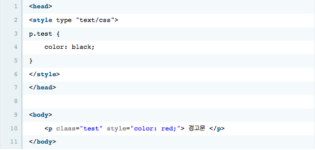
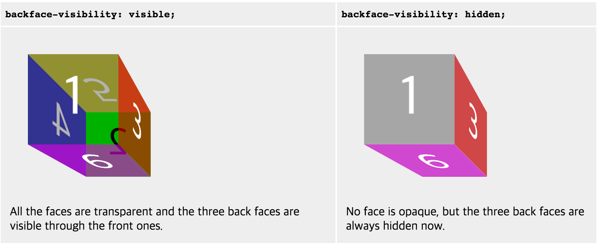
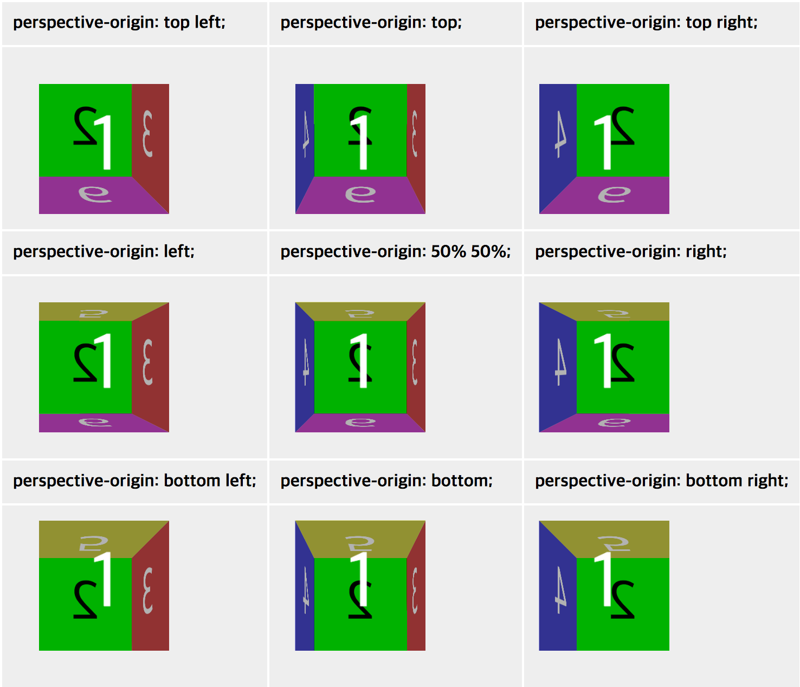
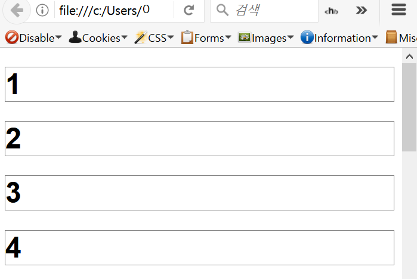

**CSS**
====

## CSS Selector 우선순위 

* CSS스타일을 적용하는데는 여러가지 방법을 사용하게 되면 `스타일이 충돌`할 수 있습니다. 그렇기 때문에 각 `원천 소스간, 선택자 간의 우선순위`를 알아야 한다.

<br>

**1. 사용자 스타일시트 우선**

* 작성자측의 스타일시트보다 `사용자 측의 스타일시트를 우선`적으로 적용한다.
* 속성에 `"!important"`를 선언한 경우 스타일의 우선순위는 다음과 같다.

>!important 선언을 한 사용자 스타일  > !important 선언을 한 작성자 스타일 > 작성자 스타일 > 사용자 스타일 > User Agent 선언 (브라우저 자체의 선언)

<br>

**2. 선택자 우선순위 계산 (specificity 계산)**

* 가상 엘리먼트와 가장클래스들은 각각 일반적인 엘리먼트와 클래스와 같이 간주된다.
~~~
a = 선택자중 ID의 수를 세어 100자리에 놓는다,
b = 선택자중 가상 클래스와 클래스의 수를 세어 10자리에 놓는다.
c = 선택자중 엘리먼트의 수를 세어 1의 자리에 놓는다.
d = 가상 엘리먼트는 무시한다.
~~~

예를들어 다음과 같은 경우를 살펴보면
```css
<style type="text/css">
p { color: gray;}
p.wrap { color: black;}
p#wrap { color: red;}
</style>
 
<p class="wrap" id="wrap">CSS Dictionary </p>
```
>이 경우 위 세가지 스타일중 선택자 우선순위가 가장 높은 p#wrap 가 적용된다.
>(p=1 , p.wrap=11 , p#wrap=101)

<br>

**3. 가장 마지막에 지정된 스타일 우선 적용**

* 만약 충돌하는 두 스타일들이 같은 원천 소스를 가지거나 선택자 우선순위가 같다면 `가장 마지막에 지정된 스타일이 우선` 적용된다.


>이 경우 "경고문"이라는 텍스트는 가장 마지막에 지정된 스타일이 적용되어 빨간색으로 출력된다.

**참고사이트**

+ 생활코딩 CSS적용 우선순위 : <https://opentutorials.org/module/484/4149>
+ CSS 선택자(Selector)와 우선 순위(티스토리) : <http://circlash.tistory.com/570>
---
## transform

* CSS transform를 사용하여 좌표공간을 변형함으로써, 다른 엘리먼트에 영향을 미치지 않고 특정 엘리먼트의 위치를 바꿀 수 있다.
* 해당 속성에 지정된 값에 따라 엘리먼트(element)에 평면과 3D공간으로의 이동(translate), 회전(rotate), 크기변경(scale), 기울임(skew)등의 효과를 줄 수 있다.

<br>

### transform-origin
**정의**

* 원점의 위치를 지정한다. 기본값은 엘리먼트의 왼쪽(left) 위(top)이지만, 수정이 가능하다. 회전(rotation), 확대/축소(scaling), 비틀기(skewing) 같이 한 점을 기준으로 수행되는 변환에 대해서 이 속성을 지정할 수 있다.

**속성**

~~~css
/* x-offset y-offset */
transform-origin: 3cm 2px;

/* x-offset-keyword y-offset-keyword */
transform-origin: right top;

/* x-offset y-offset z-offset */
transform-origin: 2px 30% 10px;

/* x-offset-keyword y-offset-keyword z-offset */
transform-origin: right bottom 2cm;
~~~

~~~css
keyword    value
left    0%
center    50%
right    100%
top    0%
bottom    100%
~~~

<br>

### backface-visibility

**정의**
* CSS 의 backface-visibility속성은 요소의 뒷면이 사용자에 접한 때 뒷면을 표시할지 여부를 결정합니다.
* 이 속성은 원근감 ( perspective )이없는 2D 변환에 효과를주지 않는다.

**속성**
~~~css
backface-visibility: visible;
backface-visibility: hidden;
~~~

**예시**


<br>

### perspective

**정의**

* perspective속성은 3D배치 된 요소에 원근감을 주어 평면과 사용자 사이의 거리를 결정한다. z > 0 인 3D 요소는 더 크고 z <0 인 3D 요소는 더 작아진다. 효과의 강도는 이 속성의 값에 따라 결정된다.
* 중심은 소실점을 기본으로 하며, perspective-origin으로 변경 가능하다.

**속성**

~~~css
perspective: none;
perspective: 절대 길이px/em;
~~~

**예시**


<br>

### perspective-origin

**정의**

* perspective-origin속성은 사용자의 보는 위치를 결정

**속성**

~~~css
perspective-origin: x-position y-position;
~~~

**예시**


<br>

### transform-box

**정의**

* transform-box속성 transform과 transform-origin속성에 관련한 레이아웃 상자를 말한다.

**속성**
~~~
transform-box: border-box;
transform-box: fill-box;
transform-box: view-box;
transform-style
~~~

### transform-style

**정의**

* transform-style속성은 요소의 자식 요소가 3D 공간에 배치되는지 평면에 배치되는지를 결정한다.

**속성**
~~~
transform-style: preserve-3d
transform-style: flat
~~~

**참고**

+ CSS z-index관련 쌓임 맥락(stacking context) 이야기 <https://developer.mozilla.org/ko/docs/Web/CSS/Understanding_z-index/The_stacking_context>

+ W3C School CSS3 transform Property
  <https://www.w3schools.com/cssref/css3_pr_transform.asp>

+ MDN Transform
  <https://developer.mozilla.org/ko/docs/Web/CSS/transform>

+ transform 브라우저 지원현황(호환성)
  <http://caniuse.com/#search=transform>

<br>

### transform함수

* 1. transform: scale() – 요소를 X축이나 Y축으로 확대/축소하기
~~~css
/*scale은 원본크기를 1로 기준으로 하고, 1보다 크면 확대, 1보다 작으면 축소됩니다.*/

transform: scaleX(x축 비율);          // x축으로 확대/축소

transform: scaleY(y축 비율);          // y축으로 확대/축소

transform: scale(x축 비율, y축 비율); // x축, y축으로 확대/축소
~~~

* 2. transform: rotate() – 요소 회전하기
~~~css
/*회전각도가 플러스값일 때는 시계 방향, 마이너스값일 때는 반시계 방향으로 회전합니다.*/

transform: rotateX(ndeg);  // x축을 기준으로 n도 만큼 회전

transform: rotateY(ndeg);  // y축을 기준으로 n도 만큼 회전

transform: rotate(ndeg);   // n도 만큼 회전
~~~

* 3. transform: skew() – 요소를 X축이나 Y축으로 기울이기
~~~css
/*skew는 지정한 각도만큼 웹요소를 기울입니다.*/
transform: skewX(ndeg);           // x축으로 n도 만큼 기울이기

transform: skewY(ndeg);           // y축으로 n도 만큼 기울이기

transform: skew(x축ndeg, y축ndeg); // x축, y축으로 n도 만큼씩 기울이기
~~~

* 4. transform: translate() – 요소를 X축이나 Y축으로 이동
~~~css
/*translate는 지정한 각도만큼 웹요소를 기울입니다.*/

transform: translateX(x축 이동거리);             // x축으로 이동

transform: translateY(y축 이동거리);             // y축으로 이동

transform: translate(x축 이동거리, y축 이동거리); // x축, y축으로 동시 이동
~~~

## Font 단축 표기법

**Syntax**
>* font: font-style | font-variant | font-weight | font-size | line-height | font-family;

**다음 선언은:**

```css
font-style: italic;
font-weight: bold;
font-size: 15px;
line-height: 1.2;
font-family: Arial;
```

**아래의 선언으로 단순화될 수 있습니다:**

```css
font: italic bold 18px/1.2 Arial;
```
**주의사항**
*  `선언 순서`를 지켜야 한다.
    1. font-style | font-variant | font-weight
    2. font-size
    3. line-height
    4. font-family

*  `반드시 선언해야할 font 속성`
    - font-size
    - font-family

```css
font: 15px/1.2 Arial;
/*이때 line-height 앞에 슬래시(/)를 붙여주어야 한다.*/
```

**참고**
+ MDN CSS 단축속성: <https://developer.mozilla.org/ko/docs/Web/CSS/Shorthand_properties>

## Transition

**속성**
> CSS3 transition은 지정된 duration 동안 특정 속성의 값이 변화 될 때 그 값의 변화가 부드럽게 변화하도록해준다.
> * 기본값: none
> * 상속: 안됨
> * 애니메이션: 불가능

**syntax**
> transition: none | transition-property | transition-duration | [transition-timing-function] | [transition-delay]

**속성 설명**
* `transition-property` : 트랜지션을 적용해야 하는 CSS 속성의 이름 혹은 이름
* `transition-duration` : 트랜지션이 일어나는 지속 시간
* `transition-timing-function` : 속성의 중간값을 계산하는 방법을 정의하는 함수
* `transition-delay` : 속성이 변한 시점과 트랜지션이 실제로 시작하는 사이에 기다리는 시간

**기본값**
* `transition-property`: all
* `transition-duration`: 0s
* `transition-delay`: 0s
* `transition-timing-function`: ease

**주의사항**
* `transition-delay` : 0초일 경우 0이 아닌 0s로 명시

**속성 값 설명**

- 여러 속성에 대해 transition 지정 할 때
```css
transition: height 3s ease-in-out 0s, padding 1s ease-in-out 0s;
```
- 예시
```css
.box {
    position: absolute;
    background: yellow;
    width: 100px;
    height: 100px;
    transition: height 1s;
}
.box:hover {
    height: 200px;
}
/*transition 속성 선언 위치는 .box:hover가 아니라 .box에 선언해야함*/
```
**Transition과 Animation의 차이**

* `발생요건`
  - transition : :hover와 같은 pseudo-class(가상 클래스)에 의해서 동작.
  - animation : 별도의 설정이 필요 없이 정의하면 자동으로 동작.
* `동작설정`
  - transition : 처음과 마지막 상태(start, end) 변화에 대한 설정만 가능.
  - animation : 구체적인 상태 변화 설정 가능(0~100%).
* `반복기능`
  - transition : 별도의 반복가능한 속성을 가지지 않고 필요하다면 스크립트로 'transitionEnd' 이벤트를 받는다.
  - animation : animation-interation-count 속성으로 반복동작 가능
* `키프레임 설정`
  - transition : 키프레임 설정을 할 수 없다.
  - animation : 키프레임 설정 가능

**참고**
+ <https://www.kirupa.com/html5/css3_animations_vs_transitions.htm>

## Counter-increment

**속성**
>CSS 카운터(변수 활용 가능)
>* 기본값: none
>* 상속: 안됨
>* 애니메이션: 불가능

**syntax**
>counter-inrement: none| variable-name | [increment-integer(정수)]

**속성 설명**
* increment-integer : 1 (기본값);
* increment-integer 값은 음수도 가능. 

```css
h3 {
    counter-increment: chapter -3;
    /* chapter 변수 값 변화 : 0 -3 -6 -9 -12 */
}
```
- 예시
```html
<h3></h3>
<h3></h3>
<h3></h3>
<h3></h3>
```
```css
h3 {
    counter-increment: index;
    border: 1px solid gray;
}
h3::after {
    content: counter(index, decimal);
}
```
- 결과



## Select
>옵션들의 메뉴가 존재하는 컨트롤. 메뉴에 있는 옵션들은 option 요소에 의해 표현되며, optgroup 요소에 의해 묶일 수 있음.

**예시**
```html
<select name="select">
  <option value="value1">Value 1</option> 
  <option value="value2" selected>Value 2</option>
  <option value="value3">Value 3</option>
</select>
```

**속성 설명**
* `autofocus`
  - 페이지가 로드되면, 포커스를 가지도록 할 수 있음
* `disabled`
  - 사용자가 컨트롤과 상호작용할 수 없음
* `form`
  - select요소가 연관된 form 요소 (요소의 form owner)
* `multiple`
  - 목록에서 다중 옵션들이 선택될 수 있음
* `required`
  - 비어있지 않은 문자열 값이 반드시 선택되어야 하는 옵션
* `size`
  - 목록에서 한 번에 볼 수 있는 행의 개수

**적용**

* 잘못된 사례
    - 이유 : 목록 선택 상자에서 초점변경으로만 새창이 열리는 경우는 잘못된 사례이다.
```html
    <select onchange="copyrtChgUrl(this.value)">
    <option value="">패밀리 사이트 전체</option>
    <option value="http://daum.net">다음</option>
    <option value="http://naver.com">네이버</option>
    <option value="http://yahoo.com">야후</option>
    <option value="http://google.com">구글</option>    
</select>
```

* 개선 방법
- 방법 1 : 목록 선택 후 별도의 [이동] 버튼을 제공하여 개선
```html
<form>
    <fieldset>
        <label for="">패밀리 사이트</label>
        <select onchange="copyrtChgUrl(this.value)">
            <option value="">패밀리 사이트 전체</option>
            <option value="http://daum.net">다음</option>
            <option value="http://naver.com">네이버</option>
            <option value="http://yahoo.com">야후</option>
            <option value="http://google.com">구글</option>    
        </select>
        <input type="submit" value="이동">
    </fieldset>
</form>
```
- 방법 2 : 새창임을 알려주고 포커스 이동이 가능하도록 개선
```html
<div>
    <h1>패밀리사이트</h1>
    <ul>
        <li><a href="http://daum.net" target="_blank" title="다음 사이트로 이동">다음</a></li>
        <li><a href="http://naver.com" target="_blank" title="네이버 사이트로 이동">네이버</a></li>
        <li><a href="http://yahoo.com" target="_blank" title="야후 사이트로 이동">야후</a></li>
        <li><a href="http://google.com" target="_blank" title="구글 사이트로 이동">구글</a></li>
    </ul>
</div>
```
**참고**
+ <https://developer.mozilla.org/ko/docs/Web/HTML/Element/select>
+ <http://www.wah.or.kr/board/boardView.asp?page=1&brd_sn=4&brd_idx=741>
+ <https://www.w3schools.com/tags/att_select_multiple.asp>
+ <https://www.w3schools.com/tags/tag_select.asp>

## List 중앙 정렬 방법
**예제 1번 : float: right; 와 margin-top: 값; 을 사용하는 방법**

```HTML
<ul class="sample1">
    <li>예제 리스트 1 <span></span></li>
    <li>예제 리스트 2 <span></span></li>
    <li>예제 리스트 3 <span></span></li>
</ul>
```

```CSS
.sample1 li{
    height: 20px;
    line-height: 20px;
}
.sample1 li::after{
    content: "";
    display: block;
    clear: both;    
}
.sample1 span{
    float: right;
    display: block;
    width: 10px;
    height: 10px;
    margin-top: 5px;
}
```

**예제 2번 : position: absolute;와 top: 50%; margin-top: -값;(음수) 을 사용하는 방법**
** margin-top의 값은 height의 값의 50%를 계산하여 넣어준다. **

```HTML
<ul class="sample2">
    <li>예제 2번의 리스트 1 <span></span></li>
    <li>예제 2번의 리스트 2 <span></span></li>
    <li>예제 2번의 리스트 3 <span></span></li>
</ul>
​```CSS
.sample2 li{
    position: relative;
    height: 20px;
    line-height: 20px;
}
.sample2 span{
    position: absolute;
    right: 0;
    top: 50%;
    margin-top: -5px; 
    display: block;
    width: 10px;
    height: 10px;
}
```
**예제 3번 : position: absolute; 와 top: 50%;와 transform: translateY(-50%); 을 사용하는 방법**
```HTML
<ul class="sample3">
    <li>예제 3번의 리스트 1 <span></span></li>
    <li>예제 3번의 리스트 2 <span></span></li>
    <li>예제 3번의 리스트 3 <span></span></li>
</ul>
```
```CSS
.sample3 li{
    position: relative;
    height: 20px;
    line-height: 20px;
}
.sample3 span{
    position: absolute;
    right: 0;
    top: 50%;
    transform: translateY(-50%);
    display: block;
    width: 10px;
    height: 10px;
}
```
**결과**


