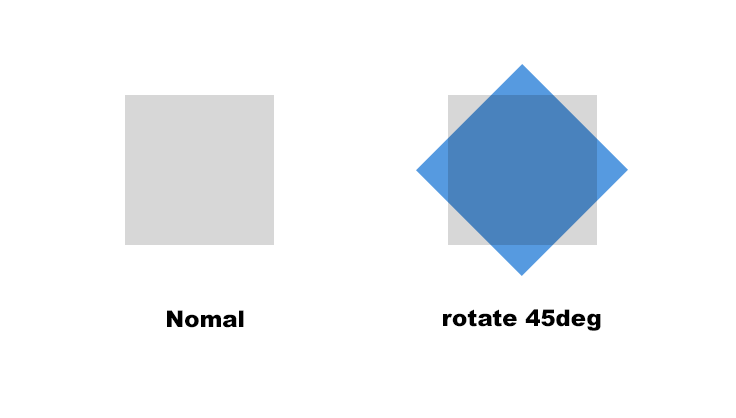
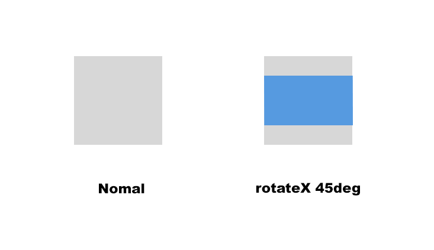
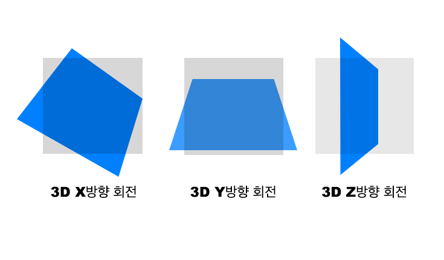
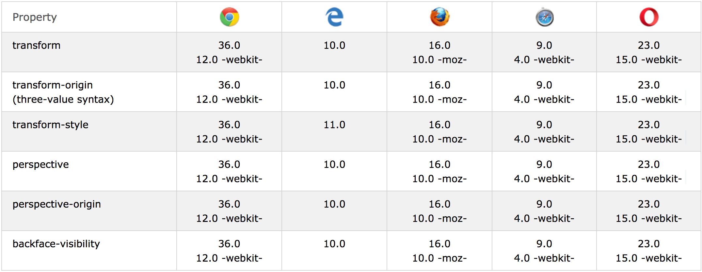
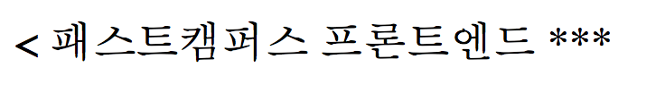
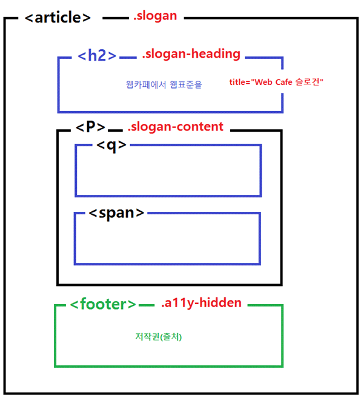

## CSS - Transform 속성


### rotate

- 해당 요소를 주어진 각도만큼 시계 방향이나 반시계 방향으로 회전시킨다.

```Css
.rotate{
	transform: rotate(45deg);
}
```


45도 예제



### rotateX

- 해당 요소를 주어진 각도만큼 x축을 기준으로 회전시킨다.

```Css
.rotate{
  transform: rotateX(45deg);
}
```


45도 예제



### rotateY

- 요소를 변형하지 않고 Y축을 중심으로 회전시킴. 이동량은 지정된 각도이며, 양수이면 시계 방향으로, 음수이면 시계 반대 방향으로 이동함. 회전축은 변환 원 CSS 속성으로 정의 된 원점을 지남.

```Html
<p>foo</p>
<p class="transformed">bar</p>
```

```css
p { 
  width: 50px;
  height: 50px;
  background-color: teal;
}

.transformed{
  transform: rotateY(60deg);
  background-color: blue;
}
```


45도 예제


### translateX

- 요소를 평면에서 수평으로 이동. 수평으로 이동하는 정도를 정의하는 <길이>라고 특징짓는다.

```html
<p>foo</p>
<p class="transformed">bar</p>
<p>foo</p>
```

```Css
p { 
  width: 50px;
  height: 50px;
  background-color: teal;
}

.transformed {
  transform: translateX(10px);
  background-color: blue;
}
```


45도 예제

.gif)


### translateY

- CSS 기능면에 수직으로 length 를 얼마나 이동시킬지 정의한다.

```Html
<p>foo</p>
<p class="transformed">bar</p>
<p>foo</p>
```

```css
p { 
  width: 50px;
  height: 50px;
  background-color: teal;
}

.transformed {
  transform: translateY(10px);
  background-color: blue;
}
```


45도 예제

.gif)

### translateZ

- 3차원 공간의 Z축을 따라 이동시킨다. 이 변환은 Z축으로 length를 얼마나 이동시킬지 정의한다.

```Html
<p>foo</p>
<p class="transformed">bar</p>
```

```Css
.transformed {
  /* Adding a perspective to create a 3d space */
  /* The user is looking "from" 500px and we */
  /* push the element forward (toward the user) */
  /* by 200px */
  transform: perspective(500px) translateZ(200px);
}
```


### transform-style: preserve-3d

- 요소에 변형을 적용할 때 그 변환이 자식(child) 요소들에게도 적용될지 안 될지를 설정한다.

- preserve-3d

  - preserve-3d 값을 사용하면 요소를 평면화하는 대신 3D 공간에 배치할 수 있다.

  - IE는 Microsoft Edge부터 값 지원

    ​

### transform-origin

- 요소의 변형에 대한 원점을 수정할 수 있다.
- transform-origin 속성은 하나 둘 또는 세 개의 값을 사용하여 지정할 수 있다.

```Css
.box {
  transform: rotate(360deg);
  transform-origin: top left;
}
```

> 위 속성 적용시, 왼쪽위를 기준으로 rotate(360deg)속성이 적용된다.


### 3D transform 예제 그림



### backface-visibility

- 3D 변형과 연관되어 있으며, 입체적인 모습의 뒷면의 가시성을 결정하는 속성이다.
- rotate 와 같은 변형이 이루어졌을 때, 뒷면을 숨기거나 보여지게 할 수 있다.
- 속성값
  - hidden
  - visible
- [Codepen 참고 링크](http://codepen.io/uzugoer/pen/oXPqPe)


### transform 속성 브라우저 호환성




------

## jQuery 메소드


### .on() 을 사용한 클릭 이벤트

- .on()은 jQuery 1.7 버전에서 나온 3가지 통합 메소드이다.
- 이벤트 핸들러 바인딩에 필요한 모든 기능을 제공한다.
- 이벤트 이름으로 click 외에도 submit 등의 키워드가 있다.


```javascript
$(선택요소).on('click', function() {
  // 실행할 구문
});
```


### .removeAttr()

`selector.removeAttr(name)`

> selector 는 속성을 제거할 객체를 의미한다.
>
> name 은 제거할 속성의 이름을 의미한다.

- 선택된 요소들의 하나 또는 그 이상의 속성을 제거하는데 사용된다.
- 비슷한 이름으로는 .removeClass(name) 이 있다.


예제

```Html
<button>Enable</button>
<input type="text" disabled="disabled" value="can't edit this" />
```

```Javascript
$("button").click(function () {
  $(this).next().removeAttr("disabled");
});

```

> 1. button 이 클릭되면 함수가 실행
> 2. $(this) 는 button 을 가르키고, .next()는 다음 형제를 선택한다. (여기서는 input)
> 3. 그리고 그 해당 형제인 input의 disable 속성을 제거한다.


### .addClass()

- 특정한 요소에 클래스를 추가한다. 그 이상의 기능은 없다.

```javascript
$('p').addClass('spin');
```

> - 모든 p 태그에 spin 이라는 class를 추가한다.
> - 모든 p 태그는 spin class 속성에 영향을 받는다.


```Javascript
$('p').addClass('spin rotate bounce');
```

> - 모든 p 태그에 여러개의 클래스를 한번에 추가할 수 있다.
> - 모든 p 태그는 spin, rotate, bounce 클래스를 가진다
> - <p class="spin rotate bounce">..</p>


### .toggleClass()

- 클래스의 존재 또는 인수의 값에 따라 일치하는 각 요소에서 하나 이상의 클래스를 한 번에 추가하거나 제거할 수 있다. 그리고 클래스를 변경할 조건을 설정할 수도 있다.

> - 이 함수는 하나 이상의 클래스명을 인자로 가질 수 있다. 
> - 이 함수가 맨 처음 실행되었을 때 해당 요소에 함수에 할당된 클래스명 인자가 이미 들어가 있다면 클래스가 제거되는 것부터 시작한다.

`selector.toggleClass(className, AddOrRemove);`


예제

```javascript
if (addOrRemove) {
  $('#foo').addClass(className);
}
else {
  $('#foo').removeClass(className);
}
```

예제

```Javascript
  $(".btn-backface").on("click", function(){
    $(".cube div").toggleClass("backface");
  });
```

> btn-backface 클래스가 있는 Element를 클릭시, cube 클래스 하위의 div들에게 backface 클래스를 추가한다.
>
> backface 클래스가 이미 존재하면, backface 클래스를 제거한다.


------

## CSS - Quotes 속성

`quotes` : `q` 태그의 before, after에 추가할 인용부호를 지정하는데 사용된다.    ***(IE8 이하 지원 안함)***

```html
<q> 패스트캠퍼스 프론트엔드 </q>
```

```css
q{
  quotes: "<" "***";
}
```


> 결과 화면




------

## ARIA 접목

- 사이트를 마무리하는 영역인 footer 에는 특별히 heading 태그를 사용하지는 않는다.
- 구조적으로 ul 내부에 heading을 넣을 수 없는 상황일 때에는 aria 기술을 접목하여 사용할 수 있다.

```html
<ul class="guide" aria-label="사이트 이용안내">
...
</ul>
```


------

## 웹카페 Slogan, Footer Semantic 마크업 구조

손현님 감사해요 ( _ _ )


#### Slogan




#### Footer


------

## Sass 기본


**설치방법**: [https://github.com/seulbinim/FDS/blob/3rd_FDS/REFERENCES/NVM.md](https://github.com/seulbinim/FDS/blob/3rd_FDS/REFERENCES/NVM.md)


### Sass 컴파일 명령어

 ` node-sass [sass 파일 경로] -o [css 파일 경로]`

 `node-sass sass/test.sass -o sass/`


### Sass 컴파일 및 출력 스타일 설정

 `node-sass [sass 파일 경로] -o [css 파일 경로] --output-style [nested | compact | expanded | compressed]`


### SCSS

```scss
$font-color: #ffweq;

.example {
  color: $font-color;
  text-align: right;
  a,
  a:visited{
    padding: 0 3px;
    color: #222222;
    color: rgba(34, 34, 34, 0.77);
   }
  a:hover{
    color: #B00909;
  }
}

```


### nested 스타일

```css
.example {
  color: #ffweq;
  text-align: right; }
  .example a,
  .example a:visited {
    padding: 0 3px;
    color: #222222;
    color: rgba(34, 34, 34, 0.77); }
  .example a:hover {
    color: #B00909; }
```


### expanded 스타일

```css
.example {
  color: #ffweq;
  text-align: right;
}

.example a,
.example a:visited {
  padding: 0 3px;
  color: #222222;
  color: rgba(34, 34, 34, 0.77);
}

.example a:hover {
  color: #B00909;
}
```


### compact 스타일

```css
.example { color: #ffweq; text-align: right; }

.example a, .example a:visited { padding: 0 3px; color: #222222; color: rgba(34, 34, 34, 0.77); }

.example a:hover { color: #B00909; }
```


### compressed 스타일

```Css
.example{color:#ffweq;text-align:right}.example a,.example a:visited{padding:0 3px;color:#222222;color:rgba(34,34,34,0.77)}.example a:hover{color:#B00909}
```


### Sass 감시 명령어

- Sass 폴더 내의 변화를 감지하여 자동으로 Css 파일로 렌더링 해주는 기능

`node-sass --watch [sass 파일 경로] -o [css 파일 경로]`

출력 스타일도 추가할 수 있다.

`node-sass --watch sass/ -o css/ --output-style [nested | compact | expanded | compressed]`


### Sass 공식 문서

[https://sass-guidelin.es/ko/](https://sass-guidelin.es/ko/)

