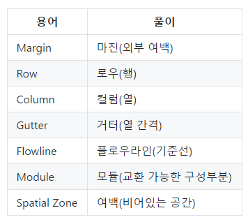
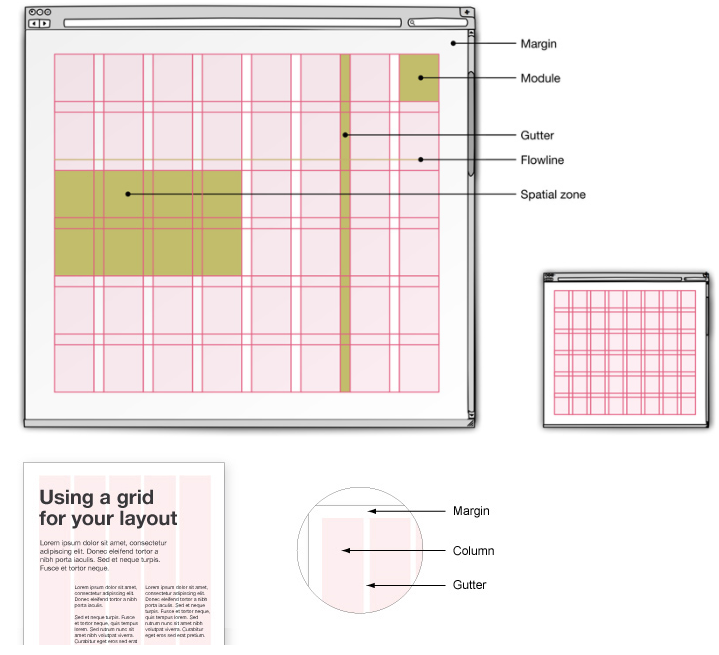
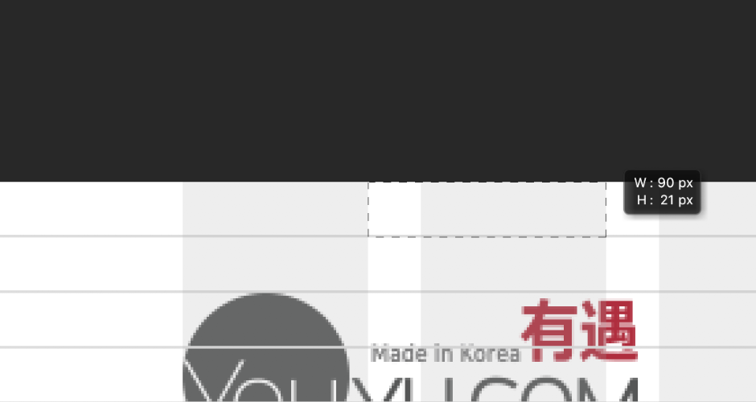
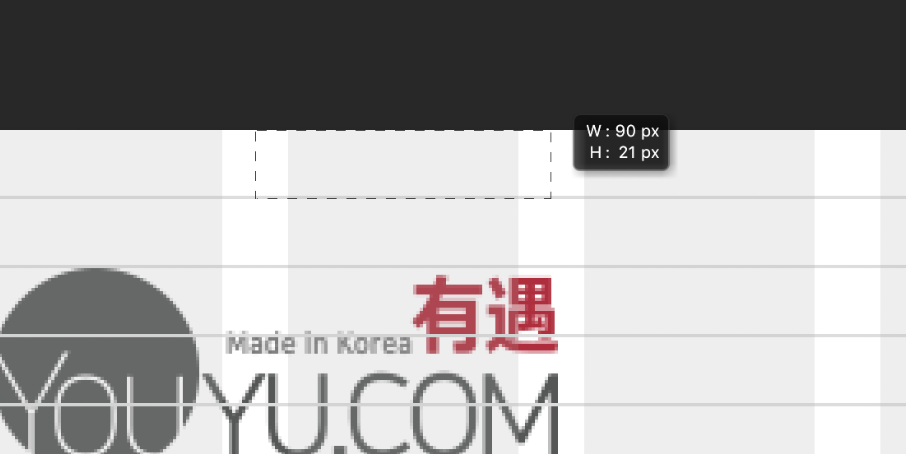
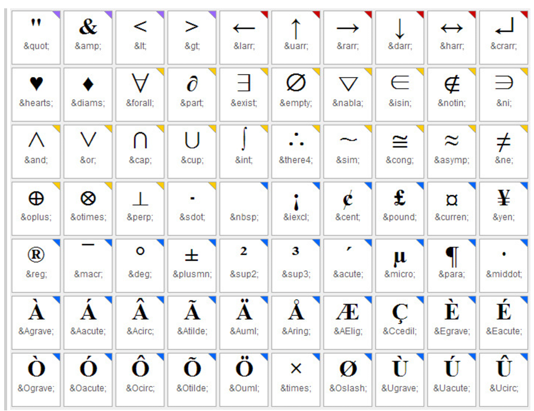

## 수업 참고 사이트

1. [Front-end roadmap](https://github.com/kamranahmedse/developer-roadmap)
2. [Front-end Handbook (2017)](https://frontendmasters.com/books/front-end-handbook/2017)
3. [나눔체 다운로드](http://hangeul.naver.com/2016/nanum)
4. [구글 Noto-Sans](https://www.google.co.kr/get/noto/)
5. [JS 이벤트 관련 자료](keycode.info)
6. [72 DPI vs 96 DPI 설명](https://spoqa.github.io/2012/07/06/pixel-and-point.html)

---

## MIME 이란?

- Multipurpose Internet Mail Extension 의 약자로 일종의 인코딩 방식이다.
- 이메일과 함께 동봉할 첨부 파일을 텍스트 문자로 전환해서 이메일 시스템을 통해 전달하기 위해 개발되어서 이름이 저렇다.....
- 현재는 웹을 통해서 여러 형태의 파일을 전달하는데 두루두루 쓰이고 있다.
- MIME 으로 인코딩 한 파일은 "Content-type" 정보를 파일의 앞 부분에 담고 있다.
- MIME type 은 [MDN](https://developer.mozilla.org/en-US/docs/Web/HTTP/Basics_of_HTTP/MIME_types) 에서 친절히 알려주고 있다

---

## Scaffolding (스캐폴딩)

- 학습자에게 적절한 인지적 도움과 안내를 제공하여 학습을 촉진시키는 전략을 의미한다.
- 컴퓨터 용어에서 Scaffolding은 데이터베이스의 각 테이블에 대한 웹 페이지를 자동으로 생성하는 Dynamic Data요소를 말한다. 자동 생선된 웹 페이지를 통해 각 테이블에 대해 만들기, 읽기, 업데이트 및 삭제(CRUD) 작업을 수행할 수 있다.

**FDS04**

- 야무샘이 알려주신 Github를 사용한 방법은...
  1. Github에 Repository를 생성한다.
  2. 자기가 원하는 프로젝트 파일 트리를 구성한다.
  3. 프로젝트를 시작할 때 마다 Clone 하여 사용한다.

---

## Javascript 파일을 </body> 전에 불러오는 이유

- 브라우저가 HTML 문서를 해석(Parsing) 할 때, <script> 태그를 만나면 그 안에 있는 Javascript의 처리가 끝날 때까지 다른 HTML 해석을 멈춘다.
- 사용자 입장에서 HTML 페이지가 화면에 다 렌더링 되기까지 더 오래 걸린다.
- CSS, HTML 해석이 먼저 완료된 후, Javascript를 불러오는 것이 사용자 입장에서는 더 빠르게 느껴진다.

---

## Grid layout 기본 속성, 용어

### Unit(유닛)

- Grid의 가장 작은 레이아웃 요소

### Gutter(여백)

- Gutter의 종류에는 left, right, 그리고 split 방식이 있다.

1. Left Gutter

2. Right Gutter

3. Split Gutter

---

## Web Caching(웹 캐싱)

- 클라이언트가 요청하는 HTML, CSS, JS 등에 대해 첫 요청 시에 파일을 내려받아 특정 위치에 복사본을 저장하고, 이후 동일한 URL의 자원 요청은 다시 내려받기 않고 내부에 저장한 파일을 사용하여 더 빠른 서비스를 제공하는 기능.

---

## Command line / 터미널 명령어

**mkdir**

- 주로 사용하는 옵션은 -p

`$mkdir ./test/example`

`$mkdir one two three`

**cp**: 복사 명령어

- -r: 하위 디렉토리에서 내부까지 전체를 함께 복사
- -dpr: 원본과 동일한 심볼릭 링크, 완벽한 복제 옵션
- -d: 심볼릭 파일 자체 및 정보를 함께 복사
- -p: 대상의 소유, 그룹, 권한, 시간 등을 그대로 복사
- -r: 서브(하위) 디렉토리 내부까지 전체 복사

**rm**: 파일 삭제, 강력한 기능이며, Linux 시스템은 삭제한 파일 복구가 어려움

- -r: 디렉토리 및 파일 전체 삭제
- -f: Y/N 여부 묻지 않고 강제로 삭제 진행
- rm -rf: [지울 대상] 으로 단일파일 및 폴더 전체를 삭제

**mv**: 이름 변경 혹은 이동

**cd**: 유저의 위치를 이동하는 명령어

- ~ : 현재 로그인 유저의 홈 디렉토리로 이동
- 절대경로 및 상대경로를 사용하여 디렉토리를 변경 가능

---

## HTML Entity Code Table

**참조:** [http://somgle.tistory.com/46](http://somgle.tistory.com/46)

---

## Keycode 값 (아스키 형식)

- Javascript 에서 Key 이벤트로 값을 받아 사용한다.

---

### HTML Language and Locale

**참조:** [http://www.vbsedit.com/html/882ca1eb-81b6-4a73-839d-154c6440bf70.asp](http://www.vbsedit.com/html/882ca1eb-81b6-4a73-839d-154c6440bf70.asp)

---

## 반응형 Grid 와 유동형 Grid 시스템

### Grid 시스템이란?

- 화면의 폭을 몇 개의 Column(컬럼)으로 나누고, 그 중 일부 컬럼을 묶어서 하나의 Class로 간단히 지정하면, 해당 컬럼의 폭과 다른 (묶음) 컬럼과의 간격도 일정하게 유지되는 시스템이다.
- 대표적으로 960 Grid System 이 유명하고, 주로 사용되는 시스템은 12 컬럼 기반이다.

#### 고정형 그리드 시스템(Static grid system)

- 픽셀 기반 치수를 정의한다.
- 특정 장치 viewport 에서 width와 height를 수동으로 조절해야 한다.
- 다양한 화면 크기 및 장치에 대한 조정이 필요하다.

#### 반응형 그리드 시스템(Fluid grid system)

- 최대 레이아웃 크기를 정의
- 레이아웃을 쉽게 처리할 수 있도록 특정 수의 열로 나눈다.
- 12컬럼을 주로 사용하며 3, 4컬럼으로 나뉘어지는 디자인이 좋은 편이다.

