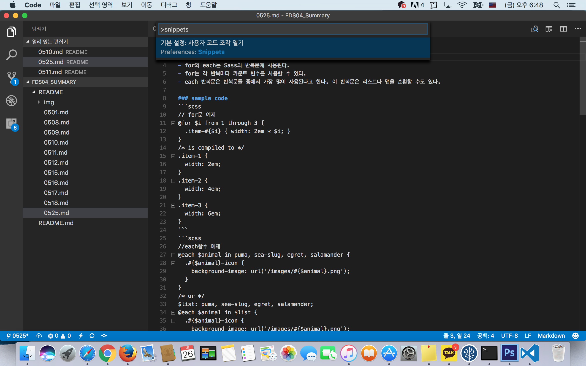
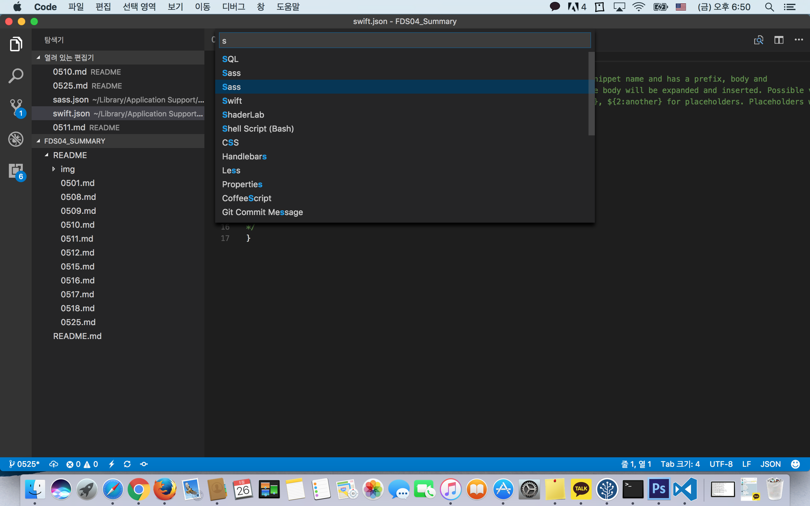
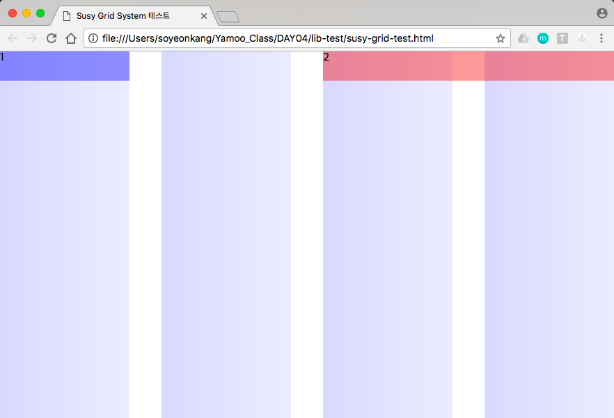

# Sass 단축 표기법
 > ### @include를 +로 표기 
+ 특징 : 들여쓰기 방식 통일, 중괄호﹒세미콜론 생략
+ 장점 : 심플하게 코딩할 수 있다.
+ 단점 : 문법이 엄격하다.

### 예시
```scss
// sass
.box
   +fixed(top 30px right 30px z-index 1000)

// css
.box {
   positon: fixed;
   top: 30px;
   right: 30px;
   z-index: 1000;
}
```

# Snippets 설정하기 - VScode
 ## 1. command + shift + p
 </img>
 ## 2. snippets 입력창에 입력
 </img>
 ## 3. snippets 입력창에 입력
 </img>
 ### 3-1. 주석을 참고하여 다음과 같이 작성한다.
 + 첫번째 속성이 명령어 
 + 두번째 prefix속성 값은 단축 명령어 
 + body속성 값에 배열로 내용을 작성하고 $+[nubmer]로 탭이동의 우선 순위를 지정한다. 
 ## 4. 다음과 같이 동작 가능해진다.
 </img>
 ## 5. sassdoc 입력후 enter 혹은 tab key를 입력하면 짜잔
 </img>


# SassDoc 
## 1. Sassdoc이란? 
 > SassDoc은 Sass 라이브러리/프레임워크 사용법(API: 변수, 함수, 믹스인 등)을 문서로 만들어 주는 자동화 도구로서 특정 구문 주석을 인식 후 데이터를 로드하여 테마에 맞춰 자동으로 HTML 문서를 만들어 준다.

## 2. 설치
### Sassdoc 사용을 위해 우선 NPM을 사용하여 전역에 Sassdoc 모듈을 설치한다.  
 ```sh
$ npm install sassdoc -g
```
## 3. 주석
### Sassdoc은 [JSDoc](http://usejsdoc.org/)에서 크게 영향을 받았으며, 문서화되어야 하는 각 항목(변수, 함수, 믹스인 등) 앞에 `///` 주석을 이용하여 정보를 제공

## 4. 작성법
### Sassdoc을 시작하는 첫 번째 행은 설명으로 시작하며 Sassdoc의 적절한 주석을 참조하여 추가한다. [Sassdoc의 주석](http://sassdoc.com/annotations/)

```sh
/// 요소의 크기(width, height)를 한 줄로 설정하도록 도와주는 믹스인
///
/// @group shorthand
/// @author yamoo9
///
/// @param {Length} $width - 요소의 너비
/// @param {Length} $height [$width] - 요소의 높이
/// @output `width`, `height`
///
/// @example scss - `.demo` 요소 크기 설정
///   .demo {
///     @include size(12rem, 4rem);
///   }
/// @example sass - `.demo` 요소 크기 설정
///   .demo
///     +size(12rem, 4rem)

@mixin size($width, $height: $width) {
  width: $width;
  height: $height;
}
```

## 5. 실행 
### 주석입력이 완료되면 터미널에서 아래와 같은 방법으로 Sassdoc을 실행한다. 
```sh
# 기본 사용법
$ sassdoc {Sass 디렉토리}

# 출력 폴더 지정
$ sassdoc {Sass 디렉토리} --dest {SassDoc 자동 생성 파일 디렉토리}

# 제외하고자 하는 항목이 있을 경우 설정
$ sassdoc stylesheets/ '!stylesheets/vendors/*'
```


# Susy 사용법
## 1. 터미널 Susy 설치
```sh
$ npm i -D susy
```
## 2. node_modules 폴더 안의 susy 폴더를 현재 작업 중인 sass폴더로 옮긴다.
## 3. _config.scss 파일 : 기본 설정을 위한 파일 (글로벌 설정)

### - flow : 문서를 읽는 방향 설정

+ 설정값 : ltr (left to right), rtl (right to left)

+ 기본값 : ltr

### - math : float 레이아웃 설정 시, 유동(%) 또는 고정(px) 사용 유무 설정

+ 설정값 : fluid, static (column-width 설정 필요)

+ 기본값 : fluid

### - output : 레이아웃 출력 모드 설정

+ 설정값 : float, isolate

+ 기본값 : float
 
### - gutter position : 거터의 방향 설정

+ 설정값 : after, before, split, inside, inside-static (column-width 설정 필요)

+ 기본값 : after

  ※ inside 설정은 Padding으로 처리됨

### - container : 컨테이너 요소의 최대 가로 폭(max-width) 값을 설정

+ 설정값 : auto, \<length\>

+ 기본값 : auto

### - columns : 컬럼의 총 개수 설정

+ 설정값 : 4, \<number\>, \<list\>

+ 기본값 : 4

### - gutters : 거터의 폭 설정 

+ cf. 1/4 -> \<gutter-width\> / \<column-width\>

### - column width : 컬럼의 가로 폭 설정

+ 설정값 : false, null, \<lengt\h>

+ 기본값 : false

### - image : 그리드 이미지 설정

+ 설정값 : hide, show, show-columns, show-baseline

+ 기본값 : hide

  ※ $base-line-height 설정 값에 따라 베이스라인을 그려줌.

### - color : 그리드 컬럼 색상 설정

+ 설정값 : rgba (#66f, .25), \<color\>

+ 기본값 : rgba (#66f, .25)

### - output : 그리드 모드

+ 설정값 : background, overlay

  ※ overlay 설정일 경우, 컨테이너 요소의 ::before 요소를 사용하여 오버레이 함.

## 4. 믹스인 / 함수

```scss
// 믹스인
 +container( auto | <length> )
 +span( <length> | ... )
 +gutters( <length> | ... )

 // 함수
 container( auto | <length> )
 span( <length> | ... )
 gutter( <length> | ... )
```
### 1) Sass
</img>
### 2) Css
</img>
### 3) Rendering result
</img>


