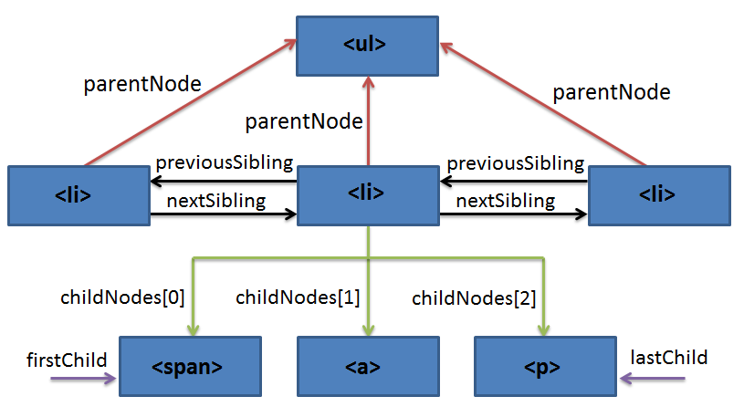

# DOM(Document Object Model)

## Core DOM
>어느 문서에나 통용되는 표준 모델로 모든 문서 요소의 객체와 속성을 정의하고 이들에 접근하기 위한 인터페이스를 정의

<br>

## XML DOM
>XML 문서의 표준 모델 <br>
>XML 문서 요소의 객체와 속성을 정의하고 XML DOM은 XML 문서에 접근하여, 그 문서를 다루는 표준화된 방법을 정의한다. <br>
>모든 XML 요소는 XML DOM를 통해 접근할 수 있다. <br>
>XML DOM은 플랫폼이나 프로그래밍 언어에 상관없이 언제나 사용할 수 있다. <br>
>XML 문서라는 정보 단위의 계층 구조인 노드에 대해 노드와 그들 사이의 관계를 설명하는 표준 프로그래밍 인터페이스이다. <br>
>(Core DOM을 XML에 맞게 확장 시킨 것.)

<br>

## HTML DOM
>HTML 문서의 표준 모델로 HTML DOM은 HTML 문서에 액세스하고 조작하기위한 표준적인 방법을 정의한다. <br>
>모든 HTML 요소는 HTML DOM를 통해 접근할 수 있다. <br>
>HTML 문서 요소의 객체와 속성을 정의하고 이들에 접근하기 위한 인터페이스를 정의

<br>

## XML DOM vs HTML DOM
* Get DOM Nodes
```javascript
// XML DOM
var anchors = document.getElementsByTagName("a");
// HTML DOM
var anchors = document.anchors;

// XML DOM
var form = document.getElementsByTagName("form");
// HTML DOM
var form = document.forms;
```

* Get Attribute
```javascript
// XML DOM
var imgSrc = elem.getAttribute(“src”);
// HTML DOM
var imgSrc = elem.src;
```

* Set Attribute
```javascript
// XML DOM
elem.setAttribute(“src”, “menu01_on.gif”);
// HTML DOM
elem.src = “menu01_on.gif”;
```

* 참고 : HTML DOM은 좀 더 직관적이며 단순 (W3C에서는 XML DOM을 권장)

<br><br>


## Node 속성(property)
* parentNode : 지정된 노드의 부모 노드를 Node 객체로 반환 (부모 노드가 없는 경우 null을 반환)
* firstChild : 지정된 노드의 첫 번째 자식 노드를 Node 객체로 반환 (자식 노드가 없는 경우 null을 반환)
* lastChild : 지정된 노드의 마지막 자식 노드를 Node 객체로 반환 (자식 노드가 없는 경우 null을 반환)
* previousSibling : 지정된 노드의 이전 형제 노드를 Node 객체로 반환 (이전 형제 노드가 없는 경우 null을 반환)
* nextSibling : 지정된 노드의 다음 형제 노드를 Node 객체로 반환 (다음 형제 노드가 없는 경우 null을 반환)
* nodeType : 지정된 노드의 유형을 반환
  - ELEMENT_NODE: 1, ATTRIBUTE_NODE: 2, TEXT_NODE: 3, COMMENT_NODE: 8
* nodeName : 지정된 노드의 이름을 반환
  - 요소 노드 : 태그 이름 반환
  - 속성 노드 : 속성의 이름을 반환
  - 다른 노드 유형 : 다른 노드 유형에 대해 다른 이름을 반환
* nodeValue : 텍스트 노드의 값을 설정하거나 리턴 할 수 있다. (텍스트 노드가 아닌 경우 null을 반환)
* childNodes : 지정된 노드의 자식 노드 컬렉션(NodeList - 유사배열) 객체 반환(읽기 전용)
  - 인덱스 번호로 접근 가능
  - 공백은 텍스트 노드 반환
  - 주석은 주석 노드 반환

<br>

## Element 속성(property)
* firstElementChild : 지정된 노드의 첫 번째 자식 요소 노드를 Node 객체로 반환 (하위 요소 노드가 없는 경우 null을 반환)
* lastElementChild : 지정된 노드의 마지막 자식 요소 노드를 Node 객체로 반환 (하위 요소 노드가 없는 경우 null을 반환)
* previousElementSibling : 지정된 노드의 이전 형제 요소 노드를 Node 객체로 반환 (이전 형제 요소 노드가 없는 경우 null을 반환)
* nextElemntSibling : 지정된 노드의 다음 형제 요소 노드를 Node 객체로 반환 (다음 형제 요소 노드가 없는 경우 null을 반환)
* tagName : 요소 노드의 이름 반환
  - nodeName과의 차이점 : nodeName은 모든 노드 (요소, 속성, 텍스트, 주석)의 이름을 반환하는 반면 tagName은 요소 노드의 이름을 반환한다.
* children : 지정된 노드의 자식 노드 컬렉션(HTMLCollection - 유사배열) 객체 반환(읽기 전용)

<br>

## Node 속성과 Element 속성을 이용한 노드 탐색 방식의 차이점
* Node 속성을 이용한 탐색 방식은 요소 노드, 텍스트 노드, 주석 노드를 반환
* Element 속성을 이용한 탐색 방식은 요소 노드만 반환

<br>

Example)
```javascript 
    // parentNode
    // DOM API를 사용해서 노드리스트에 접근한 후, 개별 아이템을 추출
    var headline = document.getElementsByTagName('h1')[0];
    headline.parentNode; 
    console.log('headline.parentNode:', headline.parentNode);
    // h1요소의 상위 부모 노드를 Node 객체로 반환 

    // firstChild 
    var headline = document.getElementsByTagName('h1')[0];
    headline.firstChild;
    console.log('headline의 첫번째 자식은?', headline.firstChild);
    // #text node 반환 

    // lastChild
    var headline = document.getElementsByTagName('h1')[0];
    console.log('headline의 마지막 자식은?:', headline.lastChild);

    // previousSibling
    //html  <li><a id="b1"/><a id="b2"/></li>
    document.getElementById("a").previousSibling; // null
    document.getElementById("b1").nextSibling.id; // a[id="b2"]

    // nextSibling
    //html <div></div><p></p>  
    document.getElementsByTagName('div')[0].nextSibling // p 


    // childNode vs children
    // html  <div><h1><abbr>DOM</abbr>이란?</h1></div>
    document.getElementsByTagName('h1').childNodes; // [abbr, text]

    // firstElementChild
    var headline = document.getElmentsByTagName('h1')[0];
    headline.firstElementChild; // abbr

    // lastElementChild
    var headline = document.getElementsByTagName('h1')[0];
    headline.lastElementChild; // abbr

    // nextElemntSibling 
    //html <div></div><p></p>  
    document.getElementsByTagName('div')[0].nextElementSibling  // p

    // previousElementSibling
    //html <div></div><p></p>
    document.getElementsByTagName('p')[0].previousElementSibling // div

    // nodeType
    document.nodeType // 9 
    var headline = document.getElementsByTagName('h2')[0].nodeType // 1 
    
    // nodeName
    var headline = document.getElementsByTagName('h1')[0].nodeName // 'H1' 
    var abbr_in_headline = document.getElementsByTagName('abbr')[0].nodeName // 'ABBR'

    // nodeValue
    var headline = document.getElementsByTagName('h1')[0].firstChild.nodeValue 
    // h1  요소의 첫번째 자식이 텍스트 노드일 경우 값을 반환 
```

<br>

## DOM 트리 탐색
* DOM 트리 탐색(node)


* DOM 트리 탐색(element)


  - element 탐색의 경우, 크로스 브라우징 이슈가 있으므로 주의해서 사용해야함.
  - nextElementSibling, previousElementSibling, firstElementChild, lastElementChild, children 속성의 경우 IE 9.0 이상에서 지원

<br>

## 메소드 체이닝 패턴(Method chaining pattern)
>메소드가 특정 객체를 반환하게 되면, 반환된 객체를 통해 또 다시 함수를 호출할 수 있다. 이러한 연쇄적인 호출 형태를 사용하는 프로그래밍 패턴을 메소드 체이닝이라 부른다.

<br>

메소드 체이닝 사용 예제
```javascript
var str1 = 'chaning';
str1 = str1.split('').reverse().join('');
console.log('str1 : ', str1);
```

메소드 체이닝 사용X 예제
```javascript
var str2 = 'chaning';
var str_arr = str2.split('');
var reverse_str_arr = str_arr.reverse(); // 배열에서는 reverse()를 사용할 수 있다.
var reverse_str = reverse_str_arr.join('');
console.log('reverse_str : ', reverse_str);
```

<br>


