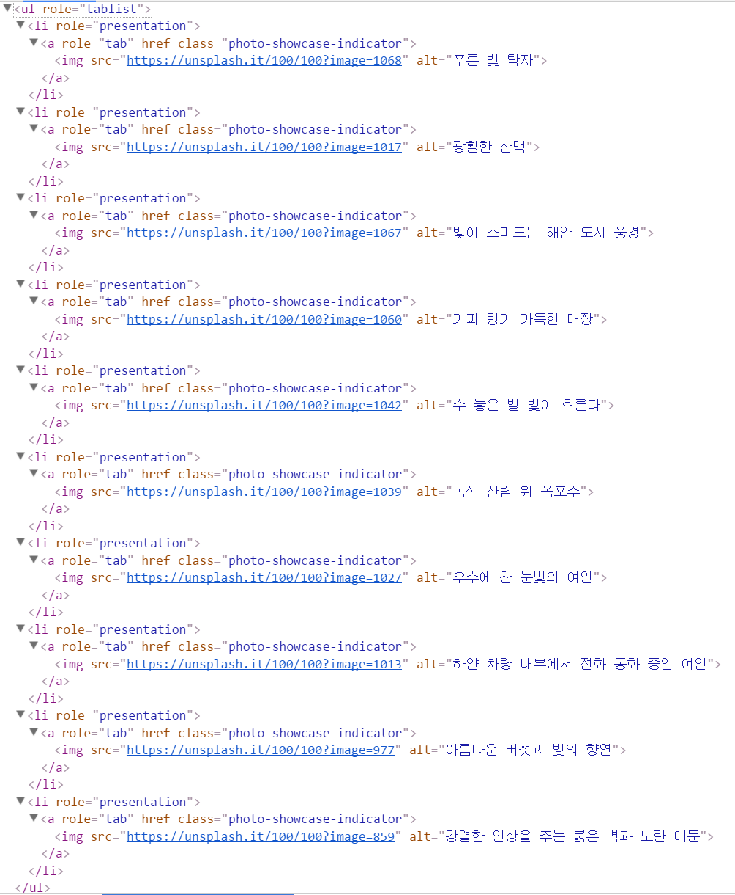

# node creation
## element node
```javascript
// syntax
var elementNode = document.createElement('element name');
// elementNode.nodeName : element name
```
## attribute node
```javascript
// syntax
var attributeNode = document.createAttribute('attribute name');
// attributeNode.nodeName : attribute name
// attributeNode.nodeValue : ''
```
## text node
```javascript
// syntax
var textNode = document.createTextNode('text');
// textNode.nodeValue : text
```
# node manipulation
## append a child node
```javascript
// syntax
var appendedChild = parentElementNode.appendChild(appendedChild);
// appendedChild : node;
// parentElementNode : element node;
```
## insert a node
```javascript
// syntax
var insertedNode = parentElementNode.insertBefore(insertNode, referenceNode);
// insertNode : node;
// parentElementNode : element node;
// referenseNode : parentElementNode의 자식 node. insertNode 의 앞에 위치하게 된다.
```
## remove a child node
```javascript
// syntax
// removedChild 의 참조를 유지하는 경우.
var removedChild = parentElementNode.removeChild(removedChild);
// removedChild : node;
// parentElementNode : element node;

// removedChild 의 참조를 유지하지 않는 경우.
node.removeChild(removedChild);
```
# applications
## API utility
```javascript
// API namespace 안에 아래 코드를 삽입하면 된다.

// create element node
var createElement = function ( name ) {
  // parameter type validation 위치
  return document.createElement( name );
};
// name : element node

// create text node
var createText = function ( nodeValue ) {
  // parameter type validation 위치
  return document.createText( nodeValue );
};
// nodeValue : text value

// create attribute node
var createAttribute = function ( name ) {
  // parameter type validation 위치
  return document.createAttribute( name );
};
// name : attribute name

// create element node with its content
var createEl = function(name, content) {
  // parameter type validation 위치
  var el = createElement( name );
  
  // content 가 null이 아니고 string 값을 갖고 있다면,
  // content 를 값으로 갖는 text node를 생성하고
  // 'el'에 자식으로 집어 넣는다.
  if( content && isType(content, 'string') ) {
    var text = createText(content);
    appendChild(el, text);
  }
  return el;
};
```
## create and manipulate mark-up structure in run-time
### target mark-up structure

### js code
```javascript
// no-name namespace (IIFE)
// FDS is user API
(function ( global, document, FDS ) {
  'use strict';

  // indices for each image urls
  var imageIndex = [1068, 1017, 1067, 1060, 1042, 1039, 1027, 1013, 977, 859];

  // alternative mentions for each images
  var imageAlt = ["푸른 빛 탁자", "광활한 산맥", "빛이 스며드는 해안 도시 풍경", "커피 향기 가득한 매장", "수 놓은 별 빛이 흐른다", "녹색 산림 위 폭포수", "우수에 찬 눈빛의 여인", "하얀 차량 내부에서 전화 통화 중인 여인", "아름다운 버섯과 빛의 향연", "강렬한 인상을 주는 붉은 벽과 노란 대문"];
  
  // image size information
  var imageInfo = {
    imageHost: '',
    big: {
      width: 900,
      height: 420
    },
    thumbnail: {
      width: 100,
      height: 100
    }
  };
  // Get a image url template from an actual DOM element's attribute.
  imageInfo.imageHost = FDS.selector('figure.photo-showcase > img').getAttribute('src').substr(0, 20);

  // Get an unordered list element node from actual DOM
  var ul = FDS.selector('ul');

  // make structure like 'ul > li*10 > a > img'
  for ( var i = 0; i < 10; i += 1 ) {
    // <li role="presentation"> ... </li>
    var li = FDS.createElement('li');
    li.setAttribute('role', 'presentation');

    // <a role="tab" href="" class="photo-showcase-indicator"> ... </a>
    var a = FDS.createElement('a');
    a.setAttribute('role', 'tab');
    a.setAttribute('href', '');
    a.setAttribute('class', 'photo-showcase-indicator');

    // 
    var img = FDS.createElement('img');
    img.setAttribute('src', ('https://unsplash.it/' + imageInfo.thumbnail.width + '/' + imageInfo.thumbnail.height + '?image=' + imageIndex[i]));
    img.setAttribute('alt', imageAlt[i]);

    //ul > li[0-9] > a > img
    FDS.appendChild(img, a);
    FDS.appendChild(a, li);
    FDS.appendChild(li, ul);
  }
})( window, window.document, window.FDS );
```
## WAYs to give each \<li\> nodes its own indcies
### WAY 1
```javascript
// no-name namespace (IIFE)
// FDS is user API
(function ( global, document, FDS ) {
  // omit...

  for ( var i = 0; i < 10; i += 1 ) {
    // omit...

    // create anchor element
    var a = FDS.createElement('a');

    // omit...

    // 'a.onclick' 은 뒤따르는 IIFE 함수가 반환하는 익명 함수를 참조하게 되는데, 이 익명함수는 for문의 각 단계에서 특정된 i의 값을 보관하는 index라는 클로저 변수를 parameter 로 받는다.
    // 이 코드는 매 반복마다 IIFE 함수를 생성한다는 문제점을 갖고 있다.
    a.onclick = (function ( index ) {
      return function () {
        index = index;
        // prevent default action
        return false;
      };
    })( i );
  }
})( window, window.document, window.FDS );
```
### WAY 2
```javascript
// no-name namespace (IIFE)
// FDS is user API
(function ( global, document, FDS ) {
  // omit...

  for ( var i = 0; i < 10; i += 1 ) {
    // omit...

    // create anchor element
    var a = FDS.createElement('a');

    // omit...

    // 'a.onclick' 는 'changeShowcaseView' 함수가 반환하는 익명함수를 참조하게 된다.
    // 함수를 반환하는 changeShowcaseView는 첫 사례와는 다르게 한번만 만들어지고 반복 호출된다.
    a.onclick = changeShowcaseView( i );
  }

  function changeShowcaseView( index ) {
    return function () {
      index = index;
      // It has a closure variable-parameter 'index' which has a copied value of 'i' from 'for' loop.
      // prevent default action
      return false;
    };
  }

})( window, window.document, window.FDS );
```
### WAY 3
```javascript
// no-name namespace (IIFE)
// FDS is user API
(function ( global, document, FDS ) {
  // omit...

  for ( var i = 0; i < 10; i += 1 ) {
    // omit...

    // create anchor element
    var a = FDS.createElement('a');

    // omit...

    // 'a.onclick' 은 changeShowcaseView 를 참조한다.
    // 'a' 는 i값을 자신의 프로퍼티로 값복사 한다.
    a.onclick = changeShowcaseView;
    a.index = i;
  }

  function changeShowcaseView( ) {
    // The 'this' context refers calling 'a'.
    this.index;
    return false;
  }

})( window, window.document, window.FDS );
```
## Make nav visible when it gets keyboard focus
### js
```javascript
(function ( global, document, FDS ) {
  // omit...
  
  for ( var i = 0; i < 10; i += 1 ) {
    // omit...
  }

  var container = FDS.selector('.photo-showcase-container');
  var controller = FDS.selector('.photo-showcase-controller [role="tablist"]');
  
  // 아래의 두 변수는 반드시 위의 for 문 다음에 나와야 한다.
  // 이들은 for 문 안에서 동적으로 생성되는 요소를 참조하기 때문이다.
  var indicator_first, indicator_last;
  indicator_first = FDS.selector('li:first-child a', controller);
  indicator_last = FDS.selector('li:last-child a', controller);

  // 첫번째 nav > a 가 focus를 얻으면,
  // 이의 조상인 container에 active라는 class attribute를 추가한다.
  indicator_first.onfocus = function () {
    var container_class = container.getAttribute('class');
    container_class += ' ' + 'active';
    container.setAttribute('class', container_class);
  };

  // 첫번째 nav > a 가 focus를 잃으면,
  // 이의 조상인 container에 active라는 class attribute를 제거한다.
  indicator_last.onblur = function () {
    var container_class = container.getAttribute('class');
    // replace from matched character pattern 'active' to ''.
    container_class = container_class.replace(/active/, '').trim();
    container.setAttribute('class', container_class);
  };

  // omit...

})( window, window.document, window.FDS );
```
The code above needs the CSS below...
```css
.photo-showcase-container.active .photo-showcase-controller,{
  opacity: 1;
}
```


# Methods of String.prototype
```javascript
String.prototype.charAt(index);
String.prototype.substring(start, end);
String.prototype.substr(start, length);
String.prototype.indexOf(string);
String.prototype.slice(start, end);
String.prototype.split(string);
String.prototype.replace(string, string);
String.prototype.replace(regExp, function(){});
```