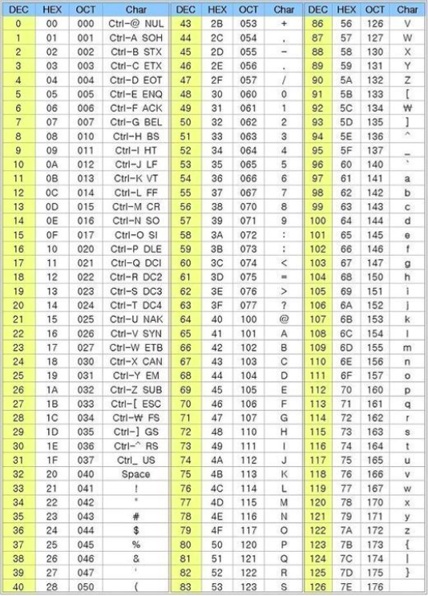
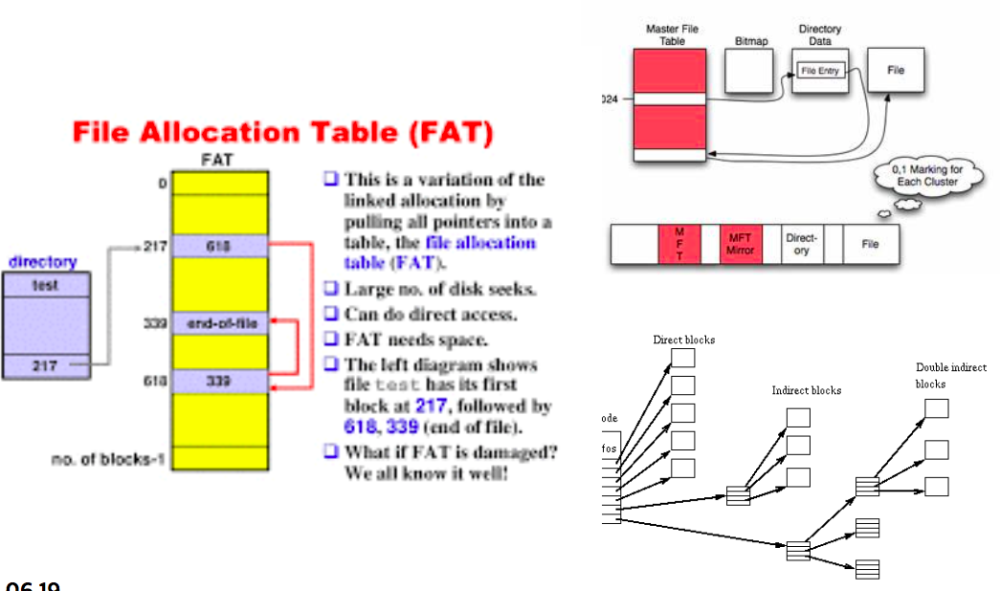
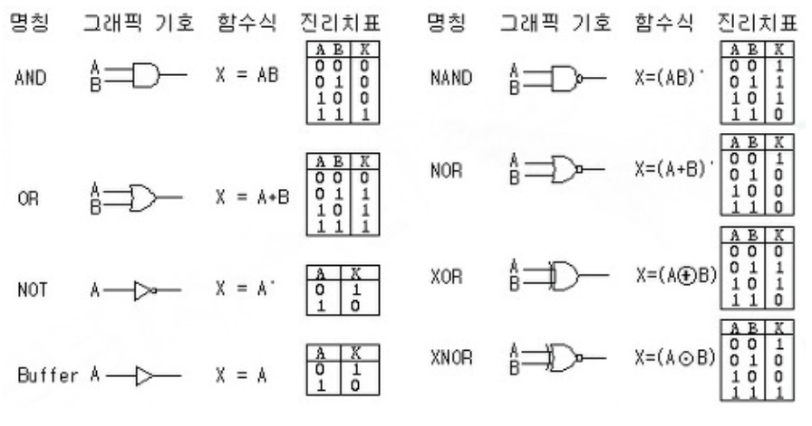
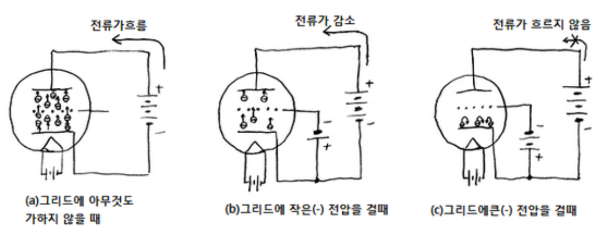
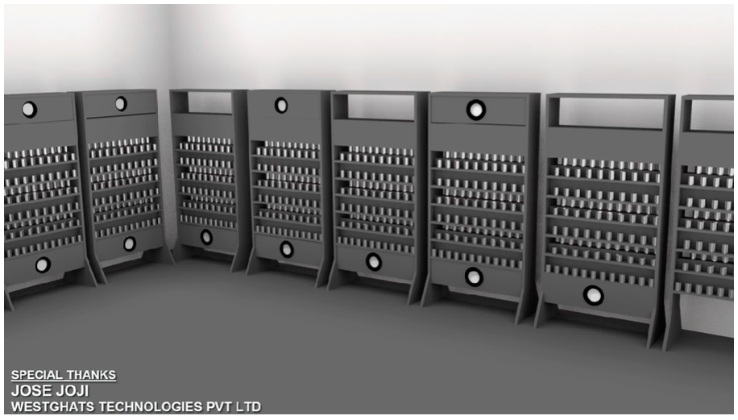
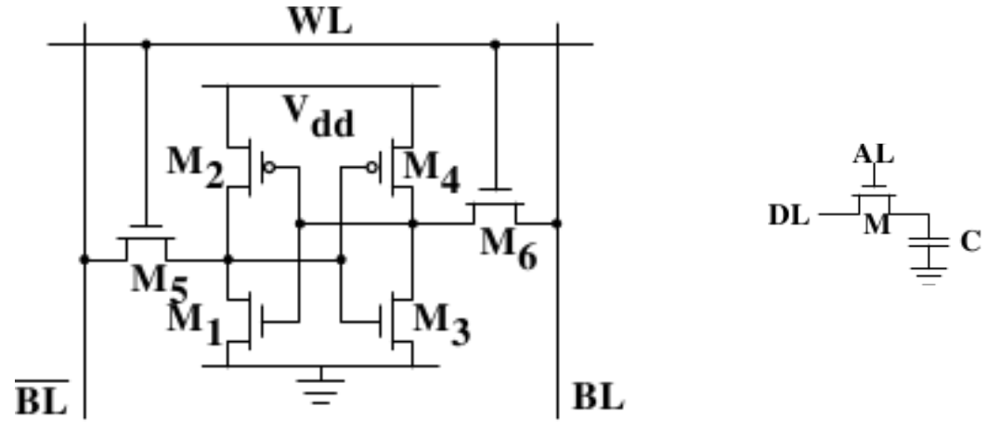
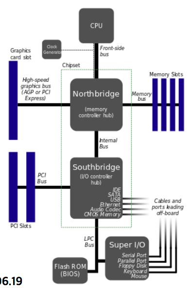

# 컴퓨터의 이해

## 바이너리 에디터 사용해보기
> 모든 프로그래밍 언어는 숫자(0,1)밖에 모른다.

- macOS iHex - (앱스토어)
- windows HxD - (https://mh-nexus.de/en/hxd/)
- Computaion Thinking (컴퓨터적 사고)

## 어셈블러 도전

- 대소문자 가리지 않음
- 최초의 Human readable 프로그래밍 언어
- 0x를 붙이면 16진수, 붙이지 않으면 10진수
- db 명령어 - ‘data byte’ 약자, 파일에 내용을 1바이트 만큼 쓴다
- resb 명령어 - ‘reserve byte’ 약자, 0을 뒤에 나오는 숫자 갯수만큼 채운다. 주석은 ;
  

## Floopy disk

- 컴퓨터 보조 기억 장치
- 껍데기 안에 자성체로 덮여 있는, 회전할 수 있는 원판이 들어있음

- [위키 참조](https://ko.wikipedia.org/wiki/%ED%94%8C%EB%A1%9C%ED%94%BC_%EB%94%94%EC%8A%A4%ED%81%AC)

### 플로피 디스크의 논리적 구조
- 섹터 / 트랙 / 플래터 / 클러스터

## File Allocation Table

- 파일 할당 테이블(FAT)은 컴퓨터 시스템에 쓰이는 컴퓨터 파일 시스템 구조이다.
- FAT에는 여러가지 종류가 있으며 운영체제의 종류에 따라 지원하는 FAT 종류에 차이가 있다.
- 운영체제는 FAT를 통해 파일관련 서비스를 제공 한다.
- [FAT 12 SPEC](http://www.dfists.ua.es/~gil/FAT12Description.pdf)
- 

## 논리 게이트

## CPU

- 진공관 - 트렌지스터 - IC
- 반가산기 설계
- 진공관
  
- 트랜지스터
  

### 폰노이만 구조

- 프로그램을 의미한다.
- 폰 노이만이 고안한 “내장 메모리 순차” 처리 방식
- 데이터와 메모리가 구분되어 있지 않고 하나의 버스를 가지고 있음
- 하드웨어는 물리적인 게이트를 통해서 결과값을 얻는 것.
- 데이터와 코드(변수, 함수...)는 물리적으로 같지만 논리적(역할)으로 구분된다.

### 하버드 구조

- 하버드 마크I(Harvard Mark I) 에서 나온 구조
- 메모리와 데이터의 버스가 구분되어 있다.

### CPU 구조

### 비트 연산자 (C와 JAVA)

- | (or 연산자) : 1101|0110 = 1111
- & (and 연산자) : 0101|1100 = 0100 
- ^ (xor 연산자) : 1010|0001 = 1000 
- ~ (not 연산자) : ~0111 = 1000

### 클럭과 CISC / RISC

- 매 클럭시마다 머신(CPU)의 상태는 변화됨 
- CISC (Complex Instruction Set Computer) 
- RISC (Reduced Instruction Set Computer) 에너지 절약 

### 클럭 이야기

- 486 시절 : SX(33Mhz) / DX(33Mhz) / DX2(66Mhz)
- SX / DX 차이 : FPU(Floating Point Unit) 유무 
- DX까지는 CPU와 주변 기기의 클럭차이가 없었음 
- DX2 부터는 클럭 차이가 생김
- 클럭이 높아지면서 생기는 이야기 -> 이후 버스에서

### 동기 / 비동기

- 동기(syncronization) 는 대상이 클럭에 의존함을 의미 
- 비동기는 클럭에 의존하지 않음
- 블록 / 논블록(javascript콜)과 유사

### 인터럽트
- 하드웨어 인터럽트 / 소프트웨어 인터럽트
- 인터럽트 벡터 : 일종의 함수 테이블
- 인터럽트는 주어진 임무를 완수하고 이전에 하던 작업으로 복귀 해야 한다 -> 컨텍스트 스위칭
  

### PIO/DMA

- PIO(Programmed Input/Output) 
- DMA(Direct Memory Access)
- 둘중에 어느것이 빠를까? * DMA와 인터럽트

## 메모리

### SRAM / DRAM

### SR 래치/플립플롭(SRAM)

### 캐시메모리 / 캐시 히트

- 캐시 히트란? 한 객체가 캐시에서 특정 데이터를 가져오려고 시도를 할때 특정 데이터가 존재 하는 경우
- 캐시 미스란? 한 객체가 캐시에서 특정 데이터를 가져오려고 시도를 할때 특정 데이터가 존재하지 않는 경우 -> 캐시 갱신 필요
- 생각해볼 문제 : 캐시는 CPU에만 존재할까?

## I/O

### 디스크

- 순차적 접근 - HDD (앞의 플로피 디스크 참조) 
- 비순차적 접근 - SSD
- 차이의 근본적인 원인 - 기구적 설계
- 좋은걸 놔두고 안좋은걸 쓰는 이유 - 돈

### 직렬 / 병렬 통신

- 직렬 : 한번에 하나의 비트를 전송 
- 병렬 : 한번에 다중 비트를 전송
- 컴퓨터의 역사를 살펴보면 병렬 통신이 직렬 통신에 자리를 내준다. 이유는 무엇일까?

### 버스의 역사

- ISA - EISA - VESA - PCI -AGP - PCI Express
- 각 시기별 한계를 극복하기 위해 새로운 버스 규격 등장

### 컨트롤러

- I/O 기기에는 컨트롤러가 전부 내장 되어있다.
- 컨트롤러에는 다른 기기와 통신을 하기 위한 프로토콜이 내장 되어있다.
- 컨트롤러에는 자체 I/O를 위한 자체 CPU가 내장되어 있다.

### 인텔 메인보드 아키텍쳐

> 노우스 브릿지
- 인텔 칩셋에서는 메모리 컨트롤 허브 (Memory Controller Hub, MCH)라 고 부름
- CPU와 가깝다.
- CPU / RAM / VIDEO - 고속용
- FSB와 관련

> 사우스 브릿지
- 인텔 칩셋에서는 입출력 컨트롤 허브 (I/O Controller Hub, ICH)라고 부름
- CPU와 멀다
- I/O용
- 상대적으로 저속