# 자료구조

## 배열과 2차원 배열
### 배열
  - C, Java 와 같은 언어에서 배열은 동일한 데이터 타입의 데이터를 여러개 담을 수 있는 자료구조이다.
  - Javascript의 경우 동적 형지정 언어로 배열의 데이터 타입으로 다양한 데이터가 담길 수 있다.
  - 배열의 인덱스를 통한 접근은 배열의 메모리 시작 주소에서부터 주소연산을 통해 접근하는 방식이다.
### 2차원 배열
  - 배열의 요소로 배열을 갖고 있는 형태
  - 배열의 요소로서 배열을 갖는 형태를 여러 레벨에 걸쳐 선언할 경우 N차원 배열 선언이 가능하다.
```javascript
var a = [ [1,2,3], [4,5,6], [7,8,9] ];
// 사람이 이해하기 쉬운 좌표형식으로 나타내면 아래와 같다.
// 1,2,3
// 4,5,6
// 7,8,9
// (1,2) = 2, (3,1) = 7, (2,2) = 5
console.log(a[0][1]); // 2
console.log(a[2][0]); // 7
console.log(a[1][1]); // 5
```

<br>

## 해쉬테이블(Hash table)
> `해쉬(Hash)`  
> 임의의 크기를 가진 데이터를 고정된 데이터의 크기로 변환 시키는것.  
* 이를 이용해 특정한 배열의 인덱스나 위치를 입력하고자 하는 데이터의 값을 저장하거나 찾을 수 있다.  
* 해쉬를 이용하면 즉시 저장하거나 찾고자 하는 위치를 찾을 수 있어 빠른속도로 데이터를 처리할 수 있다.  

> `해쉬테이블(Hash table)`  
> Hash Table은 key-value쌍에서 key 값은 테이블에 저장 할때, key값을 함수를 이용하여 계산한 뒤, 그 결과값을 배열의 인덱스로 사용하여 저장하는 방식.  
* key값을 계산하는 함수는 함수를  해쉬함수(Hash Function)라고 하며, 해쉬 함수는 입력으로 key를 받아, 0부터 배열의 크기-1 사이의 값을 출력하게 된다.  
* 해쉬 함수의 경우, 서로 다른 key값이 같은 해쉬값을 가지는 ‘충돌’이 발생할 수 있는 큰 문제점을 가지고 있으므로, 충돌을 어느정도 허용하되 이를 최소화 하는 방법을 사용하기도 한다.

<br>

## 프로토타입(Prototype)
>문자 그대로 해석하면 원형이라는 뜻으로, 자바스크립트에서 prototype은 모든 함수의 속성으로 포함되어 있으며 객체를 참조한다.
* 사용자가 생성한 모든 함수는 prototype 속성(프로퍼티)을 가지는데, 이 속성은 객체를 참조한다.
  - prototype 객체의 constructor 속성은 함수의 값을 참조한다. (기본값으로 설정됨)
* prototype 객체에 멤버를 추가하면 생성자를 통해 생성된 객체(인스턴스)는 이를 물려받아 사용가능하다.
* 자바스크립트에서 모든 객체들은 최소한 하나의 다른 객체로부터 상속을 받는다. 상속을 제공하는 객체를 prototype이라고 부르며, 상속되는 속성들은 prototype 이라는 생성자 함수 객체에서 찾을 수 있다.

### prototype chain
* 객체가 특정 속성에 접근할 때, 해당 객체에 속성이 존재하지 않을 경우 상속 하는 prototype 객체를 확인한다.
* prototype 객체는 다른 객체로부터 상속 받을 수 있다. 이러한 연쇄적인 상속형태를 prototype chain이라고 한다.


### prototype 객체 접근
```javascript
function Person () {}
var person = new Person();
// 1. Person.prototype
// 2. person.constructor.prototype
// 2. person.__proto__
// 3. Object.getPrototypeOf(person)
```
1. 생성자함수.prototype
2. (new 연산자를 사용해 생성한 객체).constructor.prototype
3. (new 연산자를 사용해 생성한 객체).\_\_proto\_\_
4. Object.getPrototypeOf(new 연산자를 사용해 생성한 객체)

### 생성자 함수
* 자바스크립트에서는 new 연산자를 이용해 함수를 통해 객체를 생성할 수 있다.
* 이러한 함수 객체를 생성자 함수라고 한다.
* 자바스크립트에서 생성자 함수와 일반적인 함수를 문법적으로 구분하는 방법은 없다.
  - 따라서 생성자 함수 용도로 만들었지만 일반 함수처럼 new 키워드를 사용하지 않고 호출 할 수 있다.
  - 의도치 않은 실행을 막기 위해서 new를 강제하는 패턴을 사용할 필요가 있다.
* 생성자 함수는 통상적인 관례로 함수명의 첫 글자를 대문자로 지정한다.

### prototype 예제
```javascript
function Person () {}
Person.prototype.talk = function() {
    console.log('blah blah');
}
var person1 = new Person();
var person2 = new Person();

person1.talk(); // blah blah
person2.talk(); // blah blah

// method override
// 해당 객체에 talk 메소드가 있기때문에 prototype chain을 수행하지 않는다.
person1.talk = function() {
    console.log('wow wow');
}
person1.talk(); // wow wow
```

<br>

## 포인터(Pointer)
> 포인터(pointer)는 프로그래밍 언어에서 다른 변수, 혹은 그 변수의 메모리 공간주소를 가리키는 변수를 말한다. 포인터가 가리키는 값을 가져오는 것을 역참조(逆參照, dereferencing)라고 한다.  

### primitive type vs reference type
  - primitive type : number, string, null, undefined, boolean 과 같이 변수가 가리키는 주소안에 상수값을 갖는 타입
  - reference type : object, array, function 과 같이 변수가 가리키는 주소안에 주소값을 갖는 타입(참조)

### 자바스크립트의 객체(object)는 pointer
  - 자바스크립트의 객체 또한 특정 변수에 담길 경우 해당 객체의 주소값으로 저장된다.
  - 주소 참조를 하는 변수 값을 다른 변수에 할당 했을 때 참조하는 곳이 같다.
```javascript
    var obj = {
        a: 1,
        b: 2
    };
    var obj2 = obj;  // 주소 복사
    // obj의 주소값을 obj2로 복사 했기 때문에 동일한 참조를 하고 있다.
    // 따라서 obj 변수에 초기화했던 객체의 속성에 접근할 수 있다.
    console.log(obj2.a); 
```

<br>

## 재귀 함수(Recursive function)
> 하나의 함수에서 자신을 다시 호출하여 작업을 수행하는 함수 

* 재귀 함수를 수행하면 가장 마지막에 호출된 함수 실행이 가장 먼저 종료되고, 가장 먼저 호출된 함수 실행이 가장 늦게 종료된다.
* 함수가 호출될 때 스택 메모리를 사용하는데 재귀호출은 함수가 꼬리에 꼬리를 물고 실행되기 때문에 계속해서 메모리에 쌓이게 된다.
* 재귀 함수는 반드시 종료 조건이 필요하며, 많은 호출이 발생할 경우 스택 메모리가 부족해지는 에러(stack overflow)가 발생한다.

```javascript
function factorial(n)
{
    if (n <= 1) {
        return 1;
    }
    else {
        return n * factorial(n - 1);
    }
}

var result = factorial(5); // 120
```

<br>

## Big O Notation(빅 O 표기법)?
* 시간 복잡도를 표기하는 방법 중 big-O 표기법이 있는데 이는 실행 시간 n을 O(n)으로 표기한다. 일반적으로 양의 두 함수 f와 g에 대한 f(n) = O(g(n))은 함수 f(n)의 시간 복잡도가 O(n)이라는 뜻이다.
* 여기서 시간 복잡도란 프로그램이나, 알고리즘을 실행시켜 완료하는데 걸리는 시간을 의미한다. 
* O 표기법은 알고리즘의 최악의 성능을 표시해 주며 Θ 표기법,  Ω 표기법 등도 존재하지만 O 표기법을 많이 사용한다.

example
```javascript 
 var data = [[1,2,3], [1,2,3], [1, 2, 3]];
 for(var i in data) {
     var arr = data[i]
     for(var j in arr){
         var obj = arr[j];
     }
 }
 // 위 코드에서의 시간 복잡도는 O(n^2) 이다 
 ```

```javascript 
var  array= ["a","b","c","d"];
 var findIndex = function(items, match){
     for( var i = 0, total = items.length; i < total; i++) {
        if(items[i] === match)
        return i;
     }
     return -1;
 }
 findIndex(array, "a");   // 0
 // 위 코드에서의 시간 복잡도는 O(n)
 ```

<br>

## 리스트(List)
> 데이터를 순차적으로 나열해 놓은 집합을 가리키는 자료구조의 추상적인 개념으로 비슷한 성질의 데이터를 순서를 고려하여 그룹화 시키고자 할 때 주료 사용하는 자료 구조이다 .

* 리스트는 배열의 index라는 장점을 버리고 빈틈없는 데이터의 적재라는 장점을 취한 자료구조이다.
* Array를 사용 시 가 데이터 처리시에 훨씬 빠르지만  리스트의 경우 데이터의 입력, 삭제가 더 간편하다.
  - 리스트 중간에 데이터를 삽입 시 해당 인덱스 이후 데이터들이 한칸씩 뒤로 이동 후 그 위치에 값이 저장된다 즉, 데이터 손실이 없다.
  - 배열은 빈 공간이 생길 수 있지만, 리스트는 빈 공간을 허용하지 않는다 .


<br>

## Linked List
> 각 노드가 데이터와 포인터를 가지고 한 줄로 연결되어 있는 방식으로 데이터를 저장하는 자료 구조이다. 데이터를 담고 있는 노드들이 연결되어 있는데 노드의 포인터가 다음이나 이전의 노드와의 연결을 담당하게 된다.
* single linked list : 각 노드에 자료 공간과 한 개의 포인터 공간이 있고 각 노드의 포인터는 다음 노드를 가리킨다.  
* double linked list : 단일 연결 리스트와 비슷하지만, 포인터 공간이 두개 가 있고 각각의 포인터는 앞의 노드와 뒤의 노드를 가리킨다.  

```javascript 
  function Node(data) {
    this.data = data;
    this.next = null;
}
function SinglyList() { 
    // 싱글 링크드 리스트 정의 
    this._length = 0;
    this.head = null;
}
// method 정의 
SinglyList.prototype.add = function(value) {
    var node = new Node(value),
        currentNode = this.head;
 
    // 1st case  빈 리스트 
    if (!currentNode) {
        this.head = node;
        this._length++;
         
        return node;
    }
 
    // 2nd case : 비지 않은 리스트 
    while (currentNode.next) {
        currentNode = currentNode.next;
    }
 
    currentNode.next = node;
 
    this._length++;
     
    return node;
};
```

<br>

## 스택(Stack)
> 입력과 출력을 한 방향으로 제한한 자료구조  
> 스택의 구조는 바닥부터 데이터를 차곡 차곡 쌓아간다는 개념으로 후입선출(Last-in, First-out : LIFO, 나중에 입력된 데이터가 출력을 명령받을 시에는 제일 먼저 출력된다는 뜻)구조를 가진 자료구조를 가진다.  
> 이러한 방식으로 데이터를 추가(push)하거나 제거(pop)할 수 있다.
* 스택 언더플로우(Stack Underflow)
  - 스택이 비어 있는데 사용가자 Pop을 명령한 경우 스택 언더플로우 발생.
  - 스택 언더플로우 발생시, 에러 메세지를 출력하는 등의 예외처리가 필요하다.
* 스택 오버플로우 (Stack Overflow)
  - 스택 크기보다 더 많은 데이터를 Push 하려고 명령하는 경우 스택이 가득차서 더이상 Push명령을 할 수 없는 경우 스택 오버플로우 발생.
  - 스택 오버플로우도 스택 언더플로우와 마찬 가지로 예외처리를 해줘야 한다.  
* 스택 프레임(Stack Frame)
  - 스택에 저장되는 함수의 호출 정보를 스택 프레임(Stack Frame)라고 하며, 이러한 스택 프레임에는 함수로 전달되는 인수와, 함수 실행 모두 마치면 돌아올 복귀 주소와 지역 변수 등의 정보가 들어간다. 빠르고 손쉽게 지역 변수 혹은 인수 등에 접근하기 위해 EBP 레지스터(스택의 크기를 조정하는 레지스터)를 통하여 스택 프레임을 참조할 수 있습니다.

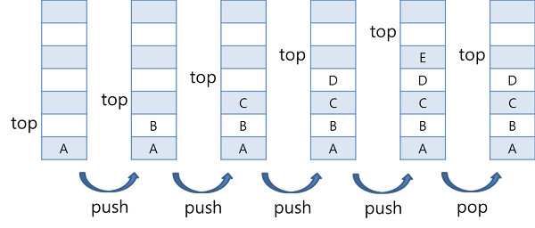

<br>

## 큐(Queue)
> 큐는 스택과 굉장히 유사하다. 스택의 경우  후입선출 방식을 사용한다면, 큐의 경우 선입    선출(First In First Out, 줄여서 FIFO)방식을 사용한다.
* FIFO방식은 처음으로 저장한 데이터를 처음으로 사용한다는 면에서 배열과는 사뭇 다르다.
* 큐의 개념은 대기표 시스템을 통해 예를 들수 있다. 
  - Put : 대기표를 받는다. 즉, 도착하는 차례대로 데이터를 저장.
  - Get : 대기 순서대로 차례가 정해진다. 즉, 처음 저장된 데이터부터 차례로 사용.
  - 주요 메서드 
    1. enqueue : 큐에 데이터를 넣음
    2. dequeue : 큐에 데이터를 뺌     
* queue overflow / underflow 
  - 큐 언더플로우는 큐가 비어있을 때 Get을 하는 경우에 발생.
  - 큐 오버플로우는 큐가 꽉차있을 때 Put을 하는 경우에 발생
* 환형큐 (circular queue) 
  - 선형 큐에서 Pop연산이 반복될 수록 큐에 저장할 수 있는 공간이 감소하는 문제점을 극복하기위해 고안.
  - 선형 큐에서 저장된 모든 데이터를 큐의 앞쪽으로 옮기기 위해서는 크기가 1,000,000인 큐의 경우 999,999번의 자료이동(shifting연산)이 필요한데, 이러한 비효율적인 연산을 대 원형의 형태로 구성한 새로운 형태의 큐. 
* 우선순위큐 (priority queue)
  - 연산의 결과로 먼저 들어간 데이터가 먼저 나오는 큐의 연산과 달리 우선순위 큐의 경우 들어간 순서에 상관없이 우선순위가 높은 데이터가 먼저 나온다.

<br>

## 트리(tree)
> 트리 구조는 한가족의 계보를 나타내는 족보나 회사의 조직도와 같이 생각할 수 있다.  
> 다른 자료구조보다 자료를 저장하거나 검색하는 등의 방법이 간단하고 메모리를 효율적으로 사용 할 수있다. 
* 트리 (tree) 용어
  - 루트(root)
  - 부모(parent) - 자식(child) 
  - 형제(siblings)
  - 잎(leaf) 노드 - 자식이 없는 노드
  - 깊이(depth)
  - 트리의 높이(height of tree)
  - 완전 이진 트리 (complete binary tree)
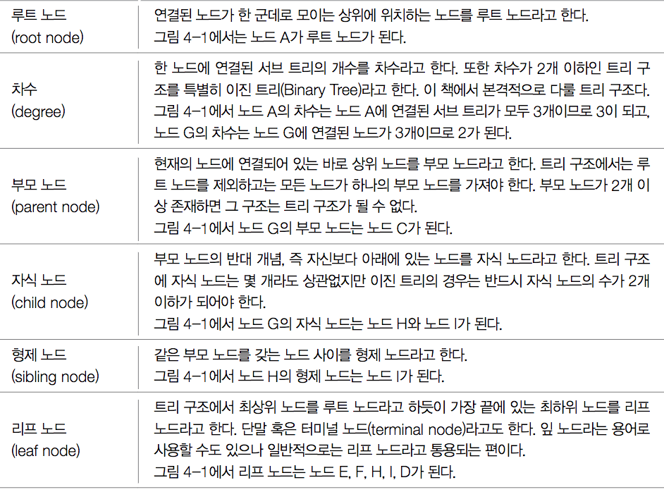
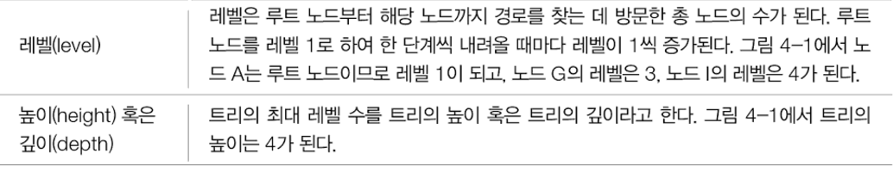

* 트리 종류
  - 이진 트리 
    - 자식노드를 2개 이하만 갖는 트리. 트리의 차수(Degree)가 2이하인 트리를 의미한다.
  - 이진 탐색 트리 
    - 이진 트리는 자식 노드가 최대 두 개의 노드를 지니고,  자식 노드가 아에 없거나, 왼쪽 자식 노드 혹은 오른쪽 자식 노드 하나만 존재하거나, 왼쪽과 오른쪽 자식 노드를 모두 지니는 경우입니다. 이진 탐색 트리는 핵심은 왼쪽 자식 노드가 부모 노드보다 작고, 오른쪽 자식 노드는 부모 노드보다 커야한다.
  - AVL-tree 
    - AVL트리는 Binary Search Tree(이하 BST)에서 가장 초기에 Balanced를 제시한 트리이다. BST의 장점은 탐색속도가 빠르다는 것이지만 편향 트리일 경우 단방향 연결리스트의 탐색과 같은 속도를 내기 때문에 AVL트리로  Balanced를 맞춰서 BST의 장점이 사라지지 않게 한다.
  - Red-black tree 
    - 이진탐색트리에 균형을 맞추는 기능을 추가한 트리.
    - 레드블랙트리가 되기 위해서는 이러한 조건이 만족한다.
      1. 노드는 레드 혹은 블랙 중의 하나이다.
      2. 루트 노드는 블랙이다.
      3. 모든 리프 노드는 블랙이다.
      4. 레드 노드의 자식노드 양쪽은 언제나 모두 블랙이다. (즉, 레드 노드는 연달아 나타날 수 없으며, 블랙 노드만이 레드 노드의 부모 노드가 될 수 있다)
      5. 어떤 노드로부터 시작되어 리프 노드에 도달하는 모든 경로에는 리프 노드를 제외하면 모두 같은 개수의 블랙 노드가 있다.
  - 쓰레드 이진 트리 
    - NULL 링크를 낭비하지 않고 순환호출 없이 노드들을 순회 할 수 있도록 중위 순회시에 선행노드인 중위 선행자나 중위 순회시 후속 노드인 중위 후속자를 저장시켜 놓은 트리.
  - 힙(heap) 
    - 큐를 이용해 우선순위를 선정한 후 이 순위에 따라 정렬하는 알고리즘.
        우선순위 큐의 구현은 힙(Heap)을 통해 가능하다.
  - B트리 
    - B트리는 자식을 두개만 가질 수 있는 이진 트리를 확장하여 더 많은 수의 자식을 가질 수 있게 일반화 한 트리.

<br>

## 그래프(Graph)
> 그래프는 실제 세계의 현상이나 사물을 정점(Vertex)와 간선(Edge)으로 표현을 하기 위해 사용한다.

* 예제 : 일상 생활에서 돈 관계를 그래프 구조로 표현

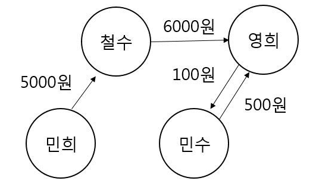

민희는 철수에게 5000원, 철수는 영희에게 6000원, 영희는 민수에게 100원, 민수는 영희에게 500원을 갚아야 하는 사물들 간의 관계를 그래프로 표현.

### 그래프의 용어
* V : 정점(Vertex, Node)  - 예) 철수, 민희
* E : 간선(Edge) - 예) 민희와 철수를 잇는 선
* W : 가중치(Weight) - 예) 민희와 철수 사이의 5000원
* G = (V,E) : 그래프 G는 집합 V와 이들간의 간선 E 로 구성
* G = (V,E,W)

### 그래프의 종류

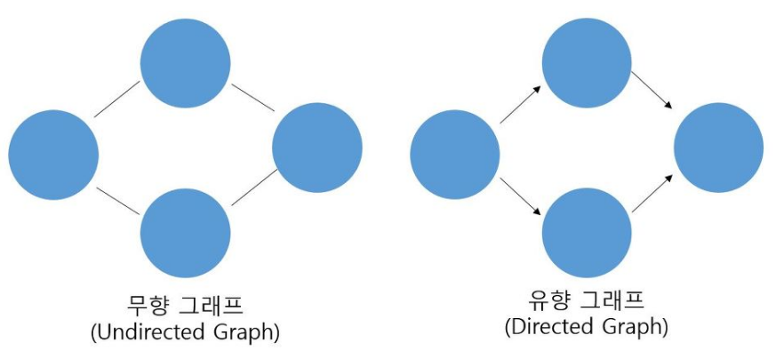

* 유향 그래프(Directed Graph) 
  - 정점 간의 간선의 방향이 존재할 경우
* 무향 그래프(Undirected Graph)
  - 정점 간의 간선의 방향이 없을 경우
* 가중치 - 정점 간의 간성이 특정한 값을 가지는 경우

### 그래프의 구현
* 인접 리스트(Adjacency List)
  - 연결 자료구조(연결 리스트)를 이용한 그래프의 구현
* 인접 행렬(Adjacency Matrix) 
  - 순차 자료구조(배열)을 이용한 그래프의 구현

<br>

## 검색(Search)
* 깊이 우선 탐색( DFS : Depth First Search)
  - 일반적으로 구현할 때는 스택(stack)을 이용하고, 트리나 그래프 같은 자료구조에서 데이터를 탐색할 때 사용는 알고리즘.
  - DFS 은 더 이상 나아갈 길이 보이지 않을 만큼 깊이 찾아가면서 탐색한다.
  - 만약, 나아갈 길이 존재하지 않으면 이전의 위치로 돌아와 찾아가지 않은 다른 길로 뻗어 나가면서 탐색해 나간다.
  - DFS를 구현하기 전에 정점과 정점의 연결 관계를 인접 행렬로 표현한다.
* 너비 우선 탐색( BFS : Breath First Search) 
  - BFS란 인접한 노드들을 차례대로 방문하도록 구현.
  - 즉, BFS는 한 갈림길에서 연결되는 모든 길을 한번씩 탐색하기 때문에 시작점에서 끝점까지의 최단경로를 알아낼 수 있음.
  - 깊이 우선 탐색(DFS)은 스택을 이용하지만, 너비 우선 탐색(BFS)은 큐를 이용한다.
  - 큐를 배열에서 사용하는 경우, 방향 데이터를 이용해 배열의 시작점에서 범위를 넓혀 가면서 탐색하는 것.

<br>

## 정렬(sort)
> 정렬이란 데이터를 순서대로 나열하는 방법을 의미.  
> 예를 들어 주소록의 이름을 오름차순으로 정렬한다든가, 블로그의 글을 최신순으로 보여주는 것이 정렬이 사용되는 예.

* 버블 정렬 (Bubble-sort)
  - 버블 정렬은 인접한 두 수를 비교해서 큰 수를 뒤로 보내는 정렬 방식.
  - 코드가 단순하기 때문에 직관적으로 쉽게 이해.
  - 단, 알고리즘적 관점에서 비효율적인 정렬방식이기에 실무에서는 거의 사용하지 않는 정렬방식.  
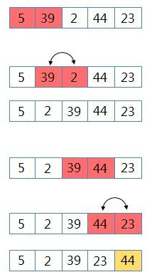

* 퀵 정렬 (Quick-sort)
  - 퀵 정렬은 가장 빠른 정렬 방식으로 가장 많이 사용되는 방식.
  - 퀵 정렬은 합병정렬과 비슷하게 보이지만 합병정렬과는 다르게 전체 데이터를 균등하게 분할하는 것이 아니라, 기준(pivot)을 선택하여 기준보다 작은 데이터를 왼쪽에 위치시키고, 큰 데이터는 오른쪽에 위치시킨다.
  - 일반적으로 기준은 첫번째 데이터로 선택한다. 즉, 퀵 정렬은 기준의 왼쪽에는 기준 보다 작은 데이터가, 오른쪽에는 큰 데이터가 위치하게 된다.
  - 퀵 정렬은 재귀적으로 더 이상 분할 할 수 없을 때까지 분할된 후 정렬을 수행한다.  
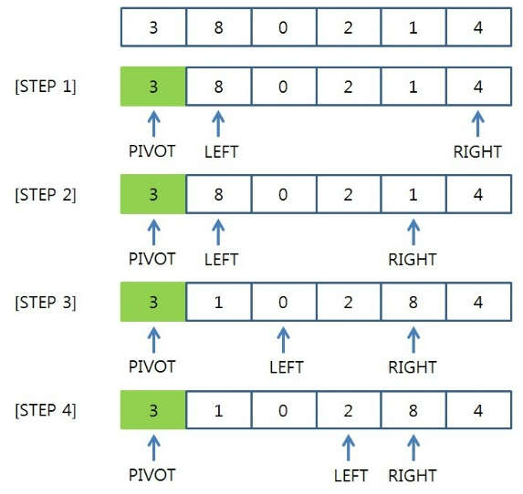
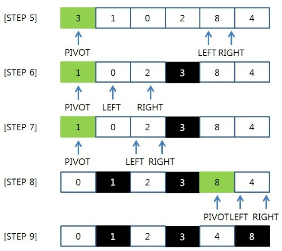

* 합병 정렬 (Merge-sort) 
  - 합병 정렬은 분할 정복(Divide and conquer) 방식으로 설계된 방식.
  - 분할 정복은 큰 문제를 반으로 쪼개 문제를 해결해 나가는 방식으로, 분할은 배열의 크기가 1보다 작거나 같을 때 까지 반복한다.
  - 입력으로 하나의 배열을 받고, 연산 중에 두개의 배열로 계속 쪼게 나간 뒤, 합치면서 정렬해 최후에는 하나의 정렬을 출력한다.  
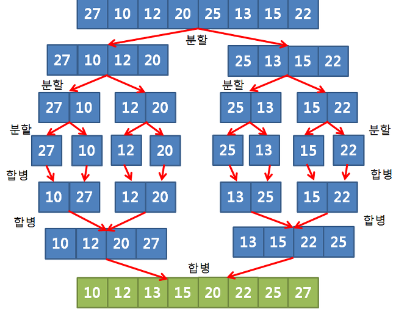

* 삽입 정렬 (Insert-sort)
  - 삽입 정렬은 모든 데이터를 앞의 수에서부터 차례로 비교하여 자신의 위치에 삽입을 통해 정렬하는 방식.
  - 배열이 길어질수록 효율이 떨어지지만 구현이 간단하다는 장점이 있음.  
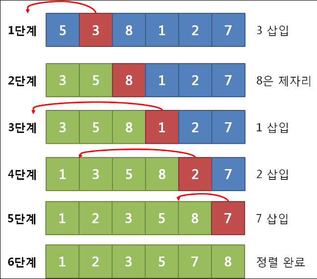

* 선택 정렬 (Select-sort)
  - 선택 정렬은 일반적으로 사람이 어떤 것을 크기 순서대로 정렬할 때 사용하는 방법과 유사한 방법.
  - 나열된 것 중에 가장 작은 또는 가장 큰 것을 선택하야 앞 또는 끝으로 보내는 작업을 반복하면 최종적으로 크기 순서대로 정렬 되는 방식.
  - 현재 위치에 저장 될 값의 크기가 크고 작음에 따라 최소 선택 정렬(Min-Selection Sort)와 최대 선택 정렬(Max-Selection Sort)로 구분 됨.
  - 최소 선택 정렬은 오름차순으로 정렬, 최대 선택 정렬은 내림차순으로 정렬  
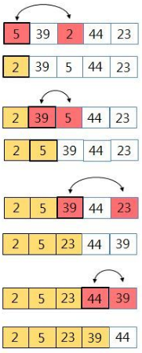

<br>

## 알고리즘
* 일을 처리하기 위한 단계
* 주어진 일을 처리하기 위한 이련의 단계

* 좋은 알고리즘을 만들기 위해서 필요한 두가지
  - 문제를 해결할 수 있는 것
  - 해결을 효과적으로 하는것

* 알고리즘의 효율성은 어떻게 측정하나
  - 점근선의 분석 이라는 방법으로 알고리즘을 비교할 수 있다.
  - [점근적 표기법 이란](https://ko.khanacademy.org/computing/computer-science/algorithms/asymptotic-notation/a/asymptotic-notation)
  - [점근적 표기법 형태의 함수](https://ko.khanacademy.org/computing/computer-science/algorithms/asymptotic-notation/a/functions-in-asymptotic-notation)
  - [알고리즘 효율성](https://ko.khanacademy.org/computing/computer-science/cryptography/comp-number-theory/v/algorithmic-efficiency)
* 동영상 : [알고리즘이란 무엇이며, 왜 중요한가?](https://ko.khanacademy.org/computing/computer-science/algorithms/intro-to-algorithms/v/what-are-algorithms)