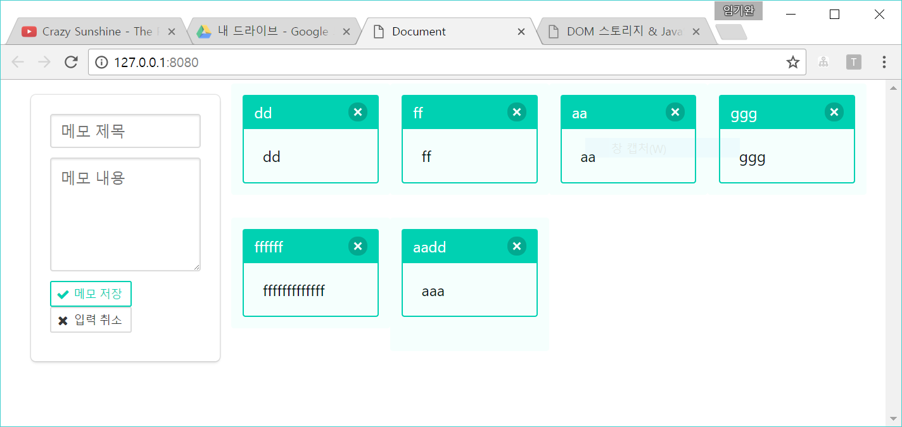
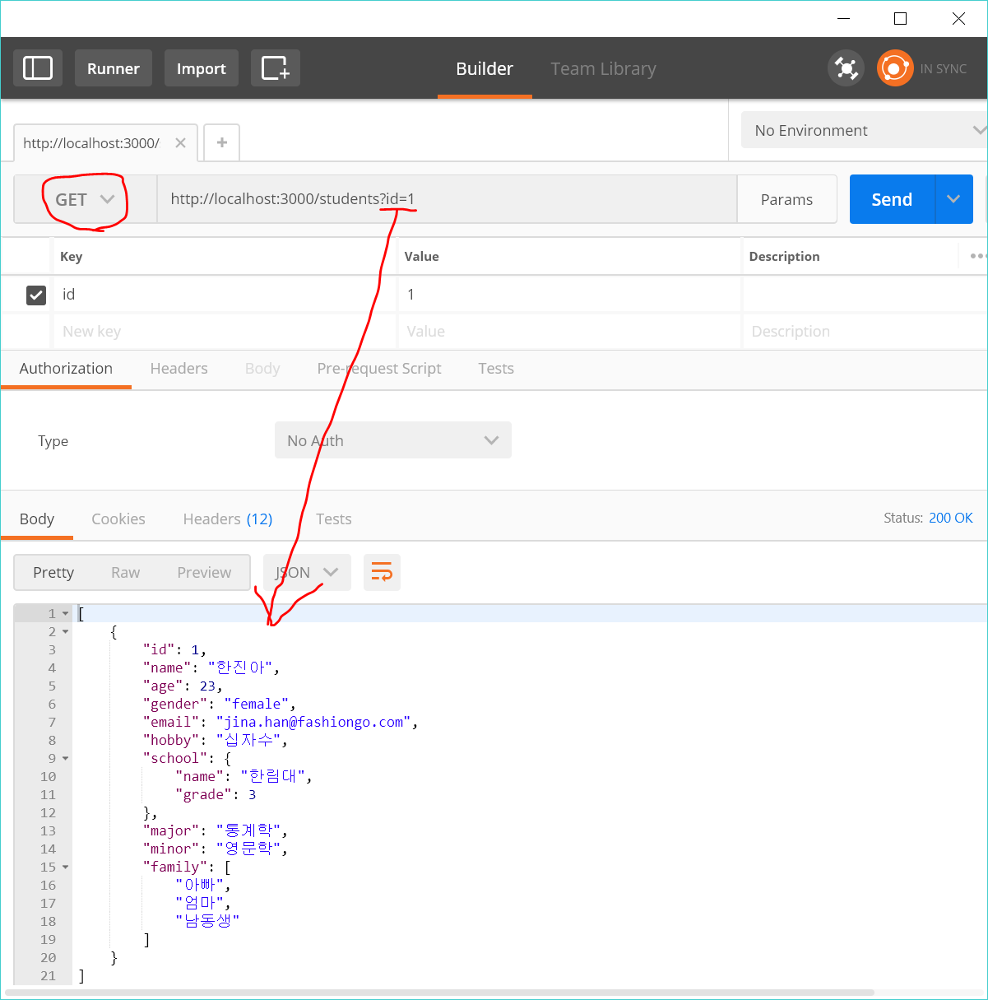
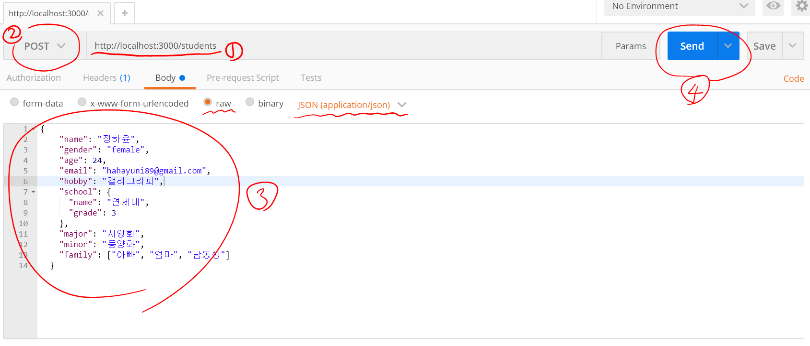

# local storage 이용하기

\
위와 같은 메모장 웹앱을 만들어 보자.\
실습에 쓰일 index.html의 body 구조는 다음과 같다.
```html
<body>
  <div class="app container is-fluid">
    <div class="columns">
      <div class="column is-3">
        <div class="memo box">
          <label class="sr-only" for="memo-title">메모 제목</label>
          <input class="input" type="text" id="memo-title" placeholder="메모 제목">
          <label class="sr-only" for="memo-content">메모 내용</label>
          <textarea
            class="textarea"
            id="memo-content"
            cols="30"
            rows="10"
            placeholder="메모 내용"></textarea>
          <div class="field is-group">
            <button type="button" class="is-save button is-primary is-outlined is-small">
              <span class="icon is-small">
                <i class="fa fa-check" aria-hidden="true"></i>
              </span>
              <span>메모 저장</span>
            </button>
            <button type="button" class="is-cancel button is-outlined is-small">
              <span class="icon is-small">
                <i class="fa fa-remove" aria-hidden="true"></i>
              </span>
              <span>입력 취소</span>
            </button>
          </div>
        </div>
      </div>
      <div class="column is-9">
        <div class="memo-item-container columns is-multiline"></div>
      </div>
    </div>
  </div>
</body>
```
index.html에선 'bulma' css framework를 사용하며 아래와 같은 css를 연결해야 한다.\
bulma는 font-awesome stylesheet에 의존성이 있으므로 반드시 이를 먼저 연결한다.
```html
<link rel="stylesheet" href="https://maxcdn.bootstrapcdn.com/font-awesome/4.7.0/css/font-awesome.min.css">
<link rel="stylesheet" href="https://cdnjs.cloudflare.com/ajax/libs/bulma/0.4.0/css/bulma.css">
```
그 외 간단한 스타일링을 한다.
```html
<style>
  .app.container {
    margin: 1rem 2rem;
  }
  .memo > * {
    margin-bottom: 10px;
  }
  .memo .textarea {
    width: 100%;
  }
</style>
```
\
\
위 index.html을 조작하기 위한 자바스zm립트 파일은 아래와 같은 iife를 이용한다.\
파일 이름은 native_storage.js로 하겠다.
```javascript
(function ( global ) { // window 객체를 global로 재명명
  'use strict';
  // .....
})( window );
```

이하는 별도의 언급이 없는 한 상기한 iife 내부에 작성된 것이다.\
먼저 선언된 변수들은 다음과 같다.
```javascript
// window.document를 doc으로 재명명
var doc = global.document;
// Array의 forEach()를 local forEach로 재명명
var forEach = Array.prototype.forEach;
// wndow.localStorage를 localStrg로 재명명
var localStrg = global.localStorage;
// local storage 내에서 메모 데이터의 id로 쓰일 문자열 값. (상수 취급)
var memo_data_id = 'memo-data';
// 돔 조작을 위해 쿼리 결과를 쥐고 있을 변수들
var memo, memo_buttons, memo_title, memo_content, memo_strg, memo_items, app;
```
iife 내에서 init()을 호출한다.
init()의 정의와 호출문은 다음과 같다.
```javascript
function init(){
  // document 내에서 'app'을 클래스로 갖는 첫번째 요소를 얻는다
  app = doc.querySelector('.app');
  // app 컨택스트 내에서 'memo'를 클래스로 갖는 첫번째 요소를 얻는다.
  memo = app.querySelector('.memo');
  // memo 컨텍스트 내에서 button 요소의 리스트를 얻는다.
  memo_buttons = memo.querySelectorAll('button');
  // app 컨텍스트 내에서 'memo-item-container'클래스로 갖는 첫번째 요소를 얻는다.
  memo_items = app.querySelector('.memo-item-container');
  // memo 컨텍스트 내에서 'memo-title'을 아이디로 갖는 요소를 얻는다.
  memo_title = memo.querySelector('#memo-title');
  // memo 컨텍스트 내에서 'memo-content'을 아이디로 갖는 요소를 얻는다.
  memo_content = memo.querySelector('#memo-content');

  // loadMemoData()를 호출. memo_data_id를 인자로 줌.
  loadMemoData(memo_data_id);
  // render()를 호출.
  render();
  // bind()를 호출.
  bind();
}
init();
```
loadMemoData()의 정의는 다음과 같다.
```javascript
function loadMemoData(id) {
  // local storage에서 id를 key로 하는 문자열 value를 얻어온다.
  var loaded_data = localStrg.getItem(id);
  // 해당 key:value가 존재하지 않는다면 key:value를 초기화 한다.
  // 초기화 value는 빈배열의 JSON 자료형.
  if(!loaded_data) {
    localStrg.setItem(id, JSON.stringify([]));
    // 아래의 default 동작을 위해 다시 한번 key의 value를 얻어온다.
    loaded_data = localStrg.getItem(id);
  }
  // default 동작으로 변수 memo_strg를 loaded_data로 초기화 한다.
  // 이때 JSON.parse()를 이용하여 문자열->객체로 형변환.
  memo_strg = JSON.parse(loaded_data);
}
```
render()의 정의는 다음과 같다.
```javascript
function render() {
  // forEach문을 위해 마크업 template 변수를 깨끗이 비운다.
  var template = '';
  // 준비된 template를 받을 메모아이템컨테이너의 innerHTML도 깨끗이 비운다.
  memo_items.innerHTML = '';
  // JSON배열인 memo_strg를 순환하며 배열요소인 객체의 title과 content를 템플릿 마크업에 삽입한다.
  memo_strg.forEach(function(memo){
    template +=  '<article class="memo-item column is-3 message is-primary">' + 
                  '<div class="message-header">' +
                  '<h5 class="memo-item-title">' + memo.title + '</h5>' +
                  '<button data-index="' + index + '" type="button" class="delete" aria-label="메모 아이템 제거"></button>' + // 이 행의 사이에 들어가는 index 값은 removeMemo() 에서 제거하기 위해 클릭한 메모를 식별하는데 쓰인다.
                  '</div>' +
                  '<div class="message-body">' +
                  '<p class="memo-item-content">' + memo.content + '</p>' +
                  '</div>' +
                  '</article>';
  });
  // 메모아이템컨테이너의 내부를 완성된 템플릿으로 채워 넣는다.
  memo_items.innerHTML = template;
}
```
bind()의 정의는 다음과 같다.
```javascript
function bind() {
  // forEach의 인자로 들어가는 callback 함수를 이용하여
  // memo_buttons의 모든 button 요소에 detectButton()을 bind한다.
  forEach.call(memo_buttons, function(button){
    button.addEventListener('click', detectButton);
  });
  // 메모아이템컨테이너(div)의 click 이벤트에 removeMemo 함수를 붙인다.
  memo_items.addEventListener('click', removeMemo);
}
```
detectButton()의 정의는 다음과 같다.
```javascript
function detectButton(){
  // is-save라는 class name을 갖고 있는 요소라면 saveMemo()를 호출
  // 아니면 cancelMemo()를 호출한다.
  this.classList.contains('is-save') ? saveMemo() : cancelMemo();
}
```
saveMemo()의 정의는 다음과 같다.
```javascript
function saveMemo() {
  // 위 두 요소에 기 입력되어있는 내용을 검증하기 위해 validateMemo()를 호출
  // 요구된 입력 내용이 충족되지 않았을 경우, 사용자에게 알리고 함수를 종료
  if ( validateMemo(memo_title, memo_content) ) { return; }
  // 사용자 입력 정보를 객체로 구성
  var memo_item = {
    title: memo_title.value,
    content: memo_content.value
  };
  // JSON의 포맷은 [ {},{},{}, ... ]와 같다.
  // 따라서 객체일 뿐인 memo_item을 배열로 감싸줄 필요가 있고
  // 이를 위해 loadMemoData()에서 배열로 초기화한 memo_strg가 사용된다.
  memo_strg.push(memo_item);
  // 사용자 입력 정보 객체를 문자화 JSON.stringify() 호출
  var memo_data = JSON.stringify(memo_item);
  // 문자화된 데이터를 로컬 스토리지에 저장
  localStrg.setItem(memo_data_id, memo_data);
  // 입력 컨트롤들의 내용을 지우기 위해 cancelMemo() 호출
  cancelMemo();
  // 추가된 메모를 즉시 그려주기 위해 render() 호출
  render();
}
```
validateMemo()의 정의는 다음과 같다.
```javascript
function validateMemo(title, content) {
  // 메모 제목이 비어있다면... (trim()으로 인해공백 무효)
  if ( title.value.trim() === '' ) {
    global.alert('메모 제목이 비어 있습니다. 내용을 입력해주세요.');
    // 메모 제목으로 포커스 이동
    memo_title.focus();
    // 함수 끝. 필수요소가 비어있음. true 반환.
    return true;
  }
  // 메모 내용이 비어 있다면... (trim()으로 인해 공백 무효)
  if ( content.value.trim() === '' ) {
    global.alert('메모 내용이 비어 있습니다. 내용을 입력해주세요.');
    // 메모 제목으로 포커스 이동
    memo_content.focus();
    // 함수 끝. 필수요소가 비어있음. true 반환.
    return true;
  }
  // 함수 끝. 필수요소가 비어있지 않음. false 반환.
  return false;
}
```
cancelMemo()의 정의는 다음과 같다.
```javascript
function cancelMemo() {
  // 사용자가 입력한 메모 제목, 내용을 지움
  memo_title.value = '';
  memo_content.value = '';
}
```
removeMemo()의 정의는 다음과 같다.
```javascript
function removeMemo(ev) {
  // 이벤트 타겟을 target 에 저장.
  var target = ev.target;
  // 이벤트 타겟이 delete라는 클래스를 갖는 button 요소일때만 다음을 수행한다.
  if(target.localName === 'button' && target.classList.contains('delete')) {
    // 이벤트 타겟 요소의 dataset 속성에서 index 값을 remove_id로 가져온다.
    var remove_id = target.dataset.index;
    // local storage data를 갱신
    memo_strg.splice(remove_id, 1);
    localStrg.setItem( memo_data_id, JSON.stringify(memo_strg));
    // 화면 렌더링 갱신
    render();
    // 이벤트 전파를 중지
    ev.stopPropagation();
  }
}
```
# HTTP request 살펴보기
## npm 명령어로 프로젝트 루트 폴더 initiating
npm이 설치된 환경에서 아래의 명령어를 터미널 prompt에 입력한다.\
./ 위치에 package.json이 생성된다.
```terminal
$ npm init -y
```
## npm로 json server 설치
npm이 설치된 환경에서 아래의 명령어를 터미널 prompt에 입력한다.
```terminal
$ npm install -g json-server
```
## json server 시동 & POSTMAN 사용
npm과 json-server가 설치된 환경에서 아래의 명령어를 터미널 prompt에 입력한다.\
filename을 DB로 하는 local server가 시동된다.\
filename은 local또는 http의 remote에 위치한 .json, .js 파일이 가능하다.
```terminal
$ json-server filename
```
실행 후 터미널에 아래와 같은 결과를 볼 수 있다.
```terminal
\{^_^}/ hi!

  Loading DB/students.json
  Done

  Resources
  http://localhost:3000/students

  Home
  http://localhost:3000

  Type s + enter at any time to create a snapshot of the database
GET / 200 10.382 ms - -
GET /style.css 200 5.149 ms - 780
GET /main.js 200 34.252 ms - -
GET /__rules 404 1.971 ms - 2
GET /db 200 6.911 ms - -
GET /students 200 6.735 ms - -
GET /db 304 7.739 ms - -
GET / 200 3.806 ms - -
GET /students 304 5.341 ms - -
```
데이터 흐름을 계속 해서 추적한다.\
\
google Chrome의 확장프로그램인 postman에 위의 결과로 제공된 URL(Resources, Home)을 사용할 수 있다.
\
GET방식 선택 -> URL뒤에 ?key=value 형태로 데이터 질의를 할 수 있다.\

\
\
POST 방식, jason raw data로 DB에 쓰기\


# jQuery HTTP request API
## jQuery.get()
get 방식의 HTTP 요청을 통해 서버로부터 데이터를 받는다.\
인자값은 다음과 같다.
 - url: string값, 요청을 보낼 URL 주소
 - data: 옵션. object 또는 string값. 요청과 함께 보낼 값.
 - success: 옵션. function. 인자로 data:object, textStatus:string, jqXHR:jqueryXHR을 받는 콜백 함수다. 요청이 성공했을 때 실행된다.
 - type: 옵션. string값. 서버가 기대하는 파일형식을 지칭하는 문자열이다.
```javascript
jQuery.get( url, data, success, dataType );
```
## jQuery.post()
POST 방식의 HTTP 요청을 통해 서버로부터 데이터를 받는다.\
인자값은 다음과 같다.
 - url: string값, 요청을 보낼 URL 주소
 - data: 옵션. object 또는 string값. 요청과 함께 보낼 값.
 - success: 옵션. function. 인자로 data:object, textStatus:string, jqXHR:jqueryXHR을 받는 콜백 함수다. 요청이 성공했을 때 실행된다.
 - type: 옵션. string값. 서버가 기대하는 파일형식을 지칭하는 문자열이다.
```javascript
jQuery.post( url, data, success, dataType );
```
## jQuery.param()
연쇄적인 형식을 갖고 있는 array 또는 object를 받아 URL query, AJAX request에 사용할 수 있는 형식화된 string값을 반환한다.
```javascript
jQuery.param( obj );
```

# 메모장 웹앱 sever storage 이용하도록 수정
실습의 용이성을 위해 json-server를 이용한 localhost 환경을 이용하자.\
위에서 완성한 메모장 웹앱을 몇군데 고쳐보자.\
\
iife 내부 최상단 변수 선언 추가.
```javascript
// HTTP request를 보낼 URL을 갖는 변수다.
var memo_api_address = '';
// 아래 변수는 더이상 사용되지 않는다.
// 주석처리로 바꿈.
// var localStrg = global.localStorage;
// var memo_data_id = 'memo-data';
```
init()에서 수정할 부분은 다음과 같다.
```javascript
function init() {
    // 새로 추가된 memo_api_address를 초기화 한다.
    // 환경에 따라 다르겠지만 이경우엔 '/memo-app'
    memo_api_address = '/memo-app';
    
    // ...중략...

    // 더이상 loadMemoData()를 호출할때 local storage를 위한 매개변수를 줄 필요가 없다.
    loadMemoData();

    // 이곳에서 render()를 호출하지 않는 방식으로 수정했다. 주석처리로 바꿈.
    // loadMemoData()에서 렌더링을 호출하는 방식으로 바꿈.
    // render();

    // ...중략...
  }
```
loadMemoData()는 아래와 같이 완전히 수정되었다.
```javascript
function loadMemoData() {
  // jQuery의 static method인 get을 이용하여
  // memo_api_address 에서 데이터 가져오기 (GET 방식)
  $.get(memo_api_address, function(data, status){
    // 서버로부터 가져온 데이터를 memo_strg에 참조
    memo_strg = data;
    // 데이터 가져온 후,
    // loadMemoData()에서 렌더링을 호출하는 방식으로 바꿈
    render();
  });
}
```
render()는 아래와 같이 수정되었다.
```javascript
function render() {
  // ...중략...
  memo_strg.forEach(function(memo){
    template += '<article class="memo-item column is-3 message is-primary">'+
      '<div class="message-header">'+
        '<h5 class="memo-item-title">'+memo.title+'</h5>'+
        // json 파일에 생성되는 id값을 사용한다.
        // 이 id값은 1부터 시작하는 특성이 있다.
        '<button data-remove-index="'+memo.id+'" type="button" class="delete" aria-label="메모 아이템 제거"></button>'+
      '</div>'+
      '<div class="message-body">'+
        '<p class="memo-item-content">'+memo.content+'</p>'+
      '</div>'+
    '</article>';
  });
  // ...중략...
}
```
removeMemo()는 아래와 같이 수정되었다.
```javascript
function removeMemo(ev) {
  // ...중략...
  if ( target.localName === 'button' && target.classList.contains('delete') ) {
    // 삭제되기 위해 클릭된 이벤트 타겟의 data-index 값을 가져온다.
    var remove_id = target.dataset.index;
    // memo_api_address 에서 데이터 지우기
    // jquery에서 DELETE 방식은 GET이나 POST처럼 랩핑된 함수가 없다.
    // 따라서 ajax()를 이용한다.
    $.ajax({
      // 삭제를 요청할 URL은 memo_api_address에 '/1'의 형태로 id값이 추가되어야 한다.
      url: memo_api_address + '/' + remove_id,
      // 요청 방식은 DELETE
      method: 'DELETE',
      // DB의 형식은 json
      dataType: 'json',
      // 요청 성공시 실행될 함수
      success: function(data){
        // 요청 성공시 loadMemoData()를 호출힌다.
        loadMemoData();
      }
    });
    // loadMemoData()에서 render를 호출하므로 더이상 이곳에서 호출할 필요가 없다.
    // 주석처리로 바꿈.
    // render();

    // ...중략...
  }
}
```
saveMemo()는 아래와 같이 수정되었다.
```javascript
function saveMemo() {
  // ...중략...
  // memo_api_address 에 memo_item을 POST 방식으로 추가
  $.post(memo_api_address, $.param(memo_item), function(data, status){
    // 요청이 성공하면 loadMemoData()를 호출한다.
    loadMemoData();
  });
  // ...중략...
  // render();
}
```