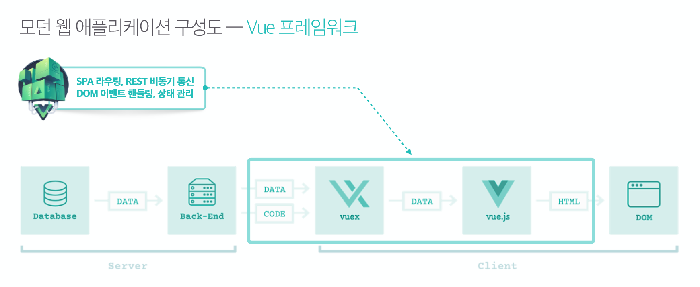
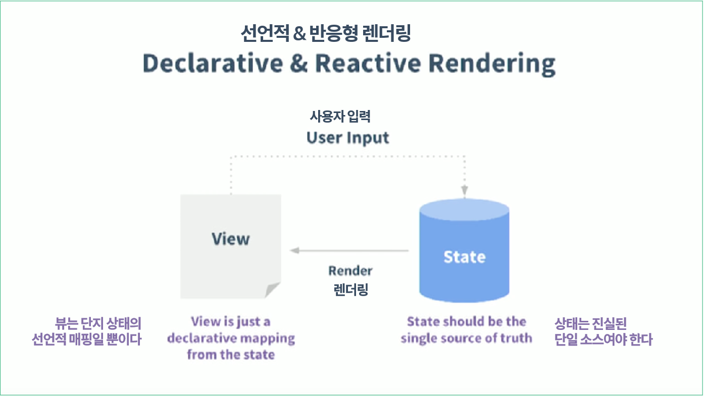
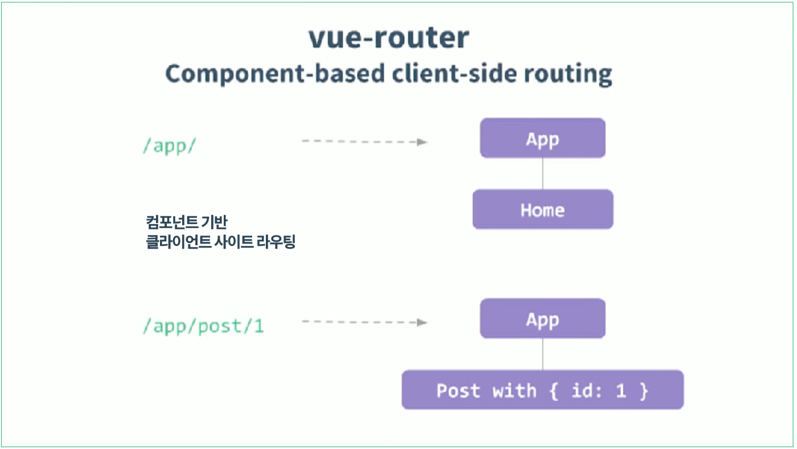

# Vue.js 학습을 위한 프로젝트 템플릿

프로젝트에 사용되는 Pug, Sass, ECMAScript 2016(ES6), 이미지 압축, 라이브 서버 구동을 자동으로 처리.

## 템플릿 다운로드

```sh
# git clone 명령을 사용하여 vue-project-template 다운로드
$ git clone https://github.com/yamoo9/vue-project-template.git
```

## 설치

```sh
# 프로젝트 템플릿 디렉토리로 이동
$ cd vue-project-template

# NPM 개발 모듈 설치 (package.json 참조)
$ npm install
```

## NPM 스크립트 명령어

프로젝트 초기화 및 서버 실행

```sh
$ npm start
```

- 이전 진행 개발 컴파일 자료 지움
- 개발 의존 라이브러리 복사/이동
- 이미지 최적화 복사/이동
- pug, sass, babel 구동
- 라이브 서버 구동

## 동작과정


## 선언적 렌더링 (Declarative Rendering)
 Vue.js의 핵심은 간단한 템플릿 구문을 사용해 선언적으로 DOM에 데이터를 렌더링 하는 것 입니다.
 ``` html
 //HTML
 <div id="app"> {{ message }} </div>
```
``` javascript
//JavaScript
var app = new Vue({
  el: '#app',
  data: { message: '안녕하세요 Vue!' }
})
```

 선언적 & 반응형 렌더링


## 반응형 렌더링 (Reactive Rendering)
Vue의 가장 두드러진 특징 중 하나는 눈을 어지럽히지 않는 반응형 시스템입니다.
일반 JavaScript 객체를 data 옵션으로 Vue 인스턴스에 전달하면 Object.defineProperty를 이용해 Vue는 모든 속성을 거쳐 getter / setter 변환합니다. 이것은 ES5 전용이며 하위 버전에 없는 기능이기 때문에 Vue가 IE8 이하를 지원하지 않습니다.

getter / setter 는 사용자에게는 보이지 않으나 속성에 액세스 하거나 수정할 때 Vue가 종속성 추적 및 변경 알림을 수행할 수 있습니다. 한가지 주의 사항은 변환된 데이터 객체가 기록될 때 브라우저가 getter / setter 형식을 다르게 처리하므로 친숙한 인터페이스를 사용하기 위해 vue-devtools를 설치하는 것이 좋습니다.

모든 컴포넌트 인스턴스에는 해당 watcher 인스턴스가 있으며, 이 인스턴스는 컴포넌트가 종속적으로 렌더링되는 동안 “수정”된 모든 속성을 기록합니다. 나중에 종속적인 setter가 트리거 되면 watcher에 알리고 컴포넌트가 다시 렌더링 됩니다.


## 클라이언트 사이드 라우팅 (Client-Side Routing)
클라이언트 측 라우팅은 서버 측 라우팅과 동일하지만 브라우저에서 실행됩니다. 
클라이언트 측 라우팅은 자바 스크립트나 JS 기반 템플릿 엔진으로 페이지를 렌더링하기 위해 브라우저내에서 이 프로세스를 실행하기만 하면 됩니다.
주로 서버 측 코드가 사용되는 단일 페이지 애플리케이션에 사용됩니다.


## 빌드시스템&개발경험

- 단일 파일 컴포넌트 제공
- vue-cli를 이용해 쉽게 세팅 적용이 가능하다.
- Webpack 또는 Browserify와 같은 빌드 도구를 사용해야한다.

```Vue
//Hello.vue
<template>
	<p>{{greeting}}World!</p>
</template>

<script>
module.exports = {
  data : function(){
    return{
      greeting: 'Hello'
    }
  }
}
</script>

<style scoped>
p{
  font-size:2em;
  text-align:center;
}
</style>
```


> ## 컨셉

- M.V.V.M (Model-View-ViewModel) 
  - MVVM 패턴 의 ViewModel레이어에 중점을 둔다.
  -  뷰 와 모델을 양방향 데이터 바인딩을 통해 연결한다.
  - 뷰 관련 옵션 : el, template
    데이터 관련 옵션 : data, methods, computed
    컴포넌트 관련 옵션 : components
    생명 주기 훅 : created, mounted, updated, destroyed

```Vue
//ViewModel
//Vue.js에서 모든 Vue 인스턴스는 ViewModel이다.
//Vue생성자 또는 그 하위 클래스로 인스터스화 된다.
var vm = 새로운 Vue ({ / * options * / })
```

- 반응형시스템
  - ES5 전용, IE8이하 지원하지 않는다.
  -  getter / setter 로 변환한다.
  - getter / setter 는 사용자에게는 보이지 않으나 속성에 액세스 하거나 수정할 때 Vue가 종속성 추적 및 변경 알림을 수행할 수 있다.

```Vue
//반응형 속성 선언하기
var vm = new Vue({
  data: {
    // 빈 값으로 메시지를 선언 합니다.
    message: ''
  },
  template: '<div>{{ message }}</div>'
})
// 나중에 `message`를 설정합니다.
vm.message = 'Hello!'
```

## [다른 프레임워크와 비교](https://is.gd/tL3uU2)
### Vue vs React

- Vue와 React의 공통점
  - 가상 DOM을 활용합니다.
  - 반응적이고 조합 가능한 컴포넌트를 제공합니다.
  - 코어 라이브러리에만 집중하고 있고 라우팅 및 전역 상태를 관리하는 컴패니언 라이브러리가 있습니다.

- Vue와 React 성능 차이
```
[vuejs.org 원문]
Both React and Vue offer comparable performance in most commonly seen use cases, with Vue usually slightly ahead due to its lighter-weight Virtual DOM implementation.
 : React와 Vue는 일반적인 사용의 경우에 둘 다 비슷한 성능을 보여주지만, Vue가 대부분의 경우 경령화된 가상 DOM implementation덕분에 약간 더 빠릅니다.(slightly ahead)
```
```
[kr.vuejs.org 한글번역문]
지금까지 테스트 한 모든 실제 시나리오에서 Vue는 React보다 월등히 우수합니다.
```
[_영문사이트도 잘 확인해보자_](https://is.gd/L8NSuT)

- HTML & CSS
```
React: JSX
Vue: Templates & JSX
```

  - Jsx의 장점
  ```
  JavaScript의 모든 힘을 활용할 수 있습니다. 여기에는 temporary variables, flow controls 및 스코프 내에서 JavaScript 값을 직접 참조하는 것이 포함됩니다.
  
  현재 Vue templates을 위한 tool 보다 더 많은 tool들이 존재한다.(예를 들어, linting, type checking, editor autocompletion)
  ```
  - Templates의 장점
  ```
  HTML에 익숙한 개발자들에게 편하기 때문에 더 높은 생산성을 보여준다.
  HTML 기반 템플릿을 사용하면 기존 응용 프로그램을 점진적으로 마이그레이션하여 Vue의 reactivity 기능을 훨씬 쉽게 활용할 수 있습니다.
  디자이너와 숙련이 덜 된 개발자에게도 더 쉽다.
  pug와 같은 pre-processor를 활용 가능하다.
  ```
  ```
  HTML과 마찬가지로 pre-processor (또는 post-processor) 를 사용하여 CSS를 작성하여 해당 생태계의 기존 라이브러리를 활용 할 수 있습니다. 또한 빌드 프로세스 동안 색상 조작과 같은 디자인 중심의 작업을 수행 할 수 있습니다.
  ```

- 학습 곡선
  - React의 경우, JSX와 ES2015+에 대해 알아야합니다. 많은 예제가 React의 클래스 구문을 사용하기 때문입니다. Babel Standalone을 기술적으로 사용하여 브라우저에서 코드를 라이브 컴파일 할 수는 있지만 작성에 적합하지 않기 때문에 빌드 시스템에 대해서도 배워야합니다.
  - Vue의 경우, JSX, ES2015 또는 빌드 시스템에 대해 알 필요가 없음.


### Vue vs AngularJS (Angular 1)

#### Vue의 일부 문법은 AngularJS와 매우 유사하며, 실제로 Vue의 개발 초기에 영감이었다. 그러나
  - 훨씬 간단하며,
  - 컴포넌트 간 단반향의 데이터 흐름을 사용하고(AngularJS의 경우 스코프 간의 양방향)
  - 유연하고,
  - 성능이 뛰어나다.


### Vue vs Angular (이전의 Angular 2)


#### - Angular보다 쉽고 유연하고 성능도 더 좋다  


## [The Vue Instance](https://is.gd/23TgQJ)  

## Constructor
모든 Vue 응용 프로그램은 Vue 생성자 함수를 사용하여 루트 Vue 인스턴스를 생성하여 부트 스트랩됩니다.
관례 상, Vue 인스턴스를 참조하기 위해 변수 vm (ViewModel의 약자)을 사용합니다.  
```
var vm = new Vue({
  // options
})
```

Vue 생성자는 미리 정의 된 옵션으로 재사용 가능한 컴포넌트 생성자를 생성하도록 확장 될 수 있습니다
```
var MyComponent = Vue.extend({
  // extension options
})
// all instances of `MyComponent` are created with
// the pre-defined extension options
var myComponentInstance = new MyComponent()
```
확장된 인스턴스를 만들수는 있으나 대개 템플릿에서 사용자 지정 엘리먼트로 선언적으로 작성하는 것이 [좋은 이유](https://is.gd/CNXBLI)  
모든 Vue 컴포넌트가 본질적으로 확장된 Vue 인스턴스라는 것을 알아야 합니다.  

## 속성과 메소드

각 Vue 인스턴스는 data 객체에 있는 모든 속성을 프록시 처리 합니다.  
```
var data = { a: 1 }
var vm = new Vue({
  data: data
})
vm.a === data.a // -> true
// 속성 설정은 원본 데이터에도 영향을 미칩니다.
vm.a = 2
data.a // -> 2
// ... 당연하게도
data.a = 3
vm.a // -> 3
```
이러한 프록시 속성은 반응형이다.

## 인스턴스 라이프사이클 훅 (instance lifecycle hook)  

각 Vue 인스턴스는 데이터 관찰을 설정하고, 템플릿을 컴파일하고, 인스턴스를 DOM에 마운트하고, 데이터가 변경 될 때 DOM을 업데이트해야 할 때 일련의 초기화 단계를 거칩니다. 그 과정에서 사용자 정의 로직을 실행할 수있는 라이프사이클 훅 도 호출됩니다. 예를 들어, created 훅은 인스턴스가 생성된 후에 호출됩니다. 예:
```
var vm = new Vue({
  data: {
    a: 1
  },
  created: function () {
    // `this` 는 vm 인스턴스를 가리킵니다.
    console.log('a is: ' + this.a)
  }
})
// -> "a is: 1"
```
모든 라이프사이클 훅은 this 컨텍스트가 호출하는 Vue 인스턴스를 가리키며 호출됩니다.  
Vue에는 “컨트롤러”의 컨셉이 없다.

## vanilla js 와 jQuery 방식
> 데이터를 받으면 view와 model을 모두 변경시켜 줘야한다.
```javascript
((global, user) => {

  let user_input = null;
  let print_user_input = null;

  function init() {
    user_input = document.querySelector('.user-input');
    print_user_input = document.querySelector('.print-user-input');

    render();
    bind();
  }

  function bind() {
    user_input.addEventListener('keyup', update);
  }

  function render() {
    let msg = user.message;
    user_input.value = msg;
    print_user_input.textContent = msg;
  
  }

  function update(e) {
    let value = e.target.value;
    user.message = value;
    print_user_input.textContent = value;
  }

  init();
})//(window, window.user);

// jquery
;((global, $, user) => {

  let user_input = null, print_user_input = null;

  function init() {
    user_input = $('.user-input');
    print_user_input = $('.print-user-input');
    bind();
    render();
  }

  function bind() {
    user_input.on('keyup', update);
  }

  function render() {
    let msg = user.message;
    user_input.attr('value', msg);
    print_user_input.text(msg);
  }

  function update(e) {
    let value = e.target.value;
    user.message = value;
    print_user_input.text(value);
  }

  init();
})(window, window.jQuery, window.user);
```
```
[MODEL](DATA) ◀━━━━━━━┓
                       ┃                      
                       ┣━━━━━ Input 
                       ┃ 
[VIEW] ◀━━━━━━━━━━━━━━┛
```
 - `Object.defineProperty`(ES5, IE9+)통해 Seering해서 데이터를 감지할 때마다 View가 바뀌게 끔 할 수 있다.
## Vue.js 방식
> Vue 생성자 함수를 생성해 root Vue 인스턴스를 생성하여 부트스트래핑 합니다.
```pug
.column.is-6.vue-demo
    h4.title-.is-3 Vue Version
    .control
    .group
        label(for="user_input") 사용자 입력
        input.user-input.input(v-model="message" type="text" id="user_input")

    p.box
    | 사용자가 입력한 데이터 값은 "{{ message }}"입니다.
```
```javascript
((global, Vue, user)=>{
  'use strict';

  global.vm = new Vue({
    el: '.vue-demo',
    data: user
  });
  // console.log(Vue);
})(window, window.Vue, window.user);
```

## Vue.js VS Angular v1
> Angular와 유사한 Vue 선언적 렌더링 방식

- 컴포넌트, 디렉티브, 필터, 인터폴레이션, 데이터바인딩, 반복문, 조건문, 속성 바인딩, 이벤트 바인딩

## Vue.js VS React.js
> React와 유사한 Vue의 가상 DOM + 반응형 시스템

## 프레임워크 상태관리
- Actual DOM (실제 문서객체모델)
  - 모델(데이터 구조) : 문서 전체를 다시 그리는 것은 비용이 많이 들기 때문에 변경 부분만 변경 할 필요가 있다.
  - 렌더링 프로세스 
  - 문서객체모델
- Server Side Rendering (서버에서 다시 그려주는 문서객체모델)
  - 클라이언트에서 데이터 변경을 요청하면 서버에서 이를 처리하여 새로운 DOM을 생성한 후 응답해주는 프로세스
- 초창기 프론트엔드 프레임워크
  - 모델(데이터 구조) 변경 
  - 렌더링 프로세스 : 모델에서 UI코드를 분리하기 위한 아키텍처를 제공했지만, 두 모델 간의 동기화는 여전히 남아있었습니다. 변경이 발생할 때 어떤 종류의 이벤트를 얻을 수 있지만 다시 렌더링 할 대상과 이동 방법을 파악하는 것은 개발자의 몫이었습니다.
  - 문서객체모델
- Ember 프레임워크
  - 모델(데이터 구조) 변경
  - 렌더링 프로세스 : Backbone과 마찬가지로 Ember는 변경이 발생할 때 데이터 모델에서 이벤트를 보냅니다. 차이점은 Ember 프레임 워크가 이벤트 수신을 위한 기능을 제공하는 것입니다. 즉, UI에 첨부된 업데이트 이벤트에 대한 리스너가 있음을 의미합니다.
  - 문서 객체모델
- Angular 프레임워크
  - 모델(데이터 구조) 변경
  - 렌더링 프로세스 : Angular 템플릿에서 데이터를 참조 할 때, 예를 들어{{foo.x}}와 같은 표현식에서 데이터를 렌더링 할 뿐만 아니라 특정 값에 대한 간찰자도 만듭니다. 그 후 앱에서 어떤일이 발생하면 Angular는 해당 감시자의 값이 마지막으로 변경되었는지 여부를 확인합니다. 있는 경우 UI의 값을 다시 렌더링 합니다. 이러한 감시자를 실행하는 프로세스가 더티 체크 입니다.
  - 문서객체모델
- React 프레임워크
  - 모델(데이터 구조) 변경
  - 가상 DOM : 서버 측 렌더링과 마찬가지로 한번 렌더링 하면 완료됩니다. 변경된 구성요소가 필요할 때 다시 렌더링 됩니다.
  - 렌더링 프로세스
  - 문서객체모델

## Virtual DOM
> 가상 DOM은 애플리케이션의 DOM을 선언적으로 표현할 수 있도록 설계된 모듈 모음입니다. 가상 DOM 뷰의 전체를 생성한 다음 상태가 변경 될 때 마다 뷰를 업데이트 할 수 있습니다.

- h.js : 가상 하이퍼 스크립트 
- h(selector, properties, children)
```javascript
var h = require('virtual-dom/h');
var tree = h('div.foo#some-id', [
    h('span', 'some text'),
    h('input', {type: 'text', value: 'foo'})
]);
```
- createElement.js : 가상 DOM, 가상(VTree) 용 DOM 렌더링 / 패치 알고리즘 DOM 노드 반환
```javascript
createElement(tree:VTree) // -> DOMNode
```

- diff.js : 가상트리, 실시간 가상 트리 비교 알고리즘 비교 결과가 반영된 패치 객체 반환
```javascript
diff(previous: VTree, current: CTree) // -> PatchObject
```

- patch.js : 가상DOM, DOM루트 노드와 DOM 패치 집합이 주어지면 patch함수는 DOM을 업데이트 DOM 노드 반환
```javascript
patch(rootNode:DOMNode, patches:PatchObject) // -> DOMNode newRootNode
```