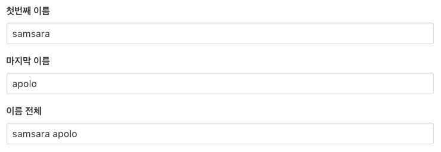
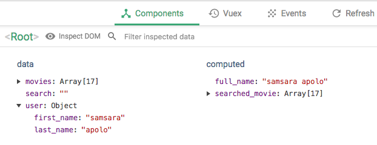

## Computed Setter
계산된 속성은 기본적으로 getter만 가지고 있지만, 필요한 경우 setter를 제공할 수 있다.
[Vue: Computed(계산된 속성)](_https://kr.vuejs.org/v2/guide/computed.html#계산된-Setter)
#### 기본예제
```javascript
computed: {
  fullName: {
    // getter
    get: function () {
      return this.firstName + ' ' + this.lastName
    },
    // setter
    set: function (newValue) {
      var names = newValue.split(' ')
      this.firstName = names[0]
      this.lastName = names[names.length - 1]
    }
  }
}
```
이제 `vm.fullName = 'John Doe'`를 실행하면 설정자가 호출되고 `vm.firstName`과 `vm.lastName`이 그에 따라 업데이트 됩니다.
#### 수업시간 예제
computed_setter.pug
```pug
  .app.container
    .columns
      .column.is-8
        .control
          label.label(for="first_name") 첫번째 이름
          input.input(type="text" v-model="user.first_name")
        .control
          label.label(for="last_name") 마지막 이름
          input.input(type="text" v-model="user.last_name")
        .control
          label.label(for="full_name") 이름 전체
          input.input(type="text" v-model="full_name")
```
computed_setter.js
```javascript
((global)=>{
  'use strict';
  var app = new Vue({
    el: '.app',
    data: {
      user: {
        first_name: 'james',
        last_name: 'apolo'
      }
    },
    computed: {
      
      // computed 속성: SETTER
      full_name: {
        get() {
          return `${this.user.first_name} ${this.user.last_name}`;
        },
        set(v){
          let name = v.split(' ');
          this.user.first_name = name.shift();
          this.user.last_name = name.pop();
        }
      },
    }
  });
})(window);
```
기존의 `first_named: 'james'`의 값을 `'samsara'`로 변경
변경된 값이 바로 반영되여 새로운 값을 가진 computed의 `full_name` 으로 변경된다.



--------

## Wacth

### 1. 감시자
대부분의 경우 계산된 속성이 더 적합하지만 사용자 정의 감시자가 필요한 경우가 있습니다.  
그래서 Vue는 watch 옵션을 통해 데이터 변경에 반응하는 보다 일반적인 방법을 제공합니다.  
이는 데이터 변경에 대한 응답으로 비동기식 또는 시간이 많이 소요되는 조작을 수행하려는 경우에 가장 유용합니다.

* 타입  : { [key : string] : string | Function | Object }
* 상세  : 키가 표시되는 표현식이고 값이 콜백 입니다. 
  값은 메서드 이름이 문자열 이거나 추가 옵션이 포함된 Object가 될 수도 있습니다. 
  Vue 인스턴스는 인스턴스 생성시 객체의 각 항목에 $watch() 를 호출합니다.


#### 예제 코드 1

```javascript

var vm = new Vue ({
  data : {
    a : 1,
    b : 2,
    c : 3
  },
  watch : {
    a : function (val, oldval)
    console.log(val, oldval);
  },
  b : 'someMethod',
  c : {
    handler : function (val, oldval) {},
    deep :true
  }

})

```


#### 예제 코드 2

```javascript
  <!-- query 관찰 속성 : 계산된 (computed) 속성과 달리 데이터 (data{}) 속성과 이름이 같아도 됩니다  -->
  query : function(newValue, oldValue){
    <!-- Vue 객체 참조  -->
    var vm = this;
    <!-- 현재 값과 이전 값 비교 검증 -->
    console.log(newValue, oldValue)
  }
    <!-- 즉시 실행 (Computed 와 유사)  -->

  <!-- 지연된 실행(watch를 통해 서버의 데이터 수신 (setTimeout 으로 2초 시뮬레이션) 후, 처리)  -->
  global.setTimeout(function(){
    vm.changeWatch = newValue;
  }, 2000)
  <!-- 2초 뒤애 Vue 객체의 changeWatch 데이터 변경(view 업데이트)  -->```
```

--------------------

## vm.$watch(expOrFn, callback, [options])

  ### 전달인자

  + {string | Function} expOrFn
      > 표혀식은 혹은 함수에서 인자로 문자열 혹은 함수이다.

  + {Function | Object} callback
    > 콜백 함수의 인자로는 함수 또는 오브젝트이다.

  + {Object} [options]
    > 옵션 값으로는 객체를 가진다.

    + {boolean} deep
    + {boolean} immediate
      > 옵션의 종류는 깊은 객체 탐색과 즉시 실행이 있고 둘다 참 거짓을 가진다.

  ### returns: {Function} unwatch
    > unwatch의 반환 값은 함수이다.

  ### Usage: 사용법

  + 변경을 위해 Vue 인스턴스에서 표현식이나 계산된 함수를 사용한다.

  + 콜백은 새값과 이전값을 인자로 호출됩니다.

  + 표현식은 점으로 구분되 경로를 허용합니다.

  + 더 복잡한 표현식을 사용할 경우엔 함수가 더 유용합니다.

    > Object | Array를 변경하는 대신 변형할 경우 동일한 참조값을 변경하므로 이전 값은 새값과 동일하며 Vue는 이전 값의 사본을 저장하지 않습니다.

  ### 예시
  ```javascript
      // 객체경로
      vm.$watch('a.b.c', function (newVal, oldVal) {
        // 로직 코드
      })
      // 함수
      vm.$watch(
        function () {
          return this.a + this.b
        },
        function (newVal, oldVal) {
          // 로직 코드
        }
      )      
  ```
  + vm.$watch는 콜백을 호출하지 않는 함수를 반환함

  ```javascript
      var unwatch = vm.$watch('a', cb)
      // 관찰자는 필요하지 않은 시점에는 제거해야 한다.
      unwatch()    
  ```
  > 계속해서 데이터의 속성을 지켜보고 탐색하는 행위는 자원적 측면에서 좋지 못하므로 반드시 불필요해진 시점해서 제거 해줄 필요가 있다. 

  ### Option: deep

    + 객체 내부의 중첩된 값을 감지하려면 options 인자에 deep: true를 전달 해야 한다.

    + 배열의 변화를 감지하기 위해선 deep 옵션을 true를 전달하지 않아도 된다. 뎁스가 깊어질 경우에 해당한다.

  ```javascript
      vm.$watch('someObject', callback, {
        deep: true
      });
      vm.someObject.nestedValue = 123
      // 콜백이 호출됩니다 deep true로 세팅했기 떄문에 중첩된 값도 워치(관찰)가 된다.
  ```

  ### Options: immidiate

    + 옵션에서 immediate: true를 전달하면 표현식의 현재 값으로 즉시 콜백을 호출합니다.

  ```javascript
      vm.$watch('a', callback, {
        immediate: true
      });
      // 사용자가 immediate 값을 투루로 설정하면 콜백은`a`의 현재 값으로 즉시 시작됩니다.
  ```
--------

## JavaScript Methods

### Array

+ #### [Array.prototype.includes()](https://developer.mozilla.org/ko/docs/Web/JavaScript/Reference/Global_Objects/Array/includes)

  배열에 특정 요소가 포함되어 있는지 여부를 확인하여 true 또는 false를 반환.

  ##### syntax

  ```javascript
  arr.includes(searchElement)
  arr.includes(searchElement, fromIndex)
  ```

  + searchElement : 검색 할 요소
  + fromIndex : 검색을 시작할 위치. 음수라면 배열의 끝에서부터 검색을 한다. 기본값은 0. 
  + return value: boolean

  ##### example

  ```javascript
  var a = [1, 2, 3];
  a.includes(2); // true 
  a.includes(4); // false
  ```

  ​

+ #### [Array.prototype.indexof()](https://developer.mozilla.org/en-US/docs/Web/JavaScript/Reference/Global_Objects/Array/indexOf)

  배열에서 지정된 요소를 찾을 수있는 첫 번째 인덱스를 반환하고 존재하지 않으면 -1을 반환.

  ##### syntax

  ```javascript
  arr.indexOf(searchElement)
  arr.indexOf(searchElement, fromIndex)
  ```

  + searchElement : 배열에서 찾을 요소. 

  + fromIndex (Optional) 

    검색을 시작할 위치. 기본값은 0(배열 전체 검색). 

    배열의 길이보다 크거나 같은 경우 -1을 반환되고 배열이 검색되지 않는다. 

    이 값이 음수이면 배열 끝에서부터의 오프셋 값으로 사용되고, 검색은 앞에서부터 순서대로 된다. 음수의 절대치가 배열의 길이보다 큰 경우 배열 전체가 검색된다. 

  + return value :  배열 내의 요소의 최초의 인덱스. 발견되지 않으면 -1.

  ##### example

  ````javascript
  var array = [2, 9, 9];
  array.indexOf(2);     // 0
  array.indexOf(7);     // -1
  array.indexOf(9, 2);  // 2
  array.indexOf(2, -1); // -1
  array.indexOf(2, -3); // 0
  ````

  ​

+ #### [Array.prototype.slice()](https://developer.mozilla.org/ko/docs/Web/JavaScript/Reference/Global_Objects/Array/slice)

  배열의 일부를 추출하여 새로운 배열을 반환.

  ##### syntax

  ````javascript
  Array.slice(begin[,end]) 
  ````

  - begin

    추출을 시작할 위치. 

    음수 인덱스는 배열의 끝에서부터의 길이를 나타낸다. (slice(-2)는 배열에서 마지막 두 개의 원소를 추출)

    begin 인자가 undefined인 경우에는, 0번 인덱스부터 slice한다. 

  - end

    추출을 종료 할 인덱스. slice는 end 인덱스를 제외하고 추출한다. 

    음수 인덱스는 배열의 끝에서부터의 길이를 나타낸다. (slice (2, -1)는 세번째부터 끝에서 두번째 요소까지 추출)

    end가 생략되거나, end의 값이 배열의 길이보다 크다면 slice는 배열의 끝까지(arr.length) 추출한다. 

  - return value : 추출된 배열.

  - begin과 end를 모두 생략하면 배열을 복사한다. 

  ##### example

  ```javascript
  var fruits = ['Banana', 'Orange', 'Lemon', 'Apple', 'Mango'];
  var citrus = fruits.slice(1, 3);
  var fruits_copy = fruits.slice();
  // fruits contains ['Banana', 'Orange', 'Lemon', 'Apple', 'Mango']
  // citrus contains ['Orange','Lemon']
  // fruits_copy ['Banana', 'Orange', 'Lemon', 'Apple', 'Mango']
  ```

  #### 

+ #### [Array.prototype.every()](https://developer.mozilla.org/ko/docs/Web/JavaScript/Reference/Global_Objects/Array/every)

  배열의 모든 요소가 제공한 함수로 구현된 테스트를 통과하는지를 테스트한다.

  ##### syntax

  ```javascript
  arr.every(callback[, thisArg])
  ```

  - callback

    각 요소에 대해서 테스트를 실행하는 함수. 

  - thisArg

    선택 사항. callback을 실행할 때 this로서 사용하는 값.

  - return value 

    콜백 함수가 모든 배열 요소에 대해 참을 반환하는 경우 true 그렇지 않으면, false.

  ##### example

  ```javascript
  function isBigEnough(element, index, array) {
    return element >= 10;
  }
  [12, 5, 8, 130, 44].every(isBigEnough);   // false
  [12, 54, 18, 130, 44].every(isBigEnough); // true
  ```

  #### 

+ #### [Array.prototype.some()](https://developer.mozilla.org/ko/docs/Web/JavaScript/Reference/Global_Objects/Array/some)

  배열 내 일부 요소가 제공된 함수에 의해 구현된 테스트를 통과하는지를 테스트한다.

  ##### syntax

  ```javascript
  arr.some(callback[, thisArg])
  ```

  - callback

    각 요소에 대해서 테스트를 실행하는 함수. 

  - thisArg

    선택 사항. callback을 실행할 때 this로서 사용하는 값.

  - return value 

    콜백 함수가 참인 배열 요소를 찾으면 즉시  true를 반환한다.  그렇지 않으면, false.

  ##### example

  ```javascript
  function isBiggerThan10(element, index, array) {
    return element > 10;
  }
  [2, 5, 8, 1, 4].some(isBiggerThan10);  // false
  [12, 5, 8, 1, 4].some(isBiggerThan10); // true
  ```

  ​

+ #### [Array.prototype.filter()](https://developer.mozilla.org/ko/docs/Web/JavaScript/Reference/Global_Objects/Array/filter)

  제공된 함수로 구현된 테스트를 통과하는 모든 요소가 있는 새로운 배열을 만든다.

  ##### syntax

  ```javascript
  var new_array = arr.filter(callback[, thisArg])
  ```

  - callback : 배열의 각 요소를 테스트하는 함수. 인수 (element, index, array)와 함께 호출된다.
  - thisArg : 선택 사항. callback을 실행할 때 this로 사용하는 값. 

  + return value : 테스트를 통과한 요소가 있는 새로운 배열.

  ##### example

  ```javascript
  function isBigEnough(value) {
    return value >= 10;
  }
  var filtered = [12, 5, 8, 130, 44].filter(isBigEnough);
  // filtered 는 [12, 130, 44]
  ```

  ​

+ #### [Array.prototype.sort()](https://developer.mozilla.org/ko/docs/Web/JavaScript/Reference/Global_Objects/Array/sort)

  sort () 메서드는 배열의 요소를 적절한 위치에 정렬하고 배열을 반환한다. 기본 정렬 순서는 문자열 유니 코드 코드 포인트에 따른다.

  ##### syntax

  ```javascript
  arr.sort()
  arr.sort(compareFunction)
  ```

  - compareFunction : 선택사항, 정렬 순서를 정의하는 함수를 지정한다. 생략하면 배열은 각 요소의 문자열 변환에 따라 각 문자의 유니 코드 코드 포인트 값에 따라 정렬된다.
  - return value : 소트 된 배열. sort() 메서드는 새로운 배열을 만들지 않는다. 

  ##### compare Function

  - compareFunction (a, b)가 0보다 작은 경우 a를 b보다 낮은 색인으로 정렬한다.  즉, a가 먼저 온다.
  - compareFunction (a, b)가 0을 반환하면 a와 b를 서로에 대해 변경하지 않고 모든 다른 요소에 대해 정렬한다. 
  - compareFunction (a, b)가 0보다 큰 경우, b를 a보다 낮은 인덱스로 소트한다.

  ```javascript
  function compare(a, b) {
    if (a is less than b by some ordering criterion) {
      return -1;
    }
    if (a is greater than b by the ordering criterion) {
      return 1;
    }
    // a must be equal to b
    return 0;
  }
  ```

  - 숫자를 비교하는 경우()

  ```javascript
  function compareNumbers(a, b) {
    return a - b;
  }
  ```

  + 객체는 해당 속성 중 하나의 값을 기준으로 정렬 할 수 있다.

  ```javascript
  var items = [
    { name: 'Edward', value: 21 },
    { name: 'Sharpe', value: 37 },
    { name: 'And', value: 45 },
    { name: 'The', value: -12 },
    { name: 'Magnetic' },
    { name: 'Zeros', value: 37 }
  ];

  // value 기준으로 정렬
  items.sort(function (a, b) {
    if (a.value > b.value) {
      return 1;
    }
    if (a.value < b.value) {
      return -1;
    }
    // a must be equal to b
    return 0;
  });
  ```

  ​

### Object

+ ####  [Object.assign()](https://developer.mozilla.org/ko/docs/Web/JavaScript/Reference/Global_Objects/Object/assign)

  열거할 수 있는 하나 이상의 소스 객체로 부터 타켓 객체로 프로퍼티들을 복사하는데 사용. 타겟 객체가 반환된다.

  ##### syntax

  ```javascript
  Object.assign(target, ...sources)
  ```

  + target : 타켓 객체
  + sources : 하나 이상의 소스 객체
  + return value : 타겟 객체

  ##### example1 객체 복사

  ```javascript
  var obj = { a: 1 };
  var copy = Object.assign({}, obj);
  console.log(copy); // { a: 1 }
  ```

  ##### example2 객체 병합

  ```javascript
  var o1 = { a: 1 };
  var o2 = { b: 2 };
  var o3 = { c: 3 };

  var obj = Object.assign(o1, o2, o3);
  console.log(obj); // { a: 1, b: 2, c: 3 }
  console.log(o1);  // { a: 1, b: 2, c: 3 }, 타겟 객체 자체도 변화한다.
  ```

  ​

+ #### [Object.keys()](https://developer.mozilla.org/en-US/docs/Web/JavaScript/Reference/Global_Objects/Object/keys)

  객체에 존재하는 열거 가능한 프로퍼티의 배열을 반환한다. 

  ##### syntax

  ```javascript
  Object.keys(obj)
  ```

  - obj : 자신의 열거 가능한 프로퍼티가 반환되는 객체.
  - return value : 주어진 객체의 열거 가능한 모든 프로퍼티의 배열 

  ##### example

  ```javascript
  var arr = ['a', 'b', 'c'];
  console.log(Object.keys(arr)); // console: ['0', '1', '2']

  var obj = { 0: 'a', 1: 'b', 2: 'c' };
  console.log(Object.keys(obj)); // console: ['0', '1', '2']

  var an_obj = { 100: 'a', 2: 'b', 7: 'c' };
  console.log(Object.keys(an_obj)); // console: ['2', '7', '100']

  ```

  ​

+ #### [Object.values()](https://developer.mozilla.org/en-US/docs/Web/JavaScript/Reference/Global_Objects/Object/values)

  객체에 존재하는 열거 가능한 프로퍼티의 값의 배열을 반환한다.   

  ##### syntax

  ```javascript
  Object.values(obj)
  ```

  - obj : 반환될 열거가능한 프로퍼티의 값을 갖는 객체.
  - return value : 주어진 객체의 열거 가능한 프로퍼티의 값을 포함하는 배열

  ##### example

  ```javascript
  var obj = { foo: "bar", baz: 42 };
  console.log(Object.values(obj)); // ['bar', 42]

  var obj = { 0: 'a', 1: 'b', 2: 'c' };
  console.log(Object.values(obj)); // ['a', 'b', 'c']

  var an_obj = { 100: 'a', 2: 'b', 7: 'c' };
  console.log(Object.values(an_obj)); // ['b', 'c', 'a']

  ```

  ​

