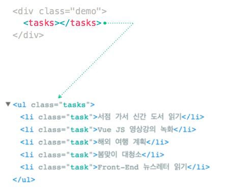

## 폼 입력 바인딩 (form input binding)

 ### 텍스트 인풋

- 양방향 데이터 바인딩: 한글/일어/중문 입력시 문제
```
<div class="field">
  <label class="label" for="user_name">이름</label>
    <p class="control">
    <input
    v-model="user.name"  // v-model 사용시 문제 발생
    id="user_name"
    class="input" 
    type="text" 
    placeholder="이민기">
  </p>
</div>
```

- 단방향 데이터 바인딩  
```
<div class="field">
  <label class="label" for="user_name">이름</label>
    <p class="control">
    <input
    @input="detectEventBinding('name', $event)"
    id="user_name"        // Vue DevTools에 바로 반영 X
    class="input" 
    type="text" 
    placeholder="이민기">
  </p>
</div>
```

- 양방향 데이터 바인딩: 한글/일어/중문 입력시 문제 해결
```
<div class="field">
  <label class="label" for="user_name">이름</label>
    <p class="control">
    <input
    @input="detectEventBinding('name', $event)"
    :value="user.name"    // Vue DevTools에 바로 반영
    id="user_name"
    class="input" 
    type="text" 
    placeholder="이민기">
  </p>
</div>
```
* 텍스트 영역의 보간 < textarea >{{ text }}< /textarea> 작동 X -> v-model 사용 -> 한글/일어/중문 입력시 문제 해결을 위해 @input, :value 사용

```
<script>
export default {
  name: 'app',
  data(){
    return {
      user: {
        name: '', // <- 여기에 user.name이 들어감
        message: '' // <- 여기에 user.message가 들어감
      }
    }
  }
}
```
--------------------------------------------------
### 라디오 버튼

```
<div class="field">
  <label class="label" for="user_career">경력 여부</label>
  <p class="control">
    <label class="radio">
      <input v-model="user.role" id="user_career" type="radio" name="role" value="junior" checked>
      신입
    </label>
    <label class="radio">
      <input v-model="user.role" type="radio" name="role" value="senior">
      경력자
    </label>
  </p>
</div>
```
* v-model은 모두 똑같다.

```
<script>
export default {
  name: 'app',
  data(){
    return {
      user: {
        role: 'junior' // 라디오버튼 체크 기본 값..템플릿에 checked는 의미 없음
      }
    }
  }
}
```
--------------------------------------------------
### 체크박스

* 하나의 체크박스는 단일 boolean 값
```
<div class="field">
  <p class="control">
    <label for="user_remember" class="checkbox">
      <input v-model="user.remember" type="checkbox" id="user_remember">
      입력한 사용자 정보를 기억합니다.
    </label>
  </p>
</div>
```

```
<script>
export default {
  name: 'app',
  data(){
    return {
      user: {
        remember: false    // <- 하나의 체크박스는 단일 boolean 값.. 초기 기본 값 설정 가능
      }
    }
  }
}

```
* 여러 개의 체크박스는 같은 배열을 바인딩
```
<div class="field">
  <label for="user_field" class="label">지원 분야</label>
  <p class="control">
    <label class="checkbox">
      <input v-model="user.field" id="user_field" value="plan" type="checkbox"> 웹 기획
    </label>
  </p>
  <p class="control">
    <label class="checkbox">
      <input v-model="user.field" value="design" type="checkbox"> 웹 디자인
    </label>
  </p>
  <p class="control">
    <label class="checkbox">
      <input v-model="user.field" value="frontend" type="checkbox"> 프론트엔드 개발
    </label>
  </p>
  <p class="control">
    <label class="checkbox">
      <input v-model="user.field" value="backend" type="checkbox"> 백엔드 개발
    </label>
  </p>
</div>
```

```
<script>
export default {
  name: 'app',
  data(){
    return {
      user: {
        field: []   // <- 배열을 바인딩
      }
    }
  }
}
```
--------------------------------------------------
### 셀렉트 메뉴

```
<div class="field">
  <label for="user_field" class="label">지원 분야</label>
  <p class="control">
    <span class="select">
      <select id="user_field" v-model="user.field">
        <option value="" disabled>지원 분야를 선택해주세요.</option> // 초기 보여지는 값.. disabled로 선택 불가 상태로
        <option value="plan">웹 기획</option>
        <option value="design">웹 디자인</option>
        <option value="frontend">프론트엔드 개발</option>
        <option value="backend">백엔드 개발</option> -->
      </select>
    </span>
  </p>
</div>
```
* 사용하지 않는 옵션에 빈 값을 넣는 것이 좋은 이유
  * v-model 표현식의 초기 값이 어떤 옵션에도 없으면, "선택 없음" 상태로 렌더링되어서 iOS의 경우 변경 이벤트가 발생하지 않아 사용자가 첫번째 항목을 선택 할 수 없음

```
<script>
export default {
  name: 'app',
  data(){
    return {
      user: {
        field: ''
      }
    }
  }
}
```

* 다중 선택

```
<div class="field">
  <label for="user_field" class="label">지원 분야</label>
  <p class="control">
    <span class="select">
      <select id="user_field" v-model="user.field" multiple>  // <- multiple 옵션으로 다중선택 가능하게..
        <option value="" disabled>지원 분야를 선택해주세요.</option> 
        <option value="plan">웹 기획</option>
        <option value="design">웹 디자인</option>
        <option value="frontend">프론트엔드 개발</option>
        <option value="backend">백엔드 개발</option> -->
      </select>
    </span>
  </p>
</div>
```
--------------------------------------------------
### v-for를 이용한 동적 옵션 렌더링

```
<div class="field">
  <label for="user_field" class="label">지원 분야</label>
  <p class="control">
    <span class="select">
      <select id="user_field" v-model="user.field">
        <option
          v-for="(content,index) in field_contents"    // 개별 속성으로 데이터 바인딩
          :disabled="!content.value"
          :value="content.value"
          :key="'user_field-'+index"> {{ content.label }} </option>
      </select>
    </span>
  </p>
</div>
```
* 개별 속성으로 데이터 바인딩
```
<script>
export default {
  name: 'app',
  data(){
    return {
      user: {
        name: '',
        email: '',
        career: 1,
        message: '',
        role: 'junior',
      }, 
      field_contents: [  // 개별 속성으로 데이터 바인딩
        { value: '', label: '지원 분야를 선택해주세요.' },
        { value: 'plan', label: '웹 기획' },
        { value: 'design', label: '웹 디자인' },
        { value: 'frontend', label: '프론트엔드 개발' },
        { value: 'backend', label: '백엔드 개발' },
        { value: 'fullstack', label: '풀스택 개발' }
      ]
    }
  }
};
</script>
```
--------------------------------------------------
### 숫자 인풋
```
<div v-if="user.role === 'senior'" class="field">  // v-if를 사용해서 senior 선택한 경우에만 숫자 입력창 나오게 설정..
  <label for="user_senior_career" class="label">경력 연차</label>
  <p class="control">
    <input
      type="number"
      v-model.number="user.career" 
      min="1"
      max="100"
      id="user_senior_career"
      class="input"
    >
  </p>
</div>
```
* 수식어 [.number](https://kr.vuejs.org/v2/guide/forms.html#number)를 통해 사용자 입력이 자동으로 숫자로 형변환 되도록 할 수 있다.
```
<script>
export default {
  name: 'app',
  data(){
    return {
      user: {
        career: 1    // <- v-model로만 바인딩하면 "2", "3"처럼 문자로 전달받음
      }
    }
  }
};
</script>
```
--------------------------------------------------
### [.lazy](https://kr.vuejs.org/v2/guide/forms.html#lazy)

- 기본적으로, v-model은 각 입력 이벤트 후 입력과 데이터를 동기화 합니다. (단 앞에서 한글/일어/중문은 제외) .lazy 수식어를 추가하여 change 이벤트 이후에 동기화 할 수 있습니다.  
  ```
  <input v-model.lazy="msg" >
  ```
- 한글/일어/중문 입력 시 문제 해결을 위해 @input 대신에 @change 이벤트를 사용
  ```
  <input @change="inputUserName" :value="user_name" id="user_name" class="input" type="test" placeholder="야무">
  ```

### [.trim](https://kr.vuejs.org/v2/guide/forms.html#trim)

- v-model이 관리하는 input을 자동으로 trim 하기 원하면, trim 수정자를 추가하면 됩니다.

  ```
  <input v-model.trim="msg">
  ```
  - .trim 수식어를 사용하면 사용자가 스페이스를 연달아 눌러 빈 문자열을 입력해도 ''로 변경 처리

    ​

## Component (컴포넌트)
### 뷰 인스턴스 (Vue Object) 
Vue 생성자를 통해 생성된 객체(인스턴스)는 상태(State)를 통해 뷰(View)를 그리고, 액션(Actions)을 처리하여 상태 변경을 수행, 뷰를 업데이트 한다. 
``` javascript
new Vue({
  // 상태(State) - 앱을 구동하는 데이터
  data (){
    return {
      count: 0
    }
  },
  // 뷰(View) - 상태의 선언적 매핑(템플릿,디렉티브)
  template:`
    <div>{{ count }}</div>
  `,
  // 액션(Action) - 뷰를 통해 사용자 입력에 반응하여 상태를 바꾸는 메서드
  methods {
    increment() {
      this.count++
    }
  }
})
```
- Vue Object는 캡슐화 되어 사용자 정의 엘리먼트(Ven Component)로 사용된다.
- Vue Component간 종속관계이며 중첩이 가능하다. (DOM과 유사한 트리구조)
  <br/><br/><br/>
### 전역(Global) Vue 컴포넌트 등록
전역 컴포넌트를 등록하려면, Vue.component(tagName, options)를 사용한다.
```javascript
Vue.component('my-component',{
  // 옵션
})
```
> tagName(사용자 정의 태그 이름) - Vue는 사용자 정의 태그 이름에 대해 W3C 규칙을 적용하지 않는다.(모두 소문자이어야 하고 하이픈을 포함해야합니다.) 그러나 이 규칙을 따르는 것이 좋다.
> </br>
```html
<my-component></my-component>
```
등록된 컴포넌트는 인스턴스의 템플릿에서 커스텀 엘리먼트로 사용할 수 있다. 루트 Vue인스턴스를 인스턴스화 하기전에 컴포넌트가 등록되어 있는지 확인해야한다.
(루트 Vue인스턴스가 만들어 진 후에 선언된 컴포넌트는 사용할 수 없습니다.)
<br/><br/>
#### 전체 예제
Vue.component(id,[definition])
- 전달인자
  - {string} id
  - {Function | Object} [definition]
- 사용방법
  - 전역 컴포넌트를 등록하거나 검색한다. 등록시 자동으로 컴포넌트의 _name_ 을 주어진 _id_로 설정한다.
```javascript
// 확장된 생성자를 등록합니다.
Vue.component('my-component', Vue.extend({ /* ... */ }))
// 옵션 객체를 등록합니다.(자동으로 Vue.extend 를 호출합니다.)
Vue.component('my-component', { /* ... */ })
// 등록한 컴포넌트를 검색합니다.(항상 생성자를 반환합니다.)
var MyComponent = Vue.component('my-component')
```
```javascript
// 전역 Vue 컴포넌트 정의
// 전역 루트 Vue 인스턴스 앞에 선언해야 함!
Vue.component('link-github',{});
// 루트 Vue 인스턴스
new Vue({
  el: '#app'
});
// 전역에서 접근 가능하도록 컴포넌트를 변수에 참조
global.linkGithub = Vue.component('link-github');
// 다음은 console에서 linkGithub을 출력한 것이다.
// 해당 컴포넌트는 전역에서 사용 가능함을 확인.
> linkGithub
  function Vemcomponent(options) {
    this._init(options);
  }
```
```html
<div id="app">
  <!-- Vue 컴포넌트: 사용자 정의요소 -->
  <link-github></link-github>
```
<br/><br/><br/>
#### 컴포넌트 이름 규약
컴포넌트(또는 prop)를 등록 할 때 kabab-case, camelCase 또는 TitleCase를 모두 사용할 수 있다.
```javascript
// 컴포넌트 정의에서
components: {
  // kebab-case를 사용한 등록
  'kebab-cased-component': {/*...*/},
  // camelCase를 사용한 등록
  'camelCased-component': {/*...*/},
  // TitleCase를 사용한 등록
  'TitleCased-component': {/*...*/},
}
```
그러나 HTML템플릿 내에서는 kebab-case만 사용 가능하다.
```html
<!-- HTML 템플릿에서 항상 kebab-case를 사용하세요. -->
<kebab-cased-component></kebab-cased-component>
<camel-cased-component></camel-cased-component>
<title-cased-component></title-cased-component>
```


## name 

> 컴포넌트가 Vue.component()로 전역으로 등록되면 전역 ID가 자동으로 이름이 설정됩니다.
- type: `String`
- 제한: `컴포넌트 옵션`으로 사용될 때만 사용할 수 있습니다.
- 이점
   - name 옵션을 추가하면 vue-devtool에 명시적인 컴포넌트 이름으로(Title Case) 보이게 됩니다.


## template

> Vue Instance의 마크업으로 사용할 문자열 템플릿입니다. 템플릿은 마운트 된(이미 마크업된) 엘리먼트를 대체합니다.
- 템플릿에 컨텐츠 배포 슬롯이 없는 경우 마운트 된 엘리먼트의 기존 마크업은 무시됩니다.
 ```javascript
 Vue.component('link-github', {
     template: `
        <a href="https://github.com/" class="button">
            <span class="icon">
                <i class="fa fa-github" aria-hidden="true"></i>
            </span>
        </a>
        <span>GitHub</span>
     `
 });
 ```
 컴포넌트의 template을 사용할 때 아래와 같이 사용하게 되면 
 ```javascript 
 <template>
    <link-github>
        <span>template 코드로 대체되어 사라짐.</span>
    </link-github>
 </template>
 ```
 결과
 ```html
 <a href="https://github.com/" class="button">
    <span class="icon">
        <i class="fa fa-github" aria-hidden="true"></i>
    </span>
 </a>
 <span>GitHub</span>
 ```
- 문자열이 #로 시작하면 querySelector로 사용되며 선택된 엘리먼트의 innerHTML을 템플릿 문자열로 사용합니다.
- 보안관점에서 신뢰할 수 있는 Vue 템플릿만 사용해야 합니다. 사용자 생성 콘텐츠를 템플릿으로 사용하면 안됩니다.
- Vue 옵션에 렌더 함수가 있으면 템플릿 속성은 무시가 됩니다.
   - `우선순위`: render함수 > template > 마운트 된 요소의 기본 마크업. 
- 템플릿을 정의하는 또 다른 방법은 X-Template를 사용하는 것입니다.
   - 이 기능은 큰 템플릿이나 매우 작은 응용 프로그램의 데모에는 유용할 수 있지만 템플릿을 나머지 컴포넌트 정의와 분리하기 때문에 피해야 합니다.
   - id 속성만 연결 가능. id 속성이 아닐 경우 `Component template require a root element`(템플릿은 단하나의 루트 요소만을 가져야한다.)라는 에러 메세지가 나타납니다.
 ```javascript
 <script type="text/x-template" id="hello-world-template">
    <p>Hello hello hello</p>
 </script>

 // 위 부분을 아래와 같이 사용
 
 Vue.component('hello-world', {
    template: '#hello-world-template'
 });
 ```


## slot

> **슬롯이란?**

- 슬롯은 부모 구성 요소에서 하위 구성 요소로 콘텐츠를 배포하는 편리한 방법을 제공한다.
- 이 콘텐츠는 텍스트, HTML 또는 기타 구성 요소의 내용 일 수 있다.
- 자식 구성 요소의 템플릿에 직접 삽입하는 수단으로 생각하는 것이 도움이 될 수 있다.
- 슬롯은 상위 구성 요소 아래의 구성 요소 구성이 항상 같지 않을 때 특히 유용하다.


> **범위 컴파일**

- 상위 템플릿의 모든 내용은 상위 범위로 컴파일된다.
- 하위 템플릿의 모든 내용은 하위 범위에서 컴파일된다.

```Vue
<!-- 작동하지 않습니다 -->
//상위 템플릿은 하위 컴포넌트의 상태를 인식하지 못합니다.
<child-component v-show="someChildProperty"></child-component>


Vue.component('child-component', {
  <!--이제 작동합니다. 올바른 위치에 놓여 있습니다.-->
  template: '<div v-show="someChildProperty">Child</div>',
  data: function () {
    return {
      someChildProperty: true
    }
  }
})
```

> **단일슬롯**

- 단일 슬롯은 하위 구성 요소가 `slot`해당 템플릿 내에서 하나만 정의 할 때 사용된다 .
- `page`위 의 구성 요소는 단일 슬롯을 사용하여 내용을 배포한다.

```Vue
//템플릿 예)
<html>
    <head>
        <title>Page Title</title>
    </head>
    <body>
        <slot>
            This will only be displayed if there is no content
            to be distributed.
        </slot>
    </body>
</html>

//슬롯 작동을 위한 설정
<page>
    <p>This content will be displayed within the page component</p>
</page>

//결과
<html>
    <head>
        <title>Page Title</title>
    </head>
    <body>
        <p>This content will be displayed within the page component</p>
    </body>
</html>
```


> **이름을 가지는 슬롯**

- `<slot>` 엘리먼트는 특별한 속성 인 `name` 을 가지고 있다.


- 단일 슬롯과 유사하게 작동하지만 대신 하위 구성 요소 템플릿 내의 다른 영역에 콘텐츠를 배포 할 수 있다.
- `name`속성 없이 정의 된 경우 : 속성을 지정하지 않는 구성 요소 태그 내에 배치 된 내용은 해당 슬롯에 배치됩니다.

```Vue
//템플릿 예)
<html>
    <head>
        <title>Page Title</title>
    </head>
    <body>
        <aside>
            <slot name="sidebar"></slot>
        </aside>
        <main>
            <slot name="content"></slot>
        </main>
    </body>
</html>

//slot속성을 통해 콘텐츠가 배치되는 위치 결정
<page>
    <p slot="sidebar">This is sidebar content.</p>
    <article slot="content"></article>
</page>

//결과페이지
<html>
    <head>
        <title>Page Title</title>
    </head>
    <body>
        <aside>
            <p>This is sidebar content.</p>
        </aside>
        <main>
            <article></article>
        </main>
    </body>
</html>
```

> **범위를 가지는 슬롯**

-  하위 구성 요소의 속성을 범위가 지정된 슬롯에 전달하고 부모로 부터 액세스 할 수 있다.
-  역 속성 전달과 같은 정렬이다.
-  ​

```Vue
//ChildComponent.vue
//하위 구성 요소에서 default or named slot 속성 전달
<template>
  <div>
    <p>Look, there's a slot below me!</p>
    <slot :text="defaultSlotText"></slot>
    <slot name="literally-the-best" :text="namedSlotText"></slot>
  </div>
</template>

<script>
export default {
  data: () => ({
    defaultSlotText: "I'll get rendered inside the default slot.",
    namedSlotText: "I'll get rendered inside the *best* slot."
  })
}
</script>

//parentComponent.vue
//슬롯에 연결된 템플릿 요소 만들기
//템플릿 요소에 범위 속성추가하기, 범위 속성에 액세스 하려는 이름으로 설정
<template>
  <div>
    <child-component>
      <template scope="defaultSlotScope">
        <p>{{defaultSlotScope.defaultSlotText}}</p>
        <!-- Renders <p>I'll get rendered inside the default slot.</p> -->
      </template>
      <template slot="literally-the-best" scope="bestSlotScope">
        <p>{{bestSlotScope.namedSlotText}}</p>
        <!-- Renders <p>I'll get rendered inside the *best* slot.</p> -->
      </template>
    </child-component>
  </div>
</template>

<script>
import ChildComponent from './ChildComponent.vue';

export default {
  components: {
    ChildComponent
  }
}
</script>
```

> **babel-plugin-transform-vue-jsx와 함께 Vue JSX에서 슬롯 사용**

- VueJS2를 사용하고 있고 JSX를 사용하고 싶을 경우의 예)
- React JS `this.$slots.default`와 거의 비슷하다.

```Vue
//Component.js
export default {
    render(h) {  //eslint-disable-line
        return (
            <li>
                 { this.$slots.default }
            </li>
        );
    }
};

//ParentComponent.js
import Component from './Component';

export default {
    render(h) {  //eslint-disable-line
        return (
            <ul>
                 <Component>
                     Hello World
                 </Component>
            </ul>
        );
    }
};
```


## IS 컴포넌트 속성

DOM을 템플릿으로 사용할 때 (예 : `el` 옵션을 사용하여 기존 콘텐츠가 있는 엘리먼트를 마운트하는 경우), Vue는 템플릿 콘텐츠만 가져올 수 있기 때문에 HTML이 작동하는 방식에 고유한 몇 가지 제한 사항이 적용됩니다. 이는 브라우저가 구문 분석과 정규화한 후에 작동합니다. 가장 중요한 것은`<ul>`,`<ol>`,`<table>`과`<select>`와 같은 일부 엘리먼트는 그 안에 어떤 엘리먼트가 나타날 수 있는지에 대한 제한을 가지고 있으며,`<option>`과 같이 특정 다른 엘리먼트 안에만 나타날 수 있습니다.

이러한 제한이 있는 엘리먼트가 있는 사용자 지정 컴포넌트를 사용하면 다음과 같은 문제가 발생할 수 있습니다.

```html
<table>
  <my-row>...</my-row>
</table>
```

사용자 지정 컴포넌트 `<my-row>` 는 잘못 된 컨텐츠가 되어, 결과적으로 렌더링시 에러를 발생시킵니다. 해결 방법은 `is` 특수 속성을 사용하는 것입니다 :

```html
<table>
  <tr is="my-row"></tr>
</table>
```

DOM 구문 분석에 문제가 발생하지 않게 올바른 하위 요소 작성 후, is 속성에 컴포넌트 연결


## data in component

> **컴포넌트의 data 객체는 함수를 통해 반환된 값이어야 한다.**

Vue 생성자에 사용할 수 있는 대부분의 옵션은 컴포넌트에서 사용할 수 있습니다. 하지만 `data` 는 함수로 객체를 반화해야 합니다.


## Component in Component


모든 컴포넌트를 전역으로 등록할 필요는 없습니다. 컴포넌트를 `Components` 인스턴스 옵션으로 등록함으로써 다른 인스턴스/컴포넌트의 범위에서는 사용할 수 없는 지역으로 사용 할 수 있습니다.


